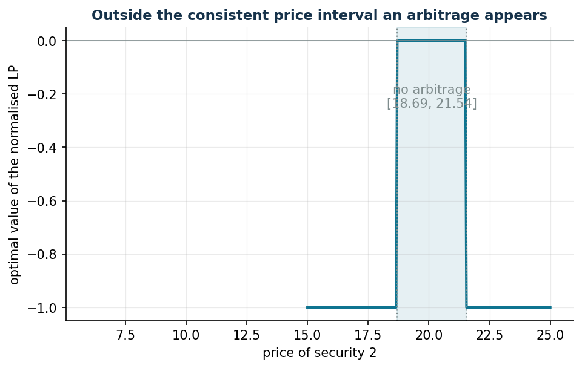

# Arbitrage and arbitrage-free pricing

**Class: LP** · Script: `python/lab14_arbitrage.py`

[](https://colab.research.google.com/github/fabiofurini/operations-research-lab/blob/main/notebooks/lab14_arbitrage.ipynb)

An **arbitrage** is a strategy that creates money out of nothing: it collects cash
today with no risk of a loss tomorrow (type A), or it costs nothing today and can
only make money (type B). Detecting one is an LP; duality — shadow prices,
complementary slackness, strong duality — becomes the theory of pricing. It is the
cleanest application of the primal-dual pair in the whole lab.

## The model

One-stage market: today we buy or sell at the prices $s^0_i$; tomorrow one out of
$m$ states of the world occurs and security $i$ pays $s^1_{ij}$. Security $0$ is
risk-free: it costs $1$ and pays $R = 1 + r$ in every state. Variables: the
positions $x_i$ (free: buying or short selling).

$$
\begin{aligned}
\min ~ \sum_{i=0}^{n} s^0_i x_i & & \\
\text{subject to} \quad \sum_{i=0}^{n} s^1_{ij} x_i &\ge 0, & \forall j \in \{1, 2, \dots, m\}, \\
x_i &\gtreqless 0, & \forall i \in \{0, 1, \dots, n\}.
\end{aligned}
$$

The null portfolio is feasible, hence the optimum is always $\le 0$. If the
optimum is $< 0$ there is a **type A arbitrage** and, the constraints being
homogeneous, the model is unbounded: for a finite certificate one adds the
**normalization** $\sum_i s^0_i x_i \ge -1$ ("collect at most 1 today").

## Duality is pricing

With the duality rules (minimization primal): every state generates a $p_j \ge 0$,
every free position a dual **equality** constraint:

$$
\sum_{j=1}^{m} s^1_{ij}\, p_j = s^0_i \quad \forall i \in \{0, 1, \dots, n\},
\qquad p_j \ge 0 .
$$

From the constraint of security 0: $\sum_j p_j = 1/R$, hence $q_j = R\, p_j$ are
**risk-neutral probabilities** and

$$
s^0_i = \frac{1}{R} \sum_{j=1}^{m} q_j\, s^1_{ij} :
$$

*today's price is the discounted expected value of tomorrow's payoffs under $q$.*

!!! note "Fundamental theorem of asset pricing"
    There is no arbitrage (neither type A nor type B) **if and only if** there exists
    a risk-neutral measure with $q_j > 0$ for every state. It is strong duality (no
    type A ⇒ the dual is feasible) plus complementary slackness (no type B ⇒ there
    exists a measure with $q > 0$).

## Case study

Three states, $R = 1{,}04$, two risky securities with payoffs $(10, 15, 13)$ and
$(30, 15, 25)$ — data in `data/arbitraggio_payoff.csv`.

```text
Prices (6, 20):      without normalization: UNBOUNDED (type A)
  normalized: optimum -1  ->  collect 1 today, payoff (0; 0; 0.20) >= 0
  by hand: (-27, 1, 1) collects 1 with payoff (11.92; 1.92; 9.92)
Prices (13, 18.69):  optimum 0, no arbitrage
  duals of the state constraints p* = (0.2846; 0.6769; 0)
  q = R p*             = (0.296;  0.704;  0)   sum 1
  pricing check: s0 = (1; 13; 18.6923) reproduced exactly
```

The duals **price**: every security, even a new one, is worth its discounted
expected payoff under $q$. The value $q_3 = 0$ signals that state 3 is not needed
to price these securities — and it is the reason why the theorem requires $q > 0$:
with $q_3 = 0$ a latent type B arbitrage on state 3 remains.

## Sensitivity: the interval of consistent prices

With only securities 0 and 1 quoted (1 and 13), the prices of security 2 that do
**not** create arbitrage form an interval, computed with two LPs (min and max of
$\sum_j s^1_{2j} p_j$ over the consistent measures):

$$
s^0_2 \in [18{,}69,\; 21{,}54] .
$$



Inside the interval the value of the normalized LP is 0 (consistent prices);
outside it drops to −1: an arbitrage exists, in one direction or the other.

**Pricing a new security.** A call on security 1 with strike 12 pays $(0, 3, 1)$:

- **complete market** (securities 0, 1, 2 quoted): a unique measure, a unique price
  $2{,}0308$;
- **incomplete market** (only 0 and 1): infinitely many consistent measures, price
  in $[1{,}4615,\; 2{,}0308]$ — outside that interval anyone could build an
  arbitrage by combining the call and the quoted securities.

??? example "Show the full script — `lab14_arbitrage.py`"

    ```python
    """Chapter 14 — Arbitrage and arbitrage-free pricing (LP).

    Case study: a one-period market with 3 states of the world, one risk-free
    security (gross return R = 1.04) and 2 risky securities.

    Contents:
      1. Detecting an arbitrage (normalised LP): prices (6, 20) -> a gain of 1 today
      2. Consistent prices (13, 18.6923): optimum 0 and risk-neutral probabilities
         from the duals of the state constraints
      3. Arbitrage-free price interval for security 2 (two LPs + a grid)
      4. Pricing a call: complete market (unique price) vs incomplete (range)
    """
    import gurobipy as gp
    import numpy as np
    import pandas as pd
    from gurobipy import GRB

    from stile import ARANCIO, GRIGIO, ROSSO, TEAL, intestazione, plt, salva_dat, salva_dati, salva_figura

    # ----------------------------------------------------------------------
    # 1. DATA: payoff s1[i][j] of security i in state j; security 0 is risk free
    # ----------------------------------------------------------------------
    r = 0.04
    R = 1 + r                                     # gross return of security 0
    s1 = np.array([[R, R, R],                     # security 0
                   [10.0, 15.0, 13.0],            # security 1
                   [30.0, 15.0, 25.0]])           # security 2
    n1, n_stati = s1.shape                        # 3 securities (0,1,2), 3 states

    salva_dati(pd.DataFrame(s1, columns=[f"state_{j+1}" for j in range(n_stati)],
                            index=["security_0", "security_1", "security_2"]).reset_index(names="security"),
               "arbitraggio_payoff")


    def lp_arbitraggio(s0, normalizza=True):
        """min sum s0_i x_i  subject to  payoff >= 0 in every state (x free).

        With `normalizza` it adds  sum s0_i x_i >= -1  (today's proceeds at most 1):
        without it, in the presence of a type-A arbitrage the model is unbounded."""
        m = gp.Model("arbitrage")
        m.Params.OutputFlag = 0
        m.Params.DualReductions = 0               # distinguishes UNBOUNDED from INFEASIBLE
        x = m.addVars(n1, lb=-GRB.INFINITY, name="x")
        v_stato = m.addConstrs(
            (gp.quicksum(s1[i, j] * x[i] for i in range(n1)) >= 0
             for j in range(n_stati)), name="state")
        if normalizza:
            m.addConstr(gp.quicksum(s0[i] * x[i] for i in range(n1)) >= -1,
                        name="normalisation")
        m.setObjective(gp.quicksum(s0[i] * x[i] for i in range(n1)), GRB.MINIMIZE)
        m.optimize()
        return m, x, v_stato


    # ----------------------------------------------------------------------
    # 2. DETECTING AN ARBITRAGE: prices (1, 6, 20)
    # ----------------------------------------------------------------------
    intestazione("Prices (6, 20): is there an arbitrage?")
    s0_arb = np.array([1.0, 6.0, 20.0])
    m_nb, _, _ = lp_arbitraggio(s0_arb, normalizza=False)
    print(f"LP without normalisation: status {m_nb.Status} "
          f"({'UNBOUNDED: type-A arbitrage' if m_nb.Status == GRB.UNBOUNDED else 'optimal'})")
    m_a, x_a, _ = lp_arbitraggio(s0_arb)
    print(f"Normalised LP: optimal value {m_a.ObjVal:.4f} "
          f"(= proceeds of 1 today with no risk at all)")
    print("Strategy:", {f"x{i}": round(x_a[i].X, 4) for i in range(n1)})
    payoff = s1.T @ np.array([x_a[i].X for i in range(n1)])
    print("Payoff in the three states:", np.round(payoff, 4), "(all >= 0)")
    # the "by hand" strategy of the chapter: (-27, 1, 1)
    x_libro = np.array([-27.0, 1.0, 1.0])
    print(f"Strategy (-27, 1, 1): cost {s0_arb @ x_libro:.0f}, "
          f"payoff {np.round(s1.T @ x_libro, 2)} (equivalent, on a different scale)")

    # ----------------------------------------------------------------------
    # 3. CONSISTENT PRICES: optimum 0 and risk-neutral probabilities
    # ----------------------------------------------------------------------
    intestazione("Prices (13, 18.6923): no arbitrage and pricing")
    s0_ok = np.array([1.0, 13.0, 18.692308])
    m_b, x_b, v_stato = lp_arbitraggio(s0_ok, normalizza=False)
    print(f"Optimal value: {m_b.ObjVal:.4f}  (null strategy: no arbitrage)")
    p = np.array([v_stato[j].Pi for j in range(n_stati)])
    q = R * p
    print(f"Duals of the state constraints p* = {np.round(p, 4)}")
    print(f"Risk-neutral probabilities q = R p* = {np.round(q, 4)} "
          f"(sum = {q.sum():.4f})")
    print("Pricing check: s0_i = sum_j p_j s1_ij =",
          np.round(s1 @ p, 4))

    # ----------------------------------------------------------------------
    # 4. ARBITRAGE-FREE PRICE INTERVAL FOR SECURITY 2
    # ----------------------------------------------------------------------
    intestazione("Arbitrage-free price interval for security 2")


    def bound_prezzo(payoff_nuovo, quotati, senso):
        """min/max of sum_j p_j payoff_j over the measures p >= 0 consistent with the quoted ones."""
        d = gp.Model("pricing")
        d.Params.OutputFlag = 0
        pp = d.addVars(n_stati, name="p")
        for i, prezzo in quotati:
            d.addConstr(gp.quicksum(s1[i, j] * pp[j] for j in range(n_stati)) == prezzo)
        d.setObjective(gp.quicksum(payoff_nuovo[j] * pp[j] for j in range(n_stati)), senso)
        d.optimize()
        assert d.Status == GRB.OPTIMAL
        return d.ObjVal


    quotati_01 = [(0, 1.0), (1, 13.0)]
    lo = bound_prezzo(s1[2], quotati_01, GRB.MINIMIZE)
    hi = bound_prezzo(s1[2], quotati_01, GRB.MAXIMIZE)
    print(f"With security 0 and security 1 quoted (1 and 13): the price of security 2 "
          f"is arbitrage free in [{lo:.4f}, {hi:.4f}]")

    griglia = np.linspace(15, 25, 201)
    valori = []
    for prezzo2 in griglia:
        mg, _, _ = lp_arbitraggio(np.array([1.0, 13.0, prezzo2]))
        valori.append(mg.ObjVal)
    curva = pd.DataFrame({"price_security2": griglia, "lp_value": valori})
    salva_dati(curva, "arbitraggio_curva_prezzo")
    salva_dat(curva, "cap14_arbitraggio_curva")
    print(f"Grid {griglia[0]:.0f}..{griglia[-1]:.0f}: LP value = 0 only inside "
          f"the interval, negative outside (arbitrage)")

    # ----------------------------------------------------------------------
    # 5. PRICING A CALL ON SECURITY 1 (STRIKE 12)
    # ----------------------------------------------------------------------
    intestazione("Pricing a call on security 1, strike 12")
    call = np.maximum(s1[1] - 12.0, 0.0)
    print("Payoff of the call in the three states:", call)
    quotati_012 = [(0, 1.0), (1, 13.0), (2, 18.692308)]
    lo_c = bound_prezzo(call, quotati_012, GRB.MINIMIZE)
    hi_c = bound_prezzo(call, quotati_012, GRB.MAXIMIZE)
    print(f"Complete market (securities 0, 1, 2 quoted): unique price "
          f"[{lo_c:.4f}, {hi_c:.4f}]")
    lo_i = bound_prezzo(call, quotati_01, GRB.MINIMIZE)
    hi_i = bound_prezzo(call, quotati_01, GRB.MAXIMIZE)
    print(f"Incomplete market (only securities 0 and 1): interval   "
          f"[{lo_i:.4f}, {hi_i:.4f}]")

    # ----------------------------------------------------------------------
    # 6. FIGURE: arbitrage gain as the price of security 2 varies
    # ----------------------------------------------------------------------
    fig, ax = plt.subplots()
    ax.plot(curva["price_security2"], curva["lp_value"], color=TEAL, lw=2)
    ax.axvspan(lo, hi, color=TEAL, alpha=0.10)
    ax.axvline(lo, color=GRIGIO, ls=":", lw=1)
    ax.axvline(hi, color=GRIGIO, ls=":", lw=1)
    ax.axhline(0, color=GRIGIO, lw=0.8)
    ax.annotate(f"no arbitrage\n[{lo:.2f}, {hi:.2f}]",
                ((lo + hi) / 2, -0.25), ha="center", color=GRIGIO)
    ax.plot([6], [0], alpha=0)  # noop
    ax.set_xlabel("price of security 2")
    ax.set_ylabel("optimal value of the normalised LP")
    ax.set_title("Outside the consistent price interval an arbitrage appears")
    salva_figura(fig, "cap14_arbitraggio_curva")

    print("\nDone: chapter 14 (arbitrage).")
    ```

## Exercises

1. With prices $(6, 20)$, find a strategy that collects 5 today with no risk
   tomorrow.
2. Set the price of security 2 at the upper endpoint $21{,}5385$: check that the
   optimum is 0 and compute the pricing measure. What happens at $21{,}60$?
3. In the complete market, price a call on security 2 with strike 20 and check the
   price with the risk-neutral probabilities.
