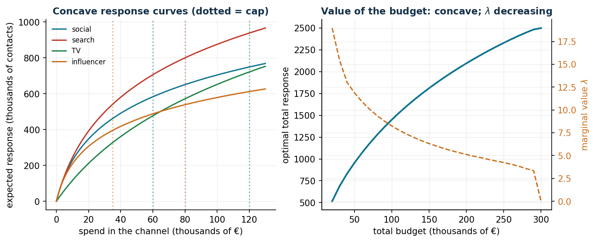
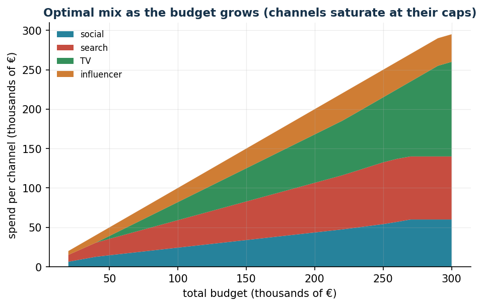

# Advertising budget allocation

**Class:** convex NLP · **Script:** `python/lab08_budget.py`

How should a campaign of 100.000 € be split among channels with diminishing
marginal returns? Theory says something strong and verifiable: **at the optimum
the marginal returns are equal to each other** — and this is exactly what the
solver returns, digit by digit.

**The problem in words.** *We decide* the spend $x_i$ on each channel.
*The objective*: maximum total response. *The constraints*: budget $b$ and caps $u_i$.

## Model

**Data (input of the model).**

| Symbol | Type | Meaning |
|---|---|---|
| $n$ | $\in \mathbb{Z}_{\ge 1}$ | number of advertising channels; the channels are indexed by $i \in \{1, 2, \dots, n\}$ |
| $b$ | $\in \mathbb{Q}_{> 0}$ | total budget (thousands of €) |
| $r_i(\cdot)$ | increasing concave function | expected response of channel $i$ as a function of the spend; in the case study $r_i(x) = a_i \log(1 + k_i\, x)$ with given $a_i, k_i \in \mathbb{Q}_{> 0}$ |
| $u_i$ | $\in \mathbb{Q}_{> 0}$ | maximum useful or allowed investment in channel $i$ |

**Decision variables.** We introduce the following $n$ non-negative variables:

$$
x_i = \text{spend on channel } i \text{ (thousands of €)},
\qquad \forall i \in \{1, 2, \dots, n\}.
$$

Using these variables, a convex NLP model for the problem is the following:

$$
\begin{aligned}
\max ~~ \sum_{i=1}^{n} r_i(x_i) & & \\
\text{subject to} \quad \sum_{i=1}^{n} x_i &\le b, & \\
x_i &\le u_i, & \forall i \in \{1, 2, \dots, n\}, \\
x_i &\ge 0, & \forall i \in \{1, 2, \dots, n\}.
\end{aligned}
$$

Description of the objective function and of the constraints:

- the concave objective function maximizes the total response of the campaign; it
  is separable by channel and is a sum of concave functions, hence the problem has
  a certifiable global optimum;
- the linear **budget** constraint imposes that the overall spend does not exceed
  $b$: it is the only constraint that links the channels to each other — without it
  every channel would go to its own cap (one linear constraint);
- the linear **cap** constraints $x_i \le u_i$ are the limit beyond which the
  channel absorbs no further useful spend ($n$ linear constraints);
- the non-negativity constraints on $x_i$ define the variables of the model.

**Economic condition at the optimum (KKT).** There exists $\lambda \ge 0$ (shadow price
of the budget) such that, for every channel that is not stuck at the bounds $0$ or $u_i$,

$$
r_i'(\tilde x_i) = \lambda .
$$

In words: **the last euro invested yields the same in all the active channels**. If
this were not the case, moving one euro from the channel with the low marginal
return to the one with the high marginal return would improve the response. The
channels at the cap $u_i$ may have a marginal return $> \lambda$ (we would like to
invest more in them but we cannot); those at zero have an initial marginal return
$< \lambda$ (they are not worth even the first euro).

!!! example "Worked example by hand (2 channels, b = 50)"
    $r_1(x) = 100\log(1 + 0.2x)$, $r_2(x) = 60\log(1 + 0.1x)$, without caps.
    Equating the marginal returns,
    $\frac{20}{1 + 0.2x_1} = \frac{6}{1 + 0.1x_2}$, and substituting
    $x_2 = 50 - x_1$ gives $x_1 = 114/3.2 = 35.6$, $x_2 = 14.4$ and
    $\lambda = 20/(1 + 0.2 \cdot 35.6) = 2.46$: one more euro of budget yields
    $\approx 2.46$ units of response, whichever channel it is fed into.

## Results and verification of the KKT conditions

Four channels, $r_i(x) = a_i\log(1 + k_i x)$, budget $b = 100$ (thousands of €),
data in `data/budget_canali.csv`.

```text
Total response: 1.449.8 (thousands of useful contacts)
    channel |  spend |   cap | response |  marginal
     social |   24.3 |    60 |    385.3 |   8.2693
     search |   34.8 |    80 |    539.5 |   8.2693
         TV |   22.9 |   120 |    235.2 |   8.2693
 influencer |   18.0 |    35 |    289.8 |   8.2693

Check: +1000 EUR of budget -> response +8.244 ~ lambda
```

The four marginal returns coincide to the fourth digit ($\lambda = 8.2693$) and the
actual increase in response with one thousand euros more (8.244) confirms the reading
of the multiplier. A managerial note: TV receives *less* than social despite its
higher cap — what matters is not the size of the channel but the speed at which it
saturates ($k_i$).





## Sensitivity

```text
b =  20: response   515.9   lambda = 18.971
b =  60: response 1.070.4   lambda = 10.909
b = 100: response 1.449.8   lambda =  8.244
b = 180: response 1.988.2   lambda =  5.538
b = 260: response 2.370.2   lambda =  4.049
b = 300: response 2.498.1   lambda =  0.000  (all channels at their caps)
```

The budget value curve is concave: $\lambda$ falls from 19 to 4 as the budget grows.
At $b = 300$ all the channels are at their caps ($60 + 80 + 120 + 35 = 295$): the
budget stops being the scarce resource and $\lambda$ collapses to zero. The curve of
$\lambda$ is the quantitative argument for negotiating the budget: marketing is
funded as long as $\lambda$ exceeds the value of one euro invested elsewhere.


## Code

The complete script of the chapter — data, model, solution, sensitivity and figures —
is [`python/lab08_budget.py`](https://github.com/fabiofurini/operations-research-lab/blob/main/python/lab08_budget.py)
(reproducible with `python3 python/lab08_budget.py` from the `python/` folder).

??? example "Show the full script — `lab08_budget.py`"

    ```python
    """Chapter 8 — Advertising budget allocation (convex NLP).

    Case study: a 100,000 € campaign over 4 channels (social, search, TV, influencer)
    with concave response curves (decreasing marginal returns).

    Contents:
      1. Maximisation of the total response with a budget and per-channel caps
      2. Numerical check of the KKT condition: equal marginal return on the active channels
      3. Value-budget curve and marginal value of one euro
      4. Optimal mix as the budget grows
    """
    import gurobipy as gp
    import numpy as np
    import pandas as pd
    from gurobipy import GRB

    from stile import (ARANCIO, CICLO, GRIGIO, TEAL, intestazione, plt, salva_dat, salva_dati,
                       salva_figura)

    # ----------------------------------------------------------------------
    # 1. DATA: logarithmic response R_i(x) = a_i * log(1 + b_i x)   [x in thousands of €]
    # ----------------------------------------------------------------------
    canali = ["social", "search", "TV", "influencer"]
    a = np.array([260.0, 380.0, 520.0, 190.0])   # response scale (useful contacts, thousands)
    b = np.array([0.14, 0.09, 0.025, 0.20])      # saturation speed
    u = np.array([60.0, 80.0, 120.0, 35.0])      # per-channel cap (thousands of €)
    B = 100.0                                    # total budget (thousands of €)

    salva_dati(pd.DataFrame({"channel": canali, "a": a, "b": b, "cap": u}), "budget_canali")


    def risposta(x):
        return float(np.sum(a * np.log1p(b * x)))


    def marginale(x):
        return a * b / (1 + b * x)


    def alloca(budget):
        """max sum a_i log(1+b_i x_i)  subject to  sum x_i <= budget, 0 <= x_i <= u_i.

        Concave problem, solved GLOBALLY by Gurobi with the non-linear constraints
        z_i = log(g_i): the same solver used throughout the lecture notes."""
        m = gp.Model("budget")
        m.Params.OutputFlag = 0
        m.Params.FuncNonlinear = 1     # log treated as an exact NL constraint (global)
        m.Params.MIPGap = 1e-9         # very tight gap: accurate differences are needed
        m.Params.FeasibilityTol = 1e-9
        m.Params.OptimalityTol = 1e-9
        x = m.addVars(4, ub=u, name="x")
        g = m.addVars(4, lb=1.0, name="g")                 # g_i = 1 + b_i x_i
        z = m.addVars(4, lb=-GRB.INFINITY, name="z")       # z_i = log(g_i)
        for i in range(4):
            m.addConstr(g[i] == 1 + b[i] * x[i])
            m.addGenConstrLog(g[i], z[i])
        m.addConstr(gp.quicksum(x[i] for i in range(4)) <= budget)
        m.setObjective(gp.quicksum(a[i] * z[i] for i in range(4)), GRB.MAXIMIZE)
        m.optimize()
        assert m.Status == GRB.OPTIMAL
        return np.array([x[i].X for i in range(4)]), m.ObjVal


    intestazione(f"Optimal allocation with budget B = {B:.0f} thousand €")
    x_opt, R_opt = alloca(B)
    print(f"Total response: {R_opt:,.1f} (thousands of useful contacts)\n")
    print(f"{'channel':>11} | {'spend':>8} | {'cap':>6} | {'response':>9} | {'marginal':>9}")
    marg = marginale(x_opt)
    for i, ch in enumerate(canali):
        print(f"{ch:>11} | {x_opt[i]:8.1f} | {u[i]:6.0f} | {a[i] * np.log1p(b[i] * x_opt[i]):9.1f} "
              f"| {marg[i]:9.4f}")
    print(f"\nTotal spend: {x_opt.sum():.1f} / {B:.0f}")

    # ----------------------------------------------------------------------
    # 2. KKT CHECK: equal marginal on the active channels not at their cap
    # ----------------------------------------------------------------------
    intestazione("KKT check")
    interni = [(0 < x_opt[i] < u[i] - 1e-6) for i in range(4)]
    marg_interni = marg[interni]
    print(f"Interior channels (neither at 0 nor at the cap): {[canali[i] for i in range(4) if interni[i]]}")
    print(f"Marginal returns on the interior channels: {np.round(marg_interni, 4)}")
    print(f"-> all equal to the shadow price of the budget: lambda ~ {marg_interni.mean():.4f}")
    print("The last euro invested yields the same return in every active channel.")

    # check by perturbation
    _, R_piu = alloca(B + 1)
    print(f"Check: +1000 € of budget -> response +{R_piu - R_opt:.4f} ~ lambda")

    # ----------------------------------------------------------------------
    # 3. VALUE-BUDGET CURVE and optimal mix
    # ----------------------------------------------------------------------
    intestazione("Value-budget curve")
    budgets = np.arange(20, 301, 10)
    valori, mixes, lambde = [], [], []
    for bb in budgets:
        xx, rr = alloca(float(bb))
        _, rr2 = alloca(float(bb) + 1)
        valori.append(rr)
        mixes.append(xx)
        lambde.append(rr2 - rr)
    mixes = np.array(mixes)
    curva = pd.DataFrame({"budget": budgets, "response": valori, "lambda": lambde})
    salva_dati(curva, "budget_curva_valore")
    for bb, rr, ll in zip(budgets[::4], valori[::4], lambde[::4]):
        print(f"  B = {bb:3d}: response {rr:8.1f}, marginal value of 1000 € = {ll:6.3f}")

    # ----------------------------------------------------------------------
    # 4. FIGURES
    # ----------------------------------------------------------------------
    xx = np.linspace(0, 130, 300)
    salva_dat(pd.DataFrame({"x": xx, **{ch: a[i] * np.log1p(b[i] * xx)
                                        for i, ch in enumerate(canali)}}), "cap08_risposte")
    salva_dat(curva, "cap08_valore_budget")
    salva_dat(pd.DataFrame({"budget": budgets, **{ch: mixes[:, i]
                                                  for i, ch in enumerate(canali)}}), "cap08_mix")
    fig, (ax1, ax2) = plt.subplots(1, 2, figsize=(10.5, 4.0))
    for i, ch in enumerate(canali):
        ax1.plot(xx, a[i] * np.log1p(b[i] * xx), label=ch, color=CICLO[i])
        ax1.axvline(u[i], color=CICLO[i], ls=":", alpha=0.5)
    ax1.set_xlabel("spend in the channel (thousands of €)")
    ax1.set_ylabel("expected response (thousands of contacts)")
    ax1.set_title("Concave response curves (dotted = cap)")
    ax1.legend(fontsize=8)
    ax2.plot(curva["budget"], curva["response"], color=TEAL, lw=2)
    ax2.set_xlabel("total budget (thousands of €)")
    ax2.set_ylabel("optimal total response")
    ax2b = ax2.twinx()
    ax2b.plot(curva["budget"], curva["lambda"], color=ARANCIO, ls="--")
    ax2b.set_ylabel("marginal value $\\lambda$", color=ARANCIO)
    ax2b.tick_params(axis="y", labelcolor=ARANCIO)
    ax2b.spines.right.set_visible(True)
    ax2.set_title("Value of the budget: concave; $\\lambda$ decreasing")
    salva_figura(fig, "cap08_curve")

    fig, ax = plt.subplots()
    ax.stackplot(budgets, mixes.T, labels=canali, colors=CICLO, alpha=0.9)
    for i in range(4):
        ax.axhline(0, lw=0)  # noop, for a clean legend
    ax.set_xlabel("total budget (thousands of €)")
    ax.set_ylabel("spend per channel (thousands of €)")
    ax.set_title("Optimal mix as the budget grows (channels saturate at their caps)")
    ax.legend(fontsize=8, loc="upper left")
    salva_figura(fig, "cap08_mix")

    print("\nDone: chapter 8.")
    ```

## Exercises

1. Worked example by hand with $b = 80$: $x = (54.4;\, 25.6)$, $\lambda = 1.68$.
2. Saturating exponential response for TV: is the cap $u_i$ still needed?
3. Channel with initial marginal return $5 < \lambda$: it stays at zero; interpret
   its "reduced cost".
4. Fair coverage across segments: $\max z$ with $z \le$ coverage of each segment.
