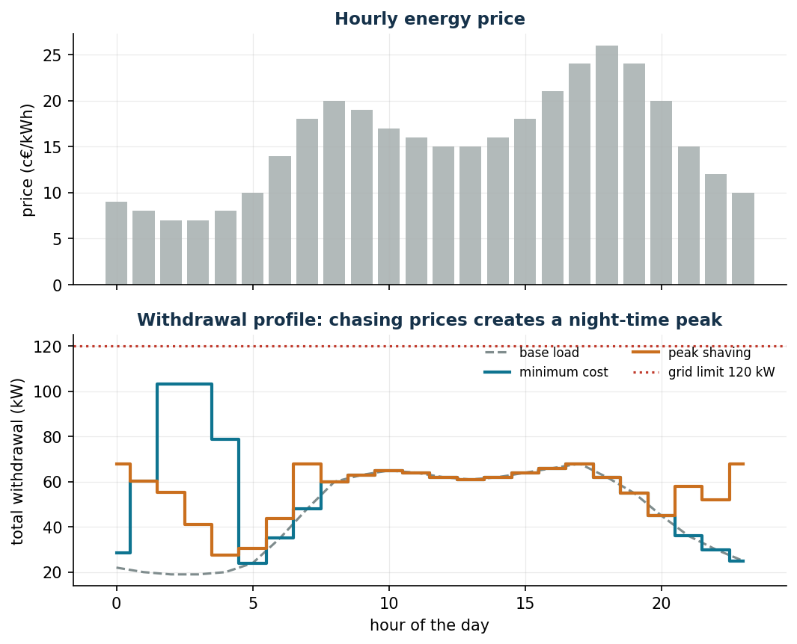
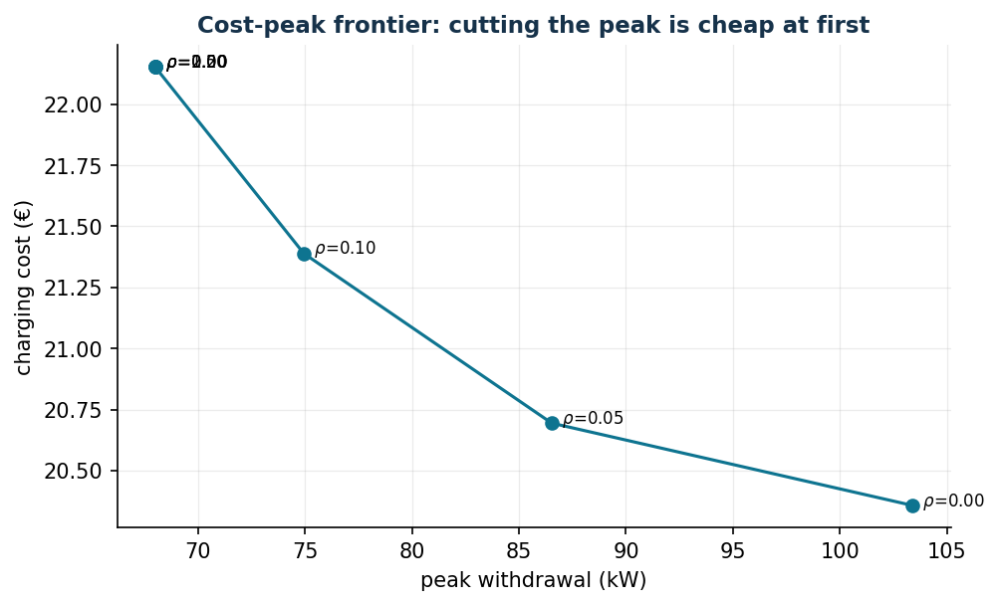

# Smart charging of electric vehicles

**Class:** LP / convex QP · **Script:** `python/lab10_ev_charging.py`

A fleet must be fully charged by the morning by exploiting the cheap hours — but if
all the vehicles charge together, the peak draw explodes. A problem that *seems* to
require on/off variables and instead is a pure LP: the real decision — how much
power — is continuous.

**The problem in words.** *We decide* the power $x_{vt}$ for each vehicle and hour.
*The objective*: minimum energy expenditure. *The constraints*: the energy required
before departure, charging only while plugged in and below the power of the charger,
total draw below the power of the meter.

## Model

**Data (input of the model).**

| Symbol | Type | Meaning |
|---|---|---|
| $n$ | $\in \mathbb{Z}_{\ge 1}$ | number of vehicles, indexed by $v \in \{1, 2, \dots, n\}$ |
| $m$ | $\in \mathbb{Z}_{\ge 1}$ | number of hourly intervals, indexed by $t \in \{1, 2, \dots, m\}$, of duration $\Delta t$ (here $\Delta t = 1$ h) |
| $\pi_t$ | $\in \mathbb{Q}_{\ge 0}$ | energy price in hour $t$ (€/kWh) |
| $a_{vt}$ | $\in \{0, 1\}$ | observed *datum*: $1$ if vehicle $v$ is plugged in during hour $t$, $0$ otherwise |
| $e_v$ | $\in \mathbb{Q}_{> 0}$ | energy required by vehicle $v$ before departure (kWh) |
| $\bar p_v$ | $\in \mathbb{Q}_{> 0}$ | maximum charging power of vehicle $v$ (kW) |
| $b_t$ | $\in \mathbb{Q}_{\ge 0}$ | base load of the building in hour $t$ (kW) |
| $k$ | $\in \mathbb{Q}_{> 0}$ | maximum power that can be drawn from the meter (kW) |
| $\eta$ | $\in \mathbb{Q},\ 0 < \eta \le 1$ | charging efficiency |

**Decision variables.** We introduce the following $n\,m$ non-negative variables:

$$
x_{vt} = \text{power assigned to vehicle } v \text{ in hour } t \text{ (kW)},
\qquad \forall v \in \{1, 2, \dots, n\},~\forall t \in \{1, 2, \dots, m\}.
$$

Using these variables, an LP model for the problem is the following:

$$
\begin{aligned}
\min ~~ \sum_{v=1}^{n} \sum_{t=1}^{m} \pi_t\, \Delta t\, x_{vt} & & \\
\text{subject to} \quad \eta \sum_{t=1}^{m} \Delta t\, x_{vt} &\ge e_v, & \forall v \in \{1, 2, \dots, n\}, \\
\sum_{v=1}^{n} x_{vt} + b_t &\le k, & \forall t \in \{1, 2, \dots, m\}, \\
x_{vt} &\le a_{vt}\, \bar p_v, & \forall v \in \{1, 2, \dots, n\},~\forall t \in \{1, 2, \dots, m\}, \\
x_{vt} &\ge 0, & \forall v \in \{1, 2, \dots, n\},~\forall t \in \{1, 2, \dots, m\}.
\end{aligned}
$$

Description of the objective function and of the constraints:

- the linear objective function minimizes the energy expenditure of the night: the
  power $x_{vt}$ delivered for the duration $\Delta t$ costs
  $\pi_t\, \Delta t\, x_{vt}$ euros;
- the linear **energy** constraints ensure that every vehicle receives all the energy
  it requires before departure; the efficiency $\eta$ stands on the left: of the
  energy that is drawn, only the fraction $\eta$ ends up in the battery ($n$ linear
  constraints);
- the linear **grid** constraints impose that the overall draw (charging plus base
  load) never exceeds the power of the meter: these are the constraints that couple
  the vehicles to each other ($m$ linear constraints);
- the linear **power** constraints limit the power of every vehicle to that of its
  charger and set it to zero in the hours in which the vehicle is absent
  ($a_{vt} = 0$): availability is a *datum*, not a decision, and this is why no
  binary variables are needed ($n\,m$ linear constraints);
- the non-negativity constraints on $x_{vt}$ define the variables of the model.

Variants: peak shaving ($\min z$ with $\sum_{v=1}^{n} x_{vt} + b_t \le z$ for every
$t \in \{1, 2, \dots, m\}$); smooth profile (QP with
$\gamma \sum_{t=2}^{m} (z_t - z_{t-1})^2$); multi-objective cost $+\,\rho\,z$.
The energy constraint is written as $\ge$ because charging more than necessary is
allowed but never worthwhile (the price is positive): at the optimum it holds with
equality.

!!! example "Worked example by hand (1 vehicle, 2 hours)"
    $e = 10$ kWh ($\eta = 1$), prices $\pi_1 = 0{,}10$ and $\pi_2 = 0{,}20$ €/kWh,
    $\bar p = 8$ kW: we charge 8 kWh in the cheap hour and 2 in the expensive one
    (cost $8 \cdot 0{,}10 + 2 \cdot 0{,}20 = 1{,}20$ €). Shadow price of the energy
    requirement = 0.20 €/kWh (the price of the *marginal hour*); shadow price of the
    power limit in hour 1 = 0.10 €/kW. With $\bar p = 12$: everything in the cheap
    hour, cost 1.00 €, dual of the requirement 0.10 and dual of the power 0
    (constraint not active).

## Case study

Six vans with different night windows, meter $k = 120$ kW, $\eta = 0{,}95$.

```text
Minimum cost   : 20.36 EUR/night   peak draw 103.4 kW (limit 120)
Peak shaving   : minimum possible peak 68.0 kW
Shadow prices of the energy requirement (EUR/kWh):
  V1 0.0947   V2 0.0842   V3 0.0842   V4 0.0947   V5 0.0947   V6 0.0842
```



The shadow prices of the energy requirement are equal to $0{,}0842 = 0{,}08/\eta$ or
$0{,}0947 = 0{,}09/\eta$: they are the prices of the **marginal hours** of each
vehicle (the cheapest hour still free within its window), corrected for the
efficiency. V2, V3 and V6 have windows that cover the hours at $0{,}08$; V1, V4 and
V5 arrive late or leave early and their marginal hour costs $0{,}09$. One additional
kWh of requirement therefore costs between 8.4 and 9.5 cents depending on the
vehicle.

## Sensitivity



```text
Trade-off cost + rho*peak:
  rho = 0.00: cost 20.36  peak 103.4     rho = 0.20: cost 22.15  peak 68.0
  rho = 0.05: cost 20.69  peak  86.5     rho = 0.50: cost 22.15  peak 68.0
  rho = 0.10: cost 21.39  peak  74.9
Meter capacity:
  k = 60, 65 kW: INFEASIBLE     k = 80: 21.09     k = 120: 20.36
  k = 70 kW    : 21.93          k = 90: 20.63
```

Cutting the peak from 103 to 75 kW (−28%) costs only one euro per night; getting
down to 68 kW costs less than two. The pure minimax (peak 68) without the cost term
would spend 27.79 €: the trade-off with $\rho = 0{,}2$ achieves the *same* peak at
22.15 € — never optimize a single objective when there are two of them.

!!! warning "An instructive bug (which really happened)"
    In the constraint `quicksum(x) + base[t] <= C` Gurobi moves the constant into the
    right-hand side: the stored RHS is `C - base[t]`. Whoever writes `v.RHS = newC`
    is relaxing the wrong constraint. When a sensitivity analysis changes nothing,
    suspect your own code before suspecting the model.


## Code

The complete script of the chapter — data, model, solution, sensitivity and figures —
is [`python/lab10_ev_charging.py`](https://github.com/fabiofurini/operations-research-lab/blob/main/python/lab10_ev_charging.py)
(reproducible with `python3 python/lab10_ev_charging.py` from the `python/` folder).

??? example "Show the full script — `lab10_ev_charging.py`"

    ```python
    """Chapter 10 — Smart charging of electric vehicles (LP / convex QP).

    Case study: a company depot with 6 electric vans to be charged overnight;
    hourly energy prices; base load of the building.

    Contents:
      1. Minimum-cost LP: charging chases the cheap hours
      2. Peak shaving: minimise the peak withdrawal (minimax)
      3. Smooth profile (QP) and multi-objective cost-peak comparison
      4. Shadow prices: grid capacity and energy requirement
    """
    import gurobipy as gp
    import numpy as np
    import pandas as pd
    from gurobipy import GRB

    from stile import (ARANCIO, GRIGIO, ROSSO, TEAL, intestazione, plt, salva_dat, salva_dati,
                       salva_figura)

    # ----------------------------------------------------------------------
    # 1. DATA
    # ----------------------------------------------------------------------
    ore = list(range(24))                      # hour t = [t, t+1)
    # price €/kWh: high during the day and in the evening peak, low at night
    prezzo = np.array([0.09, 0.08, 0.07, 0.07, 0.08, 0.10, 0.14, 0.18, 0.20, 0.19,
                       0.17, 0.16, 0.15, 0.15, 0.16, 0.18, 0.21, 0.24, 0.26, 0.24,
                       0.20, 0.15, 0.12, 0.10])
    # base load of the building (kW)
    base = np.array([22, 20, 19, 19, 20, 24, 35, 48, 60, 63, 65, 64,
                     62, 61, 62, 64, 66, 68, 62, 55, 45, 36, 30, 25], dtype=float)

    veicoli = [f"V{k}" for k in range(1, 7)]
    # (arrival hour, departure hour, required energy kWh, max power kW)
    flotta = {
        "V1": (18, 7, 46, 11), "V2": (19, 6, 38, 11), "V3": (20, 8, 55, 22),
        "V4": (17, 6, 30, 7.4), "V5": (21, 7, 42, 11), "V6": (22, 8, 50, 22),
    }
    eta = 0.95            # charging efficiency
    C_rete = 120.0        # maximum power that can be drawn from the meter (kW)

    disp = {(v, t): 1 if (flotta[v][0] <= t or t < flotta[v][1]) else 0
            for v in veicoli for t in ore}      # windows that straddle midnight

    salva_dati(pd.DataFrame({"hour": ore, "price": prezzo, "base_load": base}), "ev_prezzi_base")
    salva_dati(pd.DataFrame([(v, *flotta[v]) for v in veicoli],
                            columns=["vehicle", "arrival", "departure", "energy_kWh", "pmax_kW"]),
               "ev_flotta")


    def costruisci():
        m = gp.Model("ev_charging")
        m.Params.OutputFlag = 0
        x = m.addVars(veicoli, ore, name="x")       # charging power (kW)
        for v in veicoli:
            for t in ore:
                x[v, t].UB = flotta[v][3] * disp[v, t]     # 0 if not plugged in
        v_ene = m.addConstrs((eta * gp.quicksum(x[v, t] for t in ore) >= flotta[v][2]
                              for v in veicoli), name="energy")
        v_rete = m.addConstrs((gp.quicksum(x[v, t] for v in veicoli) + base[t] <= C_rete
                               for t in ore), name="grid")
        return m, x, v_ene, v_rete


    def profilo(x):
        return np.array([sum(x[v, t].X for v in veicoli) for t in ore])


    # ----------------------------------------------------------------------
    # 2. MINIMUM-COST LP
    # ----------------------------------------------------------------------
    intestazione("LP: minimum energy cost")
    m, x, v_ene, v_rete = costruisci()
    m.setObjective(gp.quicksum(prezzo[t] * x[v, t] for v in veicoli for t in ore), GRB.MINIMIZE)
    m.optimize()
    assert m.Status == GRB.OPTIMAL
    prof_costo = profilo(x)
    costo_min = m.ObjVal
    picco_costo = (prof_costo + base).max()
    print(f"Charging cost: {costo_min:.2f} €   peak withdrawal: {picco_costo:.1f} kW "
          f"(limit {C_rete:.0f})")
    print("\nShadow prices of the energy requirement (marginal cost of 1 more kWh per vehicle):")
    for v in veicoli:
        print(f"  {v}: {v_ene[v].Pi:.4f} €/kWh")

    # ----------------------------------------------------------------------
    # 3. PEAK SHAVING (minimax) and SMOOTH PROFILE (QP)
    # ----------------------------------------------------------------------
    intestazione("Peak shaving: minimise the peak withdrawal")
    mp, xp, _, _ = costruisci()
    z = mp.addVar(name="peak")
    mp.addConstrs((gp.quicksum(xp[v, t] for v in veicoli) + base[t] <= z for t in ore),
                  name="peak_def")
    mp.setObjective(z, GRB.MINIMIZE)
    mp.optimize()
    prof_picco = profilo(xp)
    costo_picco = sum(prezzo[t] * prof_picco[t] for t in ore)
    print(f"Lowest achievable peak: {mp.ObjVal:.1f} kW   cost: {costo_picco:.2f} € "
          f"(+{costo_picco - costo_min:.2f} € with respect to the minimum cost)")

    intestazione("Trade-off: cost + rho · peak")
    compromessi = []
    for rho in [0, 0.05, 0.1, 0.2, 0.5, 1.0, 2.0]:
        mc, xc, _, _ = costruisci()
        zc = mc.addVar(name="peak")
        mc.addConstrs((gp.quicksum(xc[v, t] for v in veicoli) + base[t] <= zc for t in ore))
        mc.setObjective(gp.quicksum(prezzo[t] * xc[v, t] for v in veicoli for t in ore)
                        + rho * zc, GRB.MINIMIZE)
        mc.optimize()
        cc = sum(prezzo[t] * xc[v, t].X for v in veicoli for t in ore)
        compromessi.append((rho, cc, zc.X))
        print(f"  rho = {rho:4.2f}: cost {cc:6.2f} €, peak {zc.X:6.1f} kW")
    salva_dati(pd.DataFrame(compromessi, columns=["rho", "cost", "peak"]), "ev_compromessi")

    # ----------------------------------------------------------------------
    # 4. SENSITIVITY: capacity of the meter
    # ----------------------------------------------------------------------
    intestazione("Sensitivity: capacity of the grid connection")
    # careful: in the constraint "sum x + base[t] <= C" Gurobi moves the constant base[t]
    # into the right-hand side; the stored RHS is C - base[t], so it must be updated like this:
    for CC in [60, 65, 70, 80, 90, 120]:
        ms, xs_, _, vr = costruisci()
        for t in ore:
            vr[t].RHS = CC - base[t]
        ms.setObjective(gp.quicksum(prezzo[t] * xs_[v, t] for v in veicoli for t in ore),
                        GRB.MINIMIZE)
        ms.optimize()
        esito = f"cost {ms.ObjVal:6.2f} €" if ms.Status == GRB.OPTIMAL else "INFEASIBLE"
        print(f"  C_grid = {CC:3d} kW: {esito}")

    # ----------------------------------------------------------------------
    # 5. FIGURES (pgfplots data + matplotlib preview)
    # ----------------------------------------------------------------------
    salva_dat(pd.DataFrame({"hour": ore, "price_cent": prezzo * 100, "base": base,
                            "totcost": base + prof_costo, "totpeak": base + prof_picco}),
              "cap10_profili")
    salva_dat(pd.DataFrame(compromessi, columns=["rho", "cost", "peak"]), "cap10_frontiera")

    fig, (ax1, ax2) = plt.subplots(2, 1, figsize=(8.2, 6.4), sharex=True)
    ax1.bar(ore, prezzo * 100, color=GRIGIO, alpha=0.6)
    ax1.set_ylabel("price (c€/kWh)")
    ax1.set_title("Hourly energy price")
    ax2.plot(ore, base, color=GRIGIO, ls="--", label="base load")
    ax2.plot(ore, base + prof_costo, color=TEAL, lw=2, drawstyle="steps-mid",
             label="minimum cost")
    ax2.plot(ore, base + prof_picco, color=ARANCIO, lw=2, drawstyle="steps-mid",
             label="peak shaving")
    ax2.axhline(C_rete, color=ROSSO, ls=":", label=f"grid limit {C_rete:.0f} kW")
    ax2.set_xlabel("hour of the day"); ax2.set_ylabel("total withdrawal (kW)")
    ax2.set_title("Withdrawal profile: chasing prices creates a night-time peak")
    ax2.legend(fontsize=8, ncol=2)
    salva_figura(fig, "cap10_profili")

    comp = pd.DataFrame(compromessi, columns=["rho", "cost", "peak"])
    fig, ax = plt.subplots()
    ax.plot(comp["peak"], comp["cost"], "-o", color=TEAL)
    for _, r in comp.iterrows():
        ax.annotate(f"  $\\rho$={r['rho']:.2f}", (r["peak"], r["cost"]), fontsize=8)
    ax.set_xlabel("peak withdrawal (kW)")
    ax.set_ylabel("charging cost (€)")
    ax.set_title("Cost-peak frontier: cutting the peak is cheap at first")
    salva_figura(fig, "cap10_frontiera")

    print("\nDone: chapter 10.")
    ```

## Exercises

1. $e_1: 46 \to 47$ kWh: cost $+0{,}0947 = 0{,}09/0{,}95$ (verified).
2. V3 arrives at 23: how do cost and peak change?
3. Smooth profile QP with $\gamma \sum_t (z_t - z_{t-1})^2$.
4. Cost-emissions frontier with an hourly carbon intensity $g_t$.
5. Minimum feasible capacity by bisection: $\tilde k = 68$ kW.
