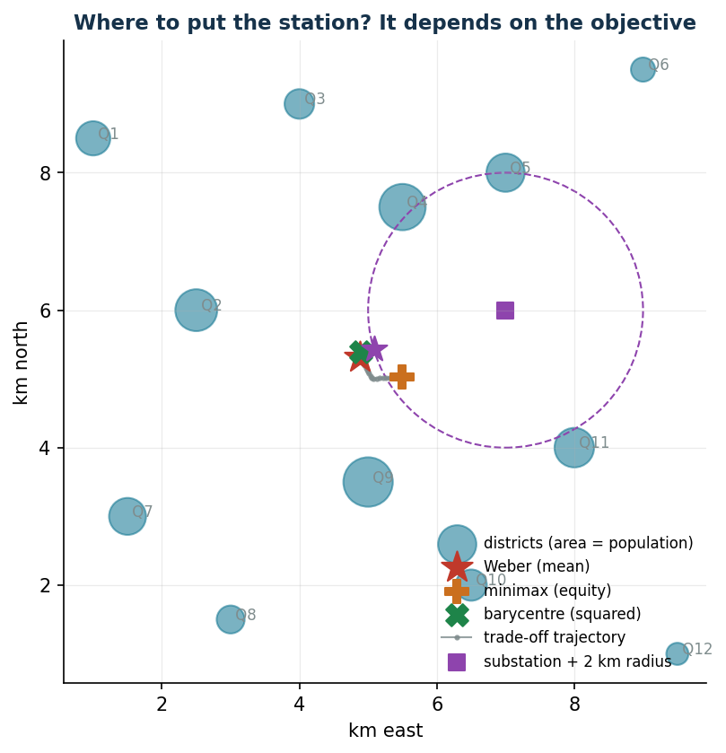
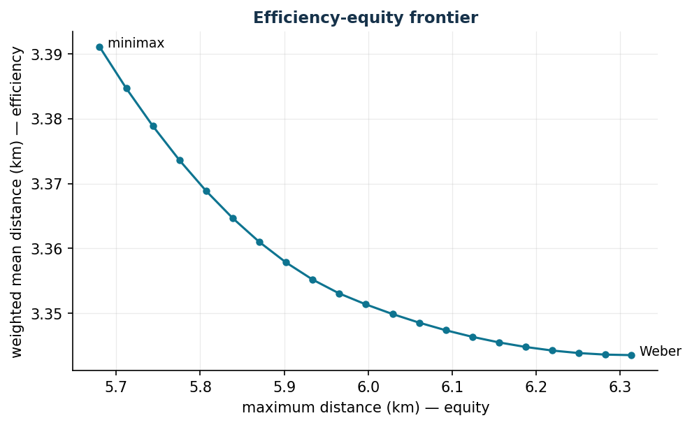

# Continuous location of a service

**Class:** convex NLP · **Script:** `python/lab09_location.py`

Where should a charging station, a micro-hub, a health-care post be placed in order
to be "close" to demand? It depends on what close means: **mean** distance
(efficiency), **maximum** (equity) or **squared** (centroid). Three objectives,
three different points on the map.

**The problem in words.** *We decide* the coordinates $(x, y)$. *The objective* is
the real managerial choice (mean / maximum / squared). *The constraints* delimit
the feasible area.

## Model

**Data (input of the model).**

| Symbol | Type | Meaning |
|---|---|---|
| $n$ | $\in \mathbb{Z}_{\ge 1}$ | number of demand points (districts), indexed by $i \in \{1, 2, \dots, n\}$ |
| $(a_i, b_i)$ | $\in \mathbb{Q}^2$ | coordinates of district $i$ (km) |
| $w_i$ | $\in \mathbb{Q}_{\ge 0}$ | weight of district $i$: population, demand or priority |
| $(a_0, b_0)$, $r$ | $\in \mathbb{Q}^2$, $\in \mathbb{Q}_{>0}$ | centre and radius of the possible geographic constraint (maximum distance from an infrastructure) |

**Decision variables.** We introduce the following $2$ free variables (they may
take any real value) and, for the minimax version, a non-negative auxiliary
variable:

$$
\begin{cases}
x = \text{east coordinate of the new facility (km)}\\[1ex]
y = \text{north coordinate of the new facility (km)}\\[1ex]
z = \text{maximum distance from the farthest district (minimax only)}
\end{cases}
$$

Using these variables, the models for the three classical objectives are the
following. **Weber** model (weighted mean distance):

$$
\begin{aligned}
\min ~~ \sum_{i=1}^{n} w_i \sqrt{(x - a_i)^2 + (y - b_i)^2} & & \\
\text{subject to} \quad x &\gtreqless 0, & \\
y &\gtreqless 0. &
\end{aligned}
$$

**Minimax** model (maximum distance):

$$
\begin{aligned}
\min ~~ z & & \\
\text{subject to} \quad \sqrt{(x - a_i)^2 + (y - b_i)^2} &\le z, & \forall i \in \{1, 2, \dots, n\}, \\
x &\gtreqless 0, & \\
y &\gtreqless 0, & \\
z &\ge 0. &
\end{aligned}
$$

Description of the objective functions and of the constraints of the two models:

- the convex objective function of the Weber model minimizes the total distance
  weighted by the districts (efficiency); the constraints on $x$ and $y$ define the
  variables, which are free;
- the objective function of the minimax model minimizes the distance of the farthest
  district (equity); the convex **covering** constraints impose that every district
  is at most at distance $z$ from the facility ($n$ constraints); the constraints on
  $x$, $y$ and $z$ define the variables;
- a third variant, **quadratic**: minimize
  $\sum_{i=1}^{n} w_i \bigl[ (x - a_i)^2 + (y - b_i)^2 \bigr]$, which has a
  closed-form solution (the weighted centroid $\tilde x = \sum_{i=1}^{n} w_i\, a_i \big/ \sum_{i=1}^{n} w_i$,
  and analogously for $y$).

Typical convex geographic constraints, to be added to any variant: rectangular
zone $x^{L} \le x \le x^{U}$, $y^{L} \le y \le y^{U}$; maximum distance from an
infrastructure $(x - a_0)^2 + (y - b_0)^2 \le r^2$.

The Weber model has no closed form and its objective function is not differentiable
at the points $(a_i, b_i)$: at the optimum the weighted unit "pulls" of the
districts cancel out. The optimum of the minimax is instead the centre of the
*smallest enclosing circle* of all the points: it depends only on the extreme
districts and ignores the weights — this is why it protects the outskirts.

!!! example "Worked example by hand (1D)"
    Customers at km 0, 4, 10 with weights 1, 1, 3. Weber = **weighted median** = 10;
    centroid = 6.8; minimax = 5. Three reasonable objectives, three different answers:
    the choice of the objective *is* the managerial decision.

## Case study

12 districts (weights 5–25 thousand inhabitants), constraint: within 2 km of the
electrical substation at (7, 6). Data in `data/localizzazione_quartieri.csv`.

The modelling trick: a variable $d_k \ge$ the Euclidean distance from district
$k$, imposed with the (convex) conic constraint $d_x^2 + d_y^2 \le d_k^2$; Weber
minimizes $\sum_k w_k d_k$, the minimax a variable $z$ with $d_k \le z$.

```text
Weighted centroid : (4.897, 5.397)
Weber             : (4.886, 5.310)  mean dist. 3.344 km  max 6.314 km
Minimax           : (5.496, 5.029)  mean dist. 3.391 km  max 5.680 km
Constrained Weber : (5.083, 5.429)  cost +0.2% (constraint active, optimum on boundary)
```



Weber and the centroid almost coincide (the weights are evenly distributed), but the
minimax moves more than half a kilometre towards the south-east to protect the
peripheral districts; the constraint of the substation costs very little (+0.2%):
discovering that a feared constraint is almost free is a managerial result as
important as the optimum itself.

## Sensitivity: the efficiency-equity frontier

The ε-constraint method: minimum mean distance with a cap $D$ on the maximum.



```text
cap D = 5.680 km: mean 3.391   (minimax solution)
cap D = 5.997 km: mean 3.351
cap D = 6.314 km: mean 3.344   (Weber solution)
```

The frontier is almost flat: guaranteeing 0.63 km less to the farthest district
costs only 47 metres of mean distance — equity here is "almost free", a very strong
argument in a public discussion. The opposite case (a steep frontier) would signal
a genuine efficiency-equity conflict.


## Code

The complete script of the chapter — data, model, solution, sensitivity and figures —
is [`python/lab09_location.py`](https://github.com/fabiofurini/operations-research-lab/blob/main/python/lab09_location.py)
(reproducible with `python3 python/lab09_location.py` from the `python/` folder).

??? example "Show the full script — `lab09_location.py`"

    ```python
    """Chapter 9 — Continuous location of a service (convex NLP).

    Case study: where to place a fast-charging station in a city with 12 districts,
    weighted by population.

    Contents:
      1. Weighted barycentre (squared distance): closed-form solution
      2. Weber point (Euclidean distance): Gurobi (conic reformulation)
      3. Minimax (protects the farthest district): reformulation with a variable z
      4. Trade-off alpha·mean + (1-alpha)·maximum: efficiency-equity curve
    """
    import gurobipy as gp
    import numpy as np
    import pandas as pd
    from gurobipy import GRB

    from stile import (ARANCIO, GRIGIO, ROSSO, TEAL, VERDE, intestazione, plt, salva_dat,
                       salva_dati, salva_figura, salva_tikz)

    rng = np.random.default_rng(7)

    # ----------------------------------------------------------------------
    # 1. DATA: 12 districts (coordinates in km, weight = population in thousands)
    # ----------------------------------------------------------------------
    nomi = [f"Q{k}" for k in range(1, 13)]
    coord = np.array([
        [1.0, 8.5], [2.5, 6.0], [4.0, 9.0], [5.5, 7.5], [7.0, 8.0], [9.0, 9.5],
        [1.5, 3.0], [3.0, 1.5], [5.0, 3.5], [6.5, 2.0], [8.0, 4.0], [9.5, 1.0]])
    peso = np.array([12.0, 18.0, 9.0, 22.0, 15.0, 6.0, 14.0, 8.0, 25.0, 10.0, 16.0, 5.0])
    salva_dati(pd.DataFrame({"district": nomi, "x": coord[:, 0], "y": coord[:, 1], "weight": peso}),
               "localizzazione_quartieri")


    def dist(p):
        return np.sqrt(((coord - p) ** 2).sum(axis=1))


    def f_weber(p):
        return float(peso @ dist(p))


    def f_max(p):
        return float(dist(p).max())


    def localizza(pesi=None, tetto=None, cabina=None, raggio=None):
        """Location with Gurobi (convex SOCP, certified global optimum).

        The trick: a variable d_k >= Euclidean distance from district k, imposed
        with the conic constraint dx_k^2 + dy_k^2 <= d_k^2 (d_k >= 0). With weights
        it minimises the weighted mean distance (Weber); without weights it minimises
        the maximum one (minimax). `tetto` imposes d_k <= cap; `cabina`/`raggio` the
        geographical constraint."""
        m = gp.Model("location")
        m.Params.OutputFlag = 0
        px = m.addVar(lb=-GRB.INFINITY, name="px")
        py = m.addVar(lb=-GRB.INFINITY, name="py")
        n = len(coord)
        d = m.addVars(n, name="d")
        for k in range(n):
            dx = m.addVar(lb=-GRB.INFINITY)
            dy = m.addVar(lb=-GRB.INFINITY)
            m.addConstr(dx == px - coord[k, 0])
            m.addConstr(dy == py - coord[k, 1])
            m.addQConstr(dx * dx + dy * dy <= d[k] * d[k])   # cone: d_k >= distance
        if tetto is not None:
            m.addConstrs((d[k] <= tetto for k in range(n)))
        if cabina is not None:
            m.addQConstr((px - cabina[0]) ** 2 + (py - cabina[1]) ** 2 <= raggio ** 2)
        if pesi is not None:                     # Weber: weighted mean
            m.setObjective(gp.quicksum(pesi[k] * d[k] for k in range(n)), GRB.MINIMIZE)
        else:                                    # minimax: maximum distance
            z = m.addVar(name="z")
            m.addConstrs((d[k] <= z for k in range(n)))
            m.setObjective(z, GRB.MINIMIZE)
        m.optimize()
        assert m.Status == GRB.OPTIMAL
        return np.array([px.X, py.X]), m.ObjVal


    # ----------------------------------------------------------------------
    # 2. THREE CLASSIC OBJECTIVES
    # ----------------------------------------------------------------------
    intestazione("Three optimal locations")
    baricentro = (peso[:, None] * coord).sum(axis=0) / peso.sum()   # closed form
    print(f"Weighted barycentre (squared dist.) : ({baricentro[0]:.3f}, {baricentro[1]:.3f}) km")

    weber, costo_weber = localizza(pesi=peso)
    print(f"Weber point (weighted mean dist.)   : ({weber[0]:.3f}, {weber[1]:.3f}) km, "
          f"cost {costo_weber:,.1f} (thousand inh. · km)")

    minimax, dist_minimax = localizza()
    print(f"Minimax (farthest district)         : ({minimax[0]:.3f}, {minimax[1]:.3f}) km, "
          f"maximum distance {dist_minimax:.3f} km")

    print(f"\nWith the Weber point: weighted mean distance {f_weber(weber) / peso.sum():.3f} km, "
          f"maximum {f_max(weber):.3f} km")
    print(f"With the minimax    : weighted mean distance {f_weber(minimax) / peso.sum():.3f} km, "
          f"maximum {f_max(minimax):.3f} km")

    # ----------------------------------------------------------------------
    # 3. EFFICIENCY-EQUITY FRONTIER (constraint method, epsilon-constraint):
    #    minimise the weighted mean distance imposing max_dist <= D
    # ----------------------------------------------------------------------
    intestazione("Efficiency-equity frontier (min mean with a cap on the maximum)")
    media_pesi = peso.sum()
    D_grid = np.linspace(f_max(minimax) + 1e-4, f_max(weber), 21)
    punti = []
    for D in D_grid:
        pos, _ = localizza(pesi=peso, tetto=D)
        punti.append((D, pos[0], pos[1], f_weber(pos) / media_pesi, f_max(pos)))
    comp = pd.DataFrame(punti, columns=["D_max", "x", "y", "mean_dist", "max_dist"])
    salva_dati(comp, "localizzazione_frontiera")
    for _, r in comp.iloc[::5].iterrows():
        print(f"  cap D = {r['D_max']:5.3f} km: position ({r['x']:5.2f}, {r['y']:5.2f}), "
              f"mean {r['mean_dist']:5.3f} km, max {r['max_dist']:5.3f} km")

    # ----------------------------------------------------------------------
    # 4. GEOGRAPHICAL CONSTRAINT: within 2 km of an electrical substation
    # ----------------------------------------------------------------------
    intestazione("Weber with a constraint: within R = 2 km of the substation at (7, 6)")
    cabina, R = np.array([7.0, 6.0]), 2.0
    pos_v, costo_v = localizza(pesi=peso, cabina=cabina, raggio=R)
    print(f"Constrained optimum: ({pos_v[0]:.3f}, {pos_v[1]:.3f}), cost {costo_v:,.1f}")
    print(f"Cost of the constraint: +{costo_v - costo_weber:,.1f} with respect to the free Weber "
          f"({(costo_v / costo_weber - 1) * 100:.1f}%)")
    attivo = np.isclose(((pos_v - cabina) ** 2).sum(), R**2, rtol=1e-3)
    print(f"The constraint is {'active (optimum on the boundary of the circle)' if attivo else 'not active'}")

    # ----------------------------------------------------------------------
    # 5. FIGURES (generated TikZ + pgfplots data + matplotlib preview)
    # ----------------------------------------------------------------------
    salva_dat(comp, "cap09_frontiera")

    r = ["% Map of the districts and optimal locations (generated by lab09_location.py)",
         "\\begin{tikzpicture}[scale=0.82, >=stealth]",
         "  \\draw[black!20, very thin] (0,0) grid[step=1] (10.5,10);",
         "  \\draw[->, black!50] (0,0) -- (10.8,0) node[below left, font=\\scriptsize] {km east};",
         "  \\draw[->, black!50] (0,0) -- (0,10.3) node[below left, rotate=90, font=\\scriptsize] {km north};"]
    for k, nome in enumerate(nomi):
        raggio = 0.11 * np.sqrt(peso[k])
        r.append(f"  \\fill[teal, opacity=0.45] ({coord[k, 0]:.2f},{coord[k, 1]:.2f}) "
                 f"circle ({raggio:.2f});")
        r.append(f"  \\node[font=\\tiny, text=black!55, anchor=west] at "
                 f"({coord[k, 0] + raggio:.2f},{coord[k, 1]:.2f}) {{{nome}}};")
    r.append("  % trajectory of the efficiency-equity trade-off")
    traj = " -- ".join(f"({rr['x']:.3f},{rr['y']:.3f})" for _, rr in comp.iterrows())
    r.append(f"  \\draw[black!45, thick, densely dotted] {traj};")
    r.append(f"  % geographical constraint: circle of the substation")
    r.append(f"  \\draw[viola, dashed, thick] ({cabina[0]},{cabina[1]}) circle ({R});")
    r.append(f"  \\node[rectangle, fill=viola, minimum size=2.2mm, inner sep=0] at "
             f"({cabina[0]},{cabina[1]}) {{}};")
    # labels at different angles to avoid overlaps (the points are close to each other)
    punti_not = [(weber, "rossomattone", 190, "Weber"),
                 (minimax, "arancio", -55, "minimax"),
                 (baricentro, "verde", 120, "barycentre"),
                 (pos_v, "viola", 35, "constrained Weber")]
    for pt, colore, angolo, etich in punti_not:
        r.append(f"  \\node[star, star points=5, fill={colore}, minimum size=3.2mm, inner sep=0pt,"
                 f" label={{[font=\\scriptsize, text={colore}, label distance=2.5mm]"
                 f"{angolo}:{etich}}}] at ({pt[0]:.3f},{pt[1]:.3f}) {{}};")
    r.append("\\end{tikzpicture}")
    salva_tikz("\n".join(r), "cap09_mappa")

    fig, ax = plt.subplots(figsize=(7.2, 6.2))
    ax.scatter(coord[:, 0], coord[:, 1], s=peso * 28, color=TEAL, alpha=0.55,
               label="districts (area = population)")
    for k, nome in enumerate(nomi):
        ax.annotate(f" {nome}", coord[k], fontsize=8, color=GRIGIO)
    ax.scatter(*weber, marker="*", s=300, color=ROSSO, zorder=5, label="Weber (mean)")
    ax.scatter(*minimax, marker="P", s=160, color=ARANCIO, zorder=5, label="minimax (equity)")
    ax.scatter(*baricentro, marker="X", s=140, color=VERDE, zorder=5, label="barycentre (squared)")
    ax.plot(comp["x"], comp["y"], ".-", color=GRIGIO, lw=1, ms=4, alpha=0.8,
            label="trade-off trajectory")
    cerchio = plt.Circle(cabina, R, fill=False, color="#8E44AD", ls="--")
    ax.add_patch(cerchio)
    ax.scatter(*cabina, marker="s", s=70, color="#8E44AD", label="substation + 2 km radius")
    ax.scatter(*pos_v, marker="*", s=200, color="#8E44AD", zorder=5)
    ax.set_xlabel("km east"); ax.set_ylabel("km north")
    ax.set_title("Where to put the station? It depends on the objective")
    ax.legend(fontsize=8, loc="lower right")
    ax.set_aspect("equal")
    salva_figura(fig, "cap09_mappa")

    fig, ax = plt.subplots()
    ax.plot(comp["max_dist"], comp["mean_dist"], "-o", color=TEAL, ms=4)
    for idx, etich in [(0, "minimax"), (20, "Weber")]:
        r = comp.iloc[idx]
        ax.annotate(f"  {etich}", (r["max_dist"], r["mean_dist"]), fontsize=9)
    ax.set_xlabel("maximum distance (km) — equity")
    ax.set_ylabel("weighted mean distance (km) — efficiency")
    ax.set_title("Efficiency-equity frontier")
    salva_figura(fig, "cap09_frontiera")

    print("\nDone: chapter 9.")
    ```

## Exercises

1. Recompute by hand the weighted centroid from the CSV data.
2. Weight of Q12 from 5 to 40: Weber migrates by 1.23 km; the minimax **does not
   move** (it ignores the weights).
3. Two facilities with assignment to the nearest one: why is the problem no longer
   convex?
4. Manhattan distance: show that Weber becomes an LP (weighted medians per
   coordinate).
5. Multiplier of the radius: with $r = 2 \to 2.1$ the cost drops from 535.79 to
   535.22.
