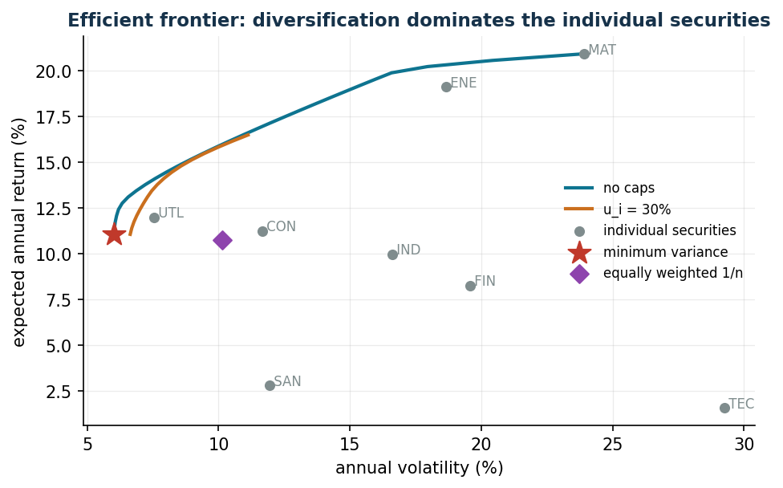
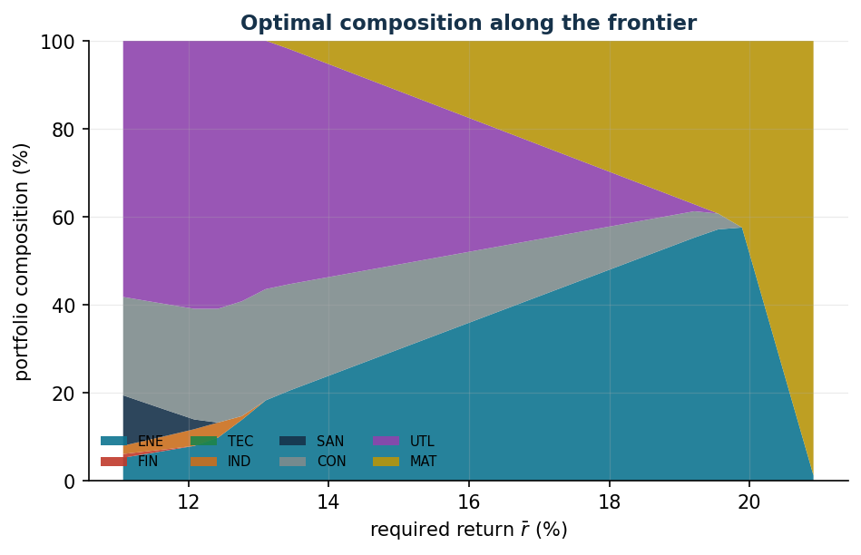

# The Markowitz portfolio

**Class:** convex QP · **Script:** `python/lab06_markowitz.py`

How much should we invest in each asset in order to balance expected return and
risk? The result is not a number but an **efficient frontier**: the complete menu
of trade-offs among which the decision maker chooses.

**The problem in words.** *We decide* the shares of capital $x_i$. *The objective*:
minimum variance of the portfolio. *The constraints*: shares summing to 1, minimum
expected return $\bar r$, bounds $\ell_i \le x_i \le u_i$.

## Model

**Data (input of the model).**

| Symbol | Type | Meaning |
|---|---|---|
| $n$ | $\in \mathbb{Z}_{\ge 1}$ | number of assets; the assets are indexed by $i \in \{1, 2, \dots, n\}$ |
| $\mu_i$ | $\in \mathbb{Q}$ | expected return of asset $i$ (per year) |
| $q_{ij}$ | $\in \mathbb{Q}$ | covariance between the returns of assets $i$ and $j$; the matrix $\boldsymbol Q = (q_{ij})$ is positive semidefinite ($\boldsymbol Q \succeq 0$) |
| $\bar r$ | $\in \mathbb{Q}$ | minimum required expected return |
| $\ell_i,\, u_i$ | $\in \mathbb{Q},\ 0 \le \ell_i \le u_i \le 1$ | minimum and maximum share that can be invested in asset $i$ |

**Decision variables.** We introduce the following $n$ non-negative variables:

$$
x_i = \text{share of capital invested in asset } i,
\qquad \forall i \in \{1, 2, \dots, n\}.
$$

Using these variables, a QP model for the problem is the following:

$$
\begin{aligned}
\min ~~ \sum_{i=1}^{n} \sum_{j=1}^{n} q_{ij}\, x_i\, x_j & & \\
\text{subject to} \quad \sum_{i=1}^{n} \mu_i\, x_i &\ge \bar r, & \\
\sum_{i=1}^{n} x_i &= 1, & \\
x_i &\le u_i, & \forall i \in \{1, 2, \dots, n\}, \\
x_i &\ge \ell_i, & \forall i \in \{1, 2, \dots, n\}.
\end{aligned}
$$

Description of the objective function and of the constraints:

- the quadratic objective function minimizes the variance of the return of the
  portfolio; it contains the covariances $q_{ij}$, and this is where
  diversification comes from: combining weakly correlated assets lowers the overall
  risk below that of the individual components;
- the linear **return** constraint imposes that the expected return of the
  portfolio reaches the threshold $\bar r$: it is the "dial" with which the
  efficient frontier is traced out, and its multiplier tells us how much variance
  each additional point of return costs (one linear constraint);
- the linear **budget** constraint imposes that the whole capital is invested (one
  linear constraint);
- the linear **cap** constraints $x_i \le u_i$ are the caps per asset, typical
  regulatory or mandate constraints ($n$ linear constraints);
- the constraints $x_i \ge \ell_i$ define the variables of the model (with
  $\ell_i = 0$: short selling is forbidden).

Equivalent formulations:
$\max\, \sum_{i=1}^{n} \mu_i x_i - \lambda \sum_{i=1}^{n}\sum_{j=1}^{n} q_{ij} x_i x_j$
(mean-variance) and $\max\, \sum_{i=1}^{n} \mu_i x_i$ with variance $\le \bar\sigma^2$
(maximum return with bounded risk). By varying $\bar r$ (or $\lambda$, or
$\bar\sigma$) the same frontier is traced out.

Every covariance matrix is positive semidefinite, hence the QP is convex and the
optimum that is found is a **certified global** one.

!!! example "Worked example by hand (2 uncorrelated assets)"
    $\sigma_1 = 20\%$, $\sigma_2 = 30\%$: minimizing
    $0.04 x_1^2 + 0.09 (1 - x_1)^2$ gives $x_1 = 9/13 = 69.2\%$ and a
    portfolio volatility of $16.6\%$ — **less risky than either of the two assets**.

## Case study

Eight sector ETFs, $\boldsymbol\mu$ and $\boldsymbol Q$ **estimated** from 60
simulated monthly returns (`data/markowitz_rendimenti.csv`). Annualized statistics:

```text
ENE: mu = 19.12%  vol = 18.65%      SAN: mu =  2.80%  vol = 11.93%
FIN: mu =  8.27%  vol = 19.59%      CON: mu = 11.25%  vol = 11.67%
TEC: mu =  1.58%  vol = 29.27%      UTL: mu = 11.99%  vol =  7.53%
IND: mu =  9.97%  vol = 16.60%      MAT: mu = 20.93%  vol = 23.93%
```

```text
Global minimum variance : return 11.06%, volatility  6.03%
Equally weighted (1/n)  : return 10.74%, volatility 10.13%
Min-variance composition: ENE 5.2%  IND 1.9%  SAN 11.5%  CON 22.3%  UTL 58.3%
```





Three messages: (1) the minimum-variance portfolio (volatility 6%) is much less
risky than the best individual asset (UTL, 7.5%) while still returning 11%; (2) the
equally weighted $1/n$ portfolio — the "I know nothing" strategy — is clearly
dominated: the same region of return but almost twice the volatility; (3) the cap
$u_i = 30\%$ cuts off the upper part of the frontier — the cost of the mandate
constraints can be *seen* as the distance between the two curves.

## Sensitivity

```text
r_min =  6%: vol 6.03%   (constraint NOT active: same as min variance)
r_min =  8%: vol 6.03%   (same)
r_min = 10%: vol 6.03%   (same)
r_min = 12%: vol 6.10%   d(variance)/d(r_min) ~ 0.0221
```

Up to $\bar r = 11\%$ the return constraint is *inactive*: the minimum-variance
portfolio already returns 11.06%, hence asking for "at least 8%" costs nothing and
the multiplier is zero. Only beyond 11.06% does the constraint bite, and every
additional point of return is paid for in variance (multiplier $\approx 0.022$ at
$\bar r = 12\%$).

!!! warning "The fragility of the estimates"
    In the simulated data the asset TEC has a true $\alpha$ of 11% per year, but over
    60 months the *estimated* return is 1.6%: the noise dominates. The estimates of
    the expected returns are far more unstable than those of the covariances, and
    optimized portfolios chase the estimation errors. Remedies: the constraints
    $u_i$, shrinkage of the estimates, or optimizing risk only (minimum variance).


## Code

The complete script of the chapter — data, model, solution, sensitivity and figures —
is [`python/lab06_markowitz.py`](https://github.com/fabiofurini/operations-research-lab/blob/main/python/lab06_markowitz.py)
(reproducible with `python3 python/lab06_markowitz.py` from the `python/` folder).

??? example "Show the full script — `lab06_markowitz.py`"

    ```python
    """Chapter 6 — Markowitz portfolio (convex QP).

    Case study: 8 securities (sector ETFs), 60 monthly returns simulated with a
    one-factor market model + idiosyncratic noise.

    Contents:
      1. Estimation of mu and Q from the historical data
      2. Global minimum-variance portfolio and portfolio with a minimum return
      3. Efficient frontier and composition along the frontier
      4. Effect of the per-security upper bounds (u_i)
    """
    import gurobipy as gp
    import numpy as np
    import pandas as pd
    from gurobipy import GRB

    from stile import (ARANCIO, CICLO, GRIGIO, ROSSO, TEAL, intestazione, plt, salva_dat,
                       salva_dati, salva_figura)

    rng = np.random.default_rng(42)

    # ----------------------------------------------------------------------
    # 1. DATA: 60 months of simulated returns (one-factor model)
    # ----------------------------------------------------------------------
    titoli = ["ENE", "FIN", "TEC", "IND", "SAN", "CON", "UTL", "MAT"]
    n, T = len(titoli), 60
    beta = np.array([1.1, 1.3, 1.5, 1.0, 0.6, 0.8, 0.4, 1.2])       # market exposure
    alfa_ann = np.array([0.05, 0.06, 0.11, 0.05, 0.045, 0.05, 0.035, 0.06])  # excess return
    sigma_idio = np.array([0.05, 0.055, 0.07, 0.04, 0.03, 0.035, 0.02, 0.06])  # monthly idio vol

    mercato = rng.normal(0.004, 0.035, T)                 # monthly market factor
    R = (alfa_ann[None, :] / 12 + np.outer(mercato, beta)
         + rng.normal(0, sigma_idio, (T, n)))             # T x n matrix of returns

    rend = pd.DataFrame(R, columns=titoli)
    rend.insert(0, "month", range(1, T + 1))
    salva_dati(rend, "markowitz_rendimenti")

    mu = R.mean(axis=0) * 12                # annualised expected return
    Q = np.cov(R.T) * 12                    # annualised covariance
    vol = np.sqrt(np.diag(Q))

    intestazione("Statistics of the securities (annualised)")
    for i, tt in enumerate(titoli):
        print(f"  {tt}: mu = {mu[i]:6.2%}   vol = {vol[i]:6.2%}")


    def portafoglio(r_min=None, u=1.0):
        """QP: minimum variance with optional minimum return and per-security cap."""
        m = gp.Model("markowitz")
        m.Params.OutputFlag = 0
        x = m.addVars(n, ub=u, name="x")
        m.addConstr(x.sum() == 1, name="budget")
        if r_min is not None:
            m.addConstr(gp.quicksum(mu[i] * x[i] for i in range(n)) >= r_min, name="return")
        m.setObjective(gp.quicksum(Q[i, j] * x[i] * x[j]
                                   for i in range(n) for j in range(n)), GRB.MINIMIZE)
        m.optimize()
        if m.Status != GRB.OPTIMAL:
            return None, None, None
        w = np.array([x[i].X for i in range(n)])
        return w, float(mu @ w), float(np.sqrt(w @ Q @ w))


    # ----------------------------------------------------------------------
    # 2. NOTABLE PORTFOLIOS
    # ----------------------------------------------------------------------
    intestazione("Notable portfolios")
    w_mv, r_mv, v_mv = portafoglio()
    print(f"Global minimum variance : return {r_mv:6.2%}, volatility {v_mv:6.2%}")
    w_eq = np.ones(n) / n
    print(f"Equally weighted (1/n)  : return {mu @ w_eq:6.2%}, "
          f"volatility {np.sqrt(w_eq @ Q @ w_eq):6.2%}")
    r_obb = 0.08
    w_8, r_8, v_8 = portafoglio(r_min=r_obb)
    print(f"Minimum return 8%       : return {r_8:6.2%}, volatility {v_8:6.2%}")
    print("\nComposition (weights > 1%):")
    for nome, w in [("min variance", w_mv), ("min return 8%", w_8)]:
        quote = ", ".join(f"{titoli[i]} {w[i]:.1%}" for i in range(n) if w[i] > 0.01)
        print(f"  {nome:>14}: {quote}")

    # ----------------------------------------------------------------------
    # 3. EFFICIENT FRONTIER (with and without the cap u_i = 30%)
    # ----------------------------------------------------------------------
    intestazione("Efficient frontier")
    r_grid = np.linspace(r_mv, mu.max() * 0.999, 30)
    frontiere = {}
    for u, etich in [(1.0, "no caps"), (0.30, "u_i = 30%")]:
        punti, composizioni = [], []
        for r in r_grid:
            w, rr, vv = portafoglio(r_min=r, u=u)
            if w is not None:
                punti.append((vv, rr))
                composizioni.append(w)
        frontiere[etich] = (np.array(punti), np.array(composizioni))
        print(f"  frontier '{etich}': {len(punti)} points computed")

    pf = frontiere["no caps"][0]
    salva_dati(pd.DataFrame({"volatility": pf[:, 0], "return": pf[:, 1]}),
               "markowitz_frontiera")

    # ----------------------------------------------------------------------
    # 4. FIGURES (pgfplots data + matplotlib preview)
    # ----------------------------------------------------------------------
    pf_lim = frontiere["u_i = 30%"][0]
    salva_dat(pd.DataFrame({"vol": pf[:, 0] * 100, "ret": pf[:, 1] * 100}), "cap06_front_libera")
    salva_dat(pd.DataFrame({"vol": pf_lim[:, 0] * 100, "ret": pf_lim[:, 1] * 100}),
              "cap06_front_limiti")
    salva_dat(pd.DataFrame({"security": titoli, "vol": vol * 100, "mu": mu * 100}), "cap06_titoli")
    salva_dat(pd.DataFrame({
        "name": ["minvar", "equalweight"],
        "vol": [v_mv * 100, float(np.sqrt(w_eq @ Q @ w_eq)) * 100],
        "ret": [r_mv * 100, float(mu @ w_eq) * 100],
    }), "cap06_speciali")
    punti_sl, comp_sl = frontiere["no caps"]
    salva_dat(pd.DataFrame({"ret": punti_sl[:, 1] * 100,
                            **{titoli[i]: comp_sl[:, i] * 100 for i in range(n)}}),
              "cap06_composizione")

    fig, ax = plt.subplots()
    for (etich, (punti, _)), colore in zip(frontiere.items(), [TEAL, ARANCIO]):
        ax.plot(punti[:, 0] * 100, punti[:, 1] * 100, "-", color=colore, lw=2, label=etich)
    ax.scatter(vol * 100, mu * 100, color=GRIGIO, s=28, zorder=3, label="individual securities")
    for i, tt in enumerate(titoli):
        ax.annotate(" " + tt, (vol[i] * 100, mu[i] * 100), fontsize=8, color=GRIGIO)
    ax.scatter([v_mv * 100], [r_mv * 100], marker="*", s=200, color=ROSSO, zorder=4,
               label="minimum variance")
    ax.scatter([np.sqrt(w_eq @ Q @ w_eq) * 100], [mu @ w_eq * 100], marker="D", s=60,
               color="#8E44AD", zorder=4, label="equally weighted 1/n")
    ax.set_xlabel("annual volatility (%)")
    ax.set_ylabel("expected annual return (%)")
    ax.set_title("Efficient frontier: diversification dominates the individual securities")
    ax.legend(fontsize=8)
    salva_figura(fig, "cap06_frontiera")

    punti, comp = frontiere["no caps"]
    fig, ax = plt.subplots()
    ax.stackplot(punti[:, 1] * 100, (comp.T * 100), labels=titoli, colors=CICLO, alpha=0.9)
    ax.set_xlabel("required return $\\bar r$ (%)")
    ax.set_ylabel("portfolio composition (%)")
    ax.set_title("Optimal composition along the frontier")
    ax.legend(fontsize=7, ncol=4, loc="lower left")
    ax.set_ylim(0, 100)
    salva_figura(fig, "cap06_composizione")

    # sensitivity: price of the return constraint (multiplier ~ slope of the frontier)
    intestazione("Sensitivity: cost (in variance) of the required return")
    for r in [0.06, 0.08, 0.10, 0.12]:
        w, rr, vv = portafoglio(r_min=r)
        if w is None:
            print(f"  r_min = {r:.0%}: infeasible (beyond the maximum return)")
            continue
        eps = 0.002
        w2, _, vv2 = portafoglio(r_min=r + eps)
        pend = (vv2**2 - vv**2) / eps if w2 is not None else float("nan")
        print(f"  r_min = {r:5.1%}: vol {vv:6.2%}  |  d(variance)/d(r_min) ~ {pend:7.4f}")

    print("\nDone: chapter 6.")
    ```

## Exercises

1. Two assets with $\rho = 0.5$: is diversification still worthwhile?
   ($x_1 = 6/7$, vol 19.6%)
2. Frontiers with $u = 1$, $0.3$, $0.2$: maximum return 20.9% / 16.7% / 14.7%.
3. Run again with a different seed: how much do the compositions change?
4. Minimum tracking error with return ≥ 12% (TE = 1.1% per year).
5. Quadratic transaction costs starting from the equally weighted portfolio.
