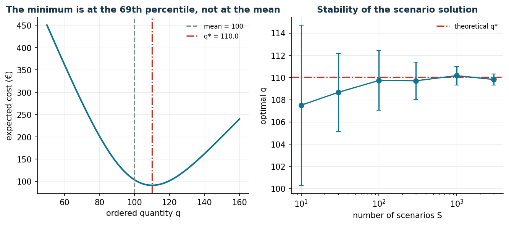
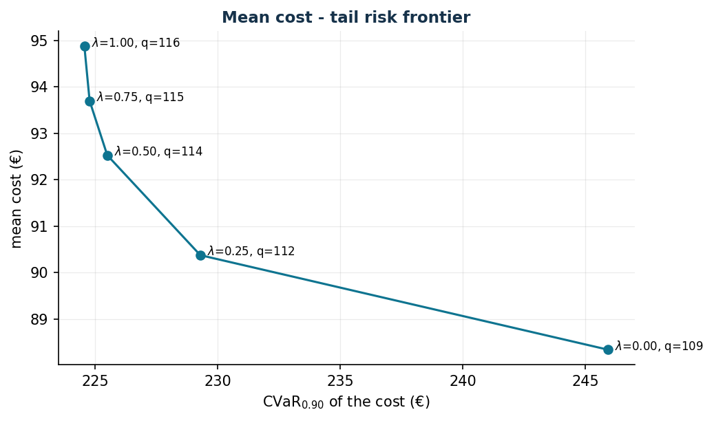

# The Newsvendor and its variants

**Class:** 1D convex / scenario-based stochastic LP · **Script:** `python/lab12_newsvendor.py`

[](https://colab.research.google.com/github/fabiofurini/operations-research-lab/blob/main/notebooks/lab12_newsvendor.ipynb)

Choosing a quantity **before** observing demand: fashion and seasonal goods, fresh
products, drugs, hotel capacity. It is the gateway to stochastic optimization, with
a clear-cut result: **the optimal quantity is not the average demand**.

**The problem in words.** *We decide* the single quantity $q$. *The objective*: the
minimum expected cost of the error — too much ($c_o$ per unsold unit) or too little
($c_u$ per lost sale).

## Basic model and the quantile rule

**Data (input of the model).**

| Symbol | Type | Meaning |
|---|---|---|
| $D$ | random variable $\ge 0$ | demand, with cumulative distribution function $F$; an exception to the convention on capital letters, to follow the literature: the random variable in upper case, its realizations in lower case ($d_s$) |
| $c_u$ | $\in \mathbb{Q}_{> 0}$ | unit *underage* cost (unmet demand): lost margin plus any penalty (€) |
| $c_o$ | $\in \mathbb{Q}_{> 0}$ | unit *overage* cost (unsold unit): cost minus salvage value (€) |

With selling price $p$, purchase cost $c$ and salvage value $v \le c$ (all in
$\mathbb{Q}_{>0}$): $c_u = p - c$ and $c_o = c - v$.

**Decision variable.** We introduce a non-negative variable:

$$
q = \text{quantity ordered before observing demand } D.
$$

Using this variable, the model for the problem is the following:

$$
\begin{aligned}
\min ~~ c_o\, \mathbb{E}\bigl[(q - D)^+\bigr] + c_u\, \mathbb{E}\bigl[(D - q)^+\bigr] & & \\
\text{subject to} \quad q &\ge 0. &
\end{aligned}
$$

Description of the objective function and of the constraint:

- the convex objective function minimizes the expected cost of the error: overage
  $(q - D)^+$ charged at $c_o$ and underage $(D - q)^+$ charged at $c_u$ (the symbol
  $(x)^+ = \max\{x, 0\}$ denotes the positive part);
- the non-negativity constraint defines the variable of the model.

If $F$ is continuous, the optimum satisfies the **quantile rule**:

$$
F(\tilde q) = \alpha = \frac{c_u}{c_u + c_o}
\qquad\Longrightarrow\qquad
\tilde q = F^{-1}(\alpha).
$$

Marginal reasoning: the $q$-th extra unit yields $c_u$ if demand absorbs it
(probability $1 - F(q)$) and costs $c_o$ if it remains unsold (probability $F(q)$);
it is worth ordering as long as $c_u\,(1 - F(q)) \ge c_o\,F(q)$, that is, as long as
$F(q) \le c_u/(c_u + c_o)$.

!!! example "Worked example by hand (discrete demand)"
    $D \in \{80, 100, 120\}$ equally likely, $c_u = 9$, $c_o = 4$ (hence
    $\alpha = 9/13 = 0{,}6923$): $C(80) = 180$, $C(100) = 86{,}7$,
    $C(120) = \mathbf{80}$. We order the **maximum**: with $c_u \gg c_o$ running short
    costs more than twice as much as running long. (Discrete rule: the smallest $q$
    with $F(q) \ge 0{,}6923$, that is, $\tilde q = 120$.)

## Case study

Bakery: $p = 15$, $c = 6$, $v = 2$ € → $c_u = 9$, $c_o = 4$; $D$ normally
distributed $(100, 20)$.

```text
alpha* = 9/13 = 0.6923
q* = F^-1(0.6923) = 110.05 units   (mean = 100)
expected cost at q*: 91.43 EUR    at q = mean: 103.72 EUR
```



## The scenario-based linear formulation

When $F$ is not known in closed form — the normal situation in a company — one uses
scenarios. New model data: the number of scenarios $k \in \mathbb{Z}_{\ge 1}$,
indexed by $s \in \{1, 2, \dots, k\}$; for each scenario, the demand
$d_s \in \mathbb{Q}_{\ge 0}$ and the probability $\pi_s \in \mathbb{Q}_{\ge 0}$, with
$\sum_{s=1}^{k} \pi_s = 1$. Besides $q$, we introduce the following $2\,k$
non-negative variables:

$$
\begin{cases}
o_s = \text{overage (unsold units) in scenario } s\\[1ex]
u_s = \text{underage (unmet demand) in scenario } s
\end{cases}
\qquad \forall s \in \{1, 2, \dots, k\}.
$$

Using these variables, an LP model for the problem is the following:

$$
\begin{aligned}
\min ~~ \sum_{s=1}^{k} \pi_s \bigl( c_o\, o_s + c_u\, u_s \bigr) & & \\
\text{subject to} \quad o_s &\ge q - d_s, & \forall s \in \{1, 2, \dots, k\}, \\
u_s &\ge d_s - q, & \forall s \in \{1, 2, \dots, k\}, \\
q &\ge 0, & \\
o_s,\ u_s &\ge 0, & \forall s \in \{1, 2, \dots, k\}.
\end{aligned}
$$

Description of the objective function and of the constraints:

- the linear objective function is the weighted average, over the scenarios, of the
  overage and underage costs: the "scenario-based" version of the expected cost of
  the basic model;
- the linear **overage** and **underage** constraints define $o_s$ and $u_s$ starting
  from the only genuine decision $q$; together with the non-negativity conditions
  they realize the positive parts ($2\,k$ linear constraints);
- the constraints on $q$, $o_s$ and $u_s$ define the variables of the model.

The **positive-part trick**: the objective pushes $o_s$ and $u_s$ down onto the
values $\max\{q - d_s, 0\}$ and $\max\{d_s - q, 0\}$ without binary variables — the
same mechanism returns in the CVaR and in the SVM.

```text
LP with k = 600 scenarios: q = 108.61
empirical quantile at 69.23%: 108.60   (they coincide: it is a theorem)
VSS: decision q = E[D] = 100 costs 99.50; stochastic q costs 88.33
     value of the stochastic solution = 11.17 EUR per cycle
```

The *value of the stochastic solution* (VSS) is worth 11.17 € per cycle here, 11% of
the cost: it is the gain from **modelling** uncertainty instead of replacing it with
the mean. Below 100 scenarios, however, the optimal $q$ swings by ±3 units from one
estimate to the next: scenarios are themselves a sample, and the decision inherits
their variance.

## Service levels and risk

```text
cycle service level 90%: q = 125.63  (cost +23.41 EUR over the economic optimum)
cycle service level 95%: q = 132.90  (cost +45.59)
cycle service level 99%: q = 146.53  (cost +95.56)
fill rate at q*: 96.06%   probability of no stockout at q*: 69.23%
```

!!! warning "Do not confuse the service levels"
    At $\tilde q = 110$ the probability of avoiding a stock-out is only 69%, but the
    *fill rate* (share of demand served on average) is 96%: different measures that
    contracts often confuse. Promising "95% probability of full coverage" costs
    +45.59 € per cycle compared with the economic optimum; promising "95% fill rate"
    is almost free. Read the SLA carefully before signing it.

With the linear formulation of the CVaR we minimize
$(1-\lambda)\,\mathbb{E}[\text{cost}] + \lambda\, \mathrm{CVaR}_{0.90}(\text{cost})$:

```text
lambda = 0.00: q = 108.61  mean cost 88.33  CVaR90 245.93
lambda = 0.25: q = 112.45  mean cost 90.37  CVaR90 229.29
lambda = 0.50: q = 114.48  mean cost 92.52  CVaR90 225.49
lambda = 1.00: q = 116.17  mean cost 94.87  CVaR90 224.56
```



The risk-averse decision maker orders more (from 108.6 to 116.2 units): pays 6.5 €
more on average in order to cut by 21.4 € the mean cost of the worst 10% of the
scenarios. Most of the protection is already obtained with $\lambda = 0{,}25$: the
frontier is steep at the beginning and flat afterwards.

## Multi-product with a shared budget

Three cakes with *correlated* demands ($\rho = 0{,}7$: the holidays go well or badly
for everyone together) and a production budget of 1200 €:

```text
  product   | q without budget | q with budget
 panettone  |            111.1 |          99.3
 pandoro    |             91.5 |          75.4
 torrone    |             65.9 |          56.8
Spend: 1200/1200   shadow price of the budget: -0.553
```

The binding budget compresses the three quantities below their respective optimal
quantiles, but not proportionally: the cut depends on the ratio $c_u/c_o$ and on the
unit cost of each product. The dual says that one more euro of budget would reduce
the expected cost by 0.55 €: a 55% return that would justify almost any financing.
Moreover, the high correlation removes the diversification benefit: the three
products fail together.


## Code

The complete script of the chapter — data, model, solution, sensitivity and figures —
is [`python/lab12_newsvendor.py`](https://github.com/fabiofurini/operations-research-lab/blob/main/python/lab12_newsvendor.py)
(reproducible with `python3 python/lab12_newsvendor.py` from the `python/` folder).

The same code is also available as a notebook — [`notebooks/lab12_newsvendor.ipynb`](https://github.com/fabiofurini/operations-research-lab/blob/main/notebooks/lab12_newsvendor.ipynb) — which opens in Colab from the badge at the top of the page and runs in the browser, with nothing to install.

??? example "Show the full script — `lab12_newsvendor.py`"

    ```python
    """Chapter 12 — The Newsvendor and its variants (scenario-based stochastic LP).

    Case study: a bakery deciding how many artisan panettoni to produce.
    Price p = 15 €, cost c = 6 €, salvage v = 2 € -> Cu = 9, Co = 4.
    Normal demand with mean 100 and standard deviation 20

    Contents:
      1. Quantile rule: alpha* = 9/13 = 0.6923 -> q* ~ 110
      2. Scenario LP: it coincides with the empirical quantile
      3. Value of the stochastic solution (VSS) and stability in the number of scenarios
      4. Service constraints (cycle service level, fill rate)
      5. Risk aversion: mean cost - CVaR frontier
      6. Multi-product with a shared budget and correlated demands
    """
    import gurobipy as gp
    import numpy as np
    import pandas as pd
    from gurobipy import GRB
    from scipy import stats

    from stile import (ARANCIO, GRIGIO, ROSSO, TEAL, VERDE, intestazione, plt, salva_dat,
                       salva_dati, salva_figura)

    rng = np.random.default_rng(42)

    p, c, v = 15.0, 6.0, 2.0
    Cu, Co = p - c, c - v                 # 9 and 4
    mu_d, sigma_d = 100.0, 20.0

    # ----------------------------------------------------------------------
    # 1. QUANTILE RULE (analytical solution)
    # ----------------------------------------------------------------------
    intestazione("Quantile rule")
    alpha_star = Cu / (Cu + Co)
    q_star = stats.norm.ppf(alpha_star, mu_d, sigma_d)
    print(f"Critical fractile alpha* = Cu/(Cu+Co) = {Cu:.0f}/{Cu + Co:.0f} = {alpha_star:.4f}")
    print(f"Optimal quantity q* = F^-1({alpha_star:.4f}) = {q_star:.2f} units (mean = {mu_d:.0f})")


    def costo_atteso(q):
        """E[Co(q-D)^+ + Cu(D-q)^+] for normal demand (normal loss function)."""
        z = (q - mu_d) / sigma_d
        # E[(D-q)^+] = sigma*(phi(z) - z*(1-Phi(z)))
        perdita = sigma_d * (stats.norm.pdf(z) - z * (1 - stats.norm.cdf(z)))
        ecc = q - mu_d + perdita          # E[(q-D)^+] = q - mu + E[(D-q)^+]
        return Co * ecc + Cu * perdita


    print(f"Expected cost at q*: {costo_atteso(q_star):.2f} €  |  at q = mean: "
          f"{costo_atteso(mu_d):.2f} €")

    qq = np.linspace(50, 160, 400)
    salva_dat(pd.DataFrame({"q": qq, "cost": [costo_atteso(q) for q in qq]}), "cap12_costo")

    # ----------------------------------------------------------------------
    # 2. SCENARIO LP
    # ----------------------------------------------------------------------
    intestazione(f"Scenario LP (S = {600})")
    S = 600   # with the pip licence (2000 vars/constraints) the CVaR requires S <= 600
    dom = np.maximum(rng.normal(mu_d, sigma_d, S), 0.0)
    salva_dati(pd.DataFrame({"scenario": range(1, S + 1), "demand": dom}), "newsvendor_scenari")


    def newsvendor_lp(dom_s, prob=None, lam=0.0, alpha_cvar=0.90):
        """LP: min (1-lam)·expected cost + lam·CVaR_alpha(cost). lam=0 -> risk neutral."""
        Sn = len(dom_s)
        pi = np.full(Sn, 1 / Sn) if prob is None else prob
        m = gp.Model("newsvendor")
        m.Params.OutputFlag = 0
        q = m.addVar(name="q")
        o = m.addVars(Sn, name="o")                 # overage
        u = m.addVars(Sn, name="u")                 # underage
        m.addConstrs((o[s] >= q - dom_s[s] for s in range(Sn)), name="over")
        m.addConstrs((u[s] >= dom_s[s] - q for s in range(Sn)), name="under")
        costo_s = {s: Co * o[s] + Cu * u[s] for s in range(Sn)}
        atteso = gp.quicksum(pi[s] * costo_s[s] for s in range(Sn))
        if lam > 0:
            eta = m.addVar(lb=-GRB.INFINITY, name="eta")
            xi = m.addVars(Sn, name="xi")
            m.addConstrs((xi[s] >= costo_s[s] - eta for s in range(Sn)), name="cvar")
            cvar = eta + gp.quicksum(pi[s] * xi[s] for s in range(Sn)) / (1 - alpha_cvar)
            m.setObjective((1 - lam) * atteso + lam * cvar, GRB.MINIMIZE)
        else:
            m.setObjective(atteso, GRB.MINIMIZE)
        m.optimize()
        assert m.Status == GRB.OPTIMAL
        costi = np.array([Co * max(q.X - d, 0) + Cu * max(d - q.X, 0) for d in dom_s])
        return q.X, float(costi @ pi), costi


    q_lp, costo_lp, costi_s = newsvendor_lp(dom)
    q_emp = np.quantile(dom, alpha_star)
    print(f"optimal q of the LP: {q_lp:.2f}  |  empirical quantile at {alpha_star:.2%}: {q_emp:.2f}")
    print(f"Expected cost (on the scenarios): {costo_lp:.2f} €  |  theoretical: {costo_atteso(q_lp):.2f} €")

    # ----------------------------------------------------------------------
    # 3. VSS AND STABILITY
    # ----------------------------------------------------------------------
    intestazione("Value of the stochastic solution (VSS)")
    costi_det = np.array([Co * max(mu_d - d, 0) + Cu * max(d - mu_d, 0) for d in dom])
    print(f"'Naive' decision q = E[D] = {mu_d:.0f}: expected cost {costi_det.mean():.2f} €")
    print(f"Stochastic decision q = {q_lp:.1f}    : expected cost {costo_lp:.2f} €")
    print(f"VSS = {costi_det.mean() - costo_lp:.2f} € per selling cycle")

    intestazione("Stability: optimal q as the number of scenarios varies")
    righe = []
    for Sn in [10, 30, 100, 300, 1000, 3000]:
        stime = []
        for rep in range(30):
            dd = np.maximum(rng.normal(mu_d, sigma_d, Sn), 0)
            stime.append(np.quantile(dd, alpha_star))
        righe.append((Sn, np.mean(stime), np.std(stime)))
        print(f"  S = {Sn:5d}: mean q {np.mean(stime):7.2f}, std dev across replications {np.std(stime):5.2f}")
    stab = pd.DataFrame(righe, columns=["S", "q_mean", "q_std"])
    salva_dat(stab, "cap12_stabilita")

    # ----------------------------------------------------------------------
    # 4. SERVICE CONSTRAINTS
    # ----------------------------------------------------------------------
    intestazione("Service levels")
    for beta in [0.90, 0.95, 0.99]:
        q_sl = stats.norm.ppf(beta, mu_d, sigma_d)
        extra = costo_atteso(q_sl) - costo_atteso(q_star)
        print(f"  cycle service level {beta:.0%}: q = {q_sl:6.2f} "
              f"(cost +{extra:5.2f} € with respect to the economic optimum)")
    q_fill = q_star
    fill = 1 - (costo_atteso(q_star) / Cu - Co / Cu * 0) / mu_d  # for teaching display only
    perdita_att = sigma_d * (stats.norm.pdf((q_star - mu_d) / sigma_d)
                             - (q_star - mu_d) / sigma_d
                             * (1 - stats.norm.cdf((q_star - mu_d) / sigma_d)))
    print(f"  fill rate at q*: {1 - perdita_att / mu_d:.2%} "
          f"(the probability of NOT having a stock-out is instead {alpha_star:.2%})")

    # ----------------------------------------------------------------------
    # 5. RISK AVERSION: cost-CVaR frontier
    # ----------------------------------------------------------------------
    intestazione("Mean cost - CVaR frontier (alpha = 0.90)")
    alpha_cv = 0.90
    front = []
    for lam in [0, 0.25, 0.5, 0.75, 1.0]:
        q_l, cm, costi_l = newsvendor_lp(dom, lam=lam, alpha_cvar=alpha_cv)
        var_l = np.quantile(costi_l, alpha_cv)
        cvar_l = costi_l[costi_l >= var_l - 1e-9].mean()
        front.append((lam, q_l, cm, cvar_l))
        print(f"  lambda = {lam:4.2f}: q = {q_l:7.2f}, mean cost = {cm:6.2f}, "
              f"CVaR90 = {cvar_l:6.2f}")
    front = pd.DataFrame(front, columns=["lam", "q", "mean_cost", "cvar"])
    salva_dat(front, "cap12_frontiera_cvar")
    print("Increasing lambda means ordering more: it costs on average, it protects in the worst scenarios.")

    # ----------------------------------------------------------------------
    # 6. MULTI-PRODUCT WITH BUDGET AND CORRELATED DEMANDS
    # ----------------------------------------------------------------------
    intestazione("Multi-product: 3 sweets, production budget 1200 €")
    nomi_p = ["panettone", "pandoro", "torrone"]
    mu_m = np.array([100.0, 80.0, 60.0])
    sig_m = np.array([20.0, 25.0, 15.0])
    costi_c = np.array([6.0, 5.0, 4.0])
    Cu_m = np.array([9.0, 7.0, 5.0])
    Co_m = np.array([4.0, 3.5, 2.5])
    rho_corr = 0.7
    Sigma = np.diag(sig_m) @ (np.full((3, 3), rho_corr) + (1 - rho_corr) * np.eye(3)) @ np.diag(sig_m)
    Sm = 300  # pip licence limit: the multi-product model has 3+6S variables
    dom_m = np.maximum(rng.multivariate_normal(mu_m, Sigma, Sm), 0)
    budget = 1200.0

    mm = gp.Model("newsvendor_multi")
    mm.Params.OutputFlag = 0
    qm = mm.addVars(3, name="q")
    om = mm.addVars(3, Sm, name="o")
    um = mm.addVars(3, Sm, name="u")
    mm.addConstrs((om[i, s] >= qm[i] - dom_m[s, i] for i in range(3) for s in range(Sm)))
    mm.addConstrs((um[i, s] >= dom_m[s, i] - qm[i] for i in range(3) for s in range(Sm)))
    v_bud = mm.addConstr(gp.quicksum(costi_c[i] * qm[i] for i in range(3)) <= budget, name="budget")
    mm.setObjective(gp.quicksum((Co_m[i] * om[i, s] + Cu_m[i] * um[i, s]) / Sm
                                for i in range(3) for s in range(Sm)), GRB.MINIMIZE)
    mm.optimize()
    assert mm.Status == GRB.OPTIMAL
    print(f"{'product':>10} | {'q no budget':>14} | {'q w/ budget':>12}")
    for i in range(3):
        q_solo = np.quantile(dom_m[:, i], Cu_m[i] / (Cu_m[i] + Co_m[i]))
        print(f"{nomi_p[i]:>10} | {q_solo:14.1f} | {qm[i].X:12.1f}")
    spesa = sum(costi_c[i] * qm[i].X for i in range(3))
    print(f"Spend: {spesa:.2f} / {budget:.0f} €  |  shadow price of the budget: {v_bud.Pi:.4f} "
          f"(reduction of the expected cost per extra 1 € of budget)")

    # ----------------------------------------------------------------------
    # 7. FIGURES
    # ----------------------------------------------------------------------
    fig, (ax1, ax2) = plt.subplots(1, 2, figsize=(10.5, 4.0))
    ax1.plot(qq, [costo_atteso(q) for q in qq], color=TEAL, lw=2)
    ax1.axvline(mu_d, color=GRIGIO, ls="--", label=f"mean = {mu_d:.0f}")
    ax1.axvline(q_star, color=ROSSO, ls="-.", label=f"q* = {q_star:.1f}")
    ax1.set_xlabel("ordered quantity q"); ax1.set_ylabel("expected cost (€)")
    ax1.set_title("The minimum is at the 69th percentile, not at the mean")
    ax1.legend(fontsize=8)
    ax2.errorbar(stab["S"], stab["q_mean"], yerr=stab["q_std"], fmt="-o", color=TEAL,
                 capsize=3)
    ax2.axhline(q_star, color=ROSSO, ls="-.", label="theoretical q*")
    ax2.set_xscale("log")
    ax2.set_xlabel("number of scenarios S"); ax2.set_ylabel("optimal q")
    ax2.set_title("Stability of the scenario solution")
    ax2.legend(fontsize=8)
    salva_figura(fig, "cap12_quantile_stabilita")

    fig, ax = plt.subplots()
    ax.plot(front["cvar"], front["mean_cost"], "-o", color=TEAL)
    for _, r in front.iterrows():
        ax.annotate(f"  $\\lambda$={r['lam']:.2f}, q={r['q']:.0f}", (r["cvar"], r["mean_cost"]),
                    fontsize=8)
    ax.set_xlabel("CVaR$_{0.90}$ of the cost (€)"); ax.set_ylabel("mean cost (€)")
    ax.set_title("Mean cost - tail risk frontier")
    salva_figura(fig, "cap12_frontiera")

    print("\nDone: chapter 12.")
    ```

## Exercises

1. Penalty $b = 3$ €: $\alpha = 0{,}75$, $\tilde q = 113{,}5$.
2. Scenarios from 24 historical observations vs an estimated distribution: which one
   would you recommend?
3. Perishables ($v = -1$): $\alpha = 0{,}5625$, $\tilde q = 103{,}2$.
4. EVPI: how much is a perfect forecast worth at most? (88.33 €/cycle.)
5. Fill rate constraint at 98% vs cycle service level at 98%: compare them.
6. Multi-product with $\rho = 0$: why does the cost go down?
