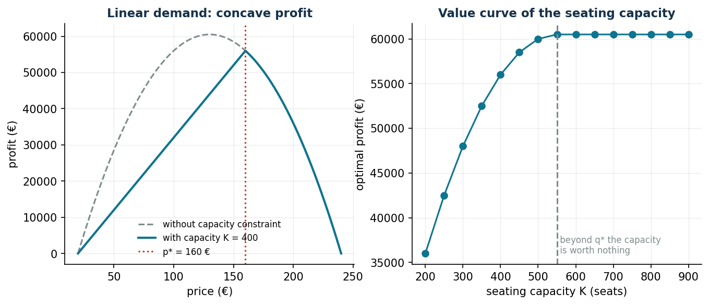
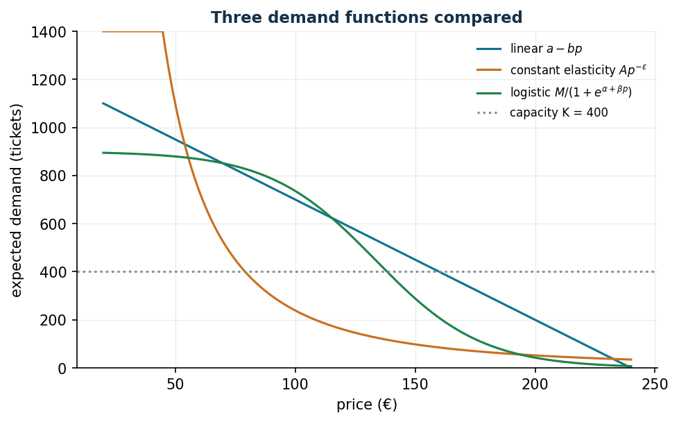

# Pricing and revenue management

**Class:** concave / non-convex NLP · **Script:** `python/lab07_pricing.py`

[](https://colab.research.google.com/github/fabiofurini/operations-research-lab/blob/main/notebooks/lab07_pricing.ipynb)

Which price maximizes profit when demand decreases as the price grows? Here the price
is a *variable*: demand becomes endogenous and the profit $p \cdot q$ introduces a
bilinear term — the first encounter with non-convexity.

**The problem in words.** *We decide* the price $p$ and the quantity $q$. *The
objective*: maximum profit $(p - c)q$. *The constraints*: $q \le d(p)$ (demand) and
$q \le k$ (capacity).

## Model

**Data (input of the model).**

| Symbol | Type | Meaning |
|---|---|---|
| $d(\cdot)$ | function $\mathbb{Q}_{\ge 0} \to \mathbb{Q}_{\ge 0}$ | expected demand at price $p$, decreasing in $p$ |
| $c$ | $\in \mathbb{Q}_{\ge 0}$ | unit marginal cost (€) |
| $k$ | $\in \mathbb{Q}_{> 0}$ | available capacity (seats, rooms, units) |

**Decision variables.** We introduce the following $2$ non-negative variables:

$$
\begin{cases}
p = \text{selling price decided by the firm (€)}\\[1ex]
q = \text{quantity sold (units)}
\end{cases}
$$

Using these variables, a pricing model for the problem is the following:

$$
\begin{aligned}
\max ~~ p\,q - c\,q & & \\
\text{subject to} \quad q &\le d(p), & \\
q &\le k, & \\
p &\ge 0, & \\
q &\ge 0. &
\end{aligned}
$$

Description of the objective function and of the constraints:

- the objective function maximizes the profit $p\,q - c\,q = (p - c)\,q$, revenue
  minus variable cost; it contains the product of the two variables $p$ and $q$ (a
  *bilinear* term, non-convex), and this is where all the difficulty of the chapter
  comes from;
- the **demand** constraint imposes that we do not sell more than the market asks for
  at price $p$ (one constraint, linear if $d$ is linear);
- the linear **capacity** constraint imposes that we do not sell more than the
  available capacity; when it is active, it is this constraint that determines the
  optimal price (one linear constraint);
- the non-negativity constraints on $p$ and $q$ define the variables of the model.

Demand functions used in the case study, with their respective data (all positive
rationals): linear $d(p) = a - b\,p$; constant elasticity
$d(p) = \theta\, p^{-\varepsilon}$ with $\varepsilon > 1$; logistic
$d(p) = m / \bigl(1 + e^{-\alpha + \beta p}\bigr)$.

Why $q \le d(p)$ and not $q = d(p)$? At the optimum the inequality is active by
itself (selling less than what is possible at that price is never worthwhile if
$p > c$), but writing it as $\le$ keeps the feasible region simpler and the model
feasible even when $d(p) > k$. The non-convexity lies in the product $p \cdot q$:
with linear demand, substituting $q = a - b\,p$, the reduced profit
$(p - c)(a - b\,p)$ is a concave parabola, but Gurobi solves the bilinear version to
global optimality anyway (`NonConvex=2`).

!!! example "Worked example by hand (concert)"
    $d(p) = 1200 - 5p$ (hence $a = 1200$, $b = 5$), $c = 20$ €, $k = 400$ seats.

    1. Without capacity: $p^\circ = (a/b + c)/2 = 130$ €, $q^\circ = 550$.
    2. Capacity bites ($550 > 400$): $\tilde p = (a - k)/b = 160$ €, profit
       $(160 - 20) \cdot 400 = 56{,}000$ €.
    3. Value of one extra seat: $\frac{d\Pi}{dk} = (\tilde p - c) + k \frac{d\tilde p}{dk}
       = 140 - 80 = 60$ € — **not** the full margin: to fill the seat the price is
       lowered for everybody.

## Results

Same data as the example, plus the constant-elasticity
($\theta = 6 \cdot 10^6$, $\varepsilon = 2.2$) and logistic ($m = 900$,
$\alpha = 6$, $\beta = 0.045$) variants.

```text
Gurobi:  p* = 160.00 EUR, q* = 400, profit = 56.000.00 EUR
Marginal value of a seat: 59.80 EUR (theory: 60.00)
Constant elasticity: p* = 79.11 EUR  (optimum at the point where d(p) = k)
Logistic           : p* = 138.29 EUR, profit = 47.316.83 EUR
```





!!! tip "The optimum at a corner point"
    With constant elasticity the *unconstrained* optimum would be
    $c\,\varepsilon/(\varepsilon - 1) = 36.67$ €, but at that price demand would
    exceed capacity by far. For $p$ below $79.11$ € we sell $k$ anyway (so it is
    worthwhile to raise the price); above it, the profit
    $(p - c)\,\theta p^{-\varepsilon}$ decreases. The optimum
    $\tilde p = (\theta/k)^{1/\varepsilon} = 79.11$ € lies at the *corner point*
    where $d(p) = k$: it makes no derivative vanish. Never look for the optimum among
    stationary points only when there are constraints.

## Multi-product version

Two ticket categories with substitution (raising the price of the stalls pushes part
of the demand towards the balcony): $d_1(p_1, p_2) = 500 - 2p_1 + 0.6\,p_2$,
$d_2(p_1, p_2) = 900 + 0.8\,p_1 - 4p_2$, costs $(30, 15)$ €, capacities
$(150, 300)$ seats.

```text
stalls   : p1* = 234.04 EUR   q1* = 150/150 (full)
balcony  : p2* = 196.81 EUR   q2* = 300/300 (full)
total profit: 85.148.94 EUR
```

Both categories fill up, but the prices are not "the ones that empty" each hall taken
on its own: the model exploits substitution, keeping the stalls expensive in order to
push demand towards the balcony. With substitute products prices must be decided
**jointly**: optimizing them one at a time leaves money on the table.


## Code

The full script of the chapter — data, model, solution, sensitivity and figures —
is [`python/lab07_pricing.py`](https://github.com/fabiofurini/operations-research-lab/blob/main/python/lab07_pricing.py)
(reproducible with `python3 python/lab07_pricing.py` from the `python/` folder).

The same code is also available as a notebook — [`notebooks/lab07_pricing.ipynb`](https://github.com/fabiofurini/operations-research-lab/blob/main/notebooks/lab07_pricing.ipynb) — which opens in Colab from the badge at the top of the page and runs in the browser, with nothing to install.

??? example "Show the full script — `lab07_pricing.py`"

    ```python
    """Chapter 7 — Pricing and revenue management (NLP, partly non-convex).

    Case study: ticket price for a concert in a 400-seat theatre.

    Contents:
      1. Linear demand: analytical solution and QP (bilinear) with Gurobi
      2. Marginal value of one extra seat (by perturbation)
      3. Constant-elasticity and logistic demand (Gurobi function constraints, global)
      4. Multi-product version (2 categories with substitution)
    """
    import gurobipy as gp
    import numpy as np
    import pandas as pd
    from gurobipy import GRB

    from stile import (ARANCIO, GRIGIO, ROSSO, TEAL, VERDE, intestazione, plt, salva_dat,
                       salva_dati, salva_figura)

    # ----------------------------------------------------------------------
    # 1. LINEAR DEMAND: D(p) = a - b p
    # ----------------------------------------------------------------------
    a, b, c, K = 1200.0, 5.0, 20.0, 400.0   # demand, slope, unit cost, seating capacity

    intestazione("Linear demand: analytical vs Gurobi (bilinear QP)")
    p_libero = (a / b + c) / 2                 # optimum without the capacity constraint
    q_libero = a - b * p_libero
    print(f"UNCONSTRAINED optimum: p* = {p_libero:.2f} €, q* = {q_libero:.0f} tickets")
    if q_libero > K:
        p_vinc = (a - K) / b
        print(f"The capacity K = {K:.0f} is binding -> p* = (a-K)/b = {p_vinc:.2f} €, q* = {K:.0f}")

    m = gp.Model("linear_pricing")
    m.Params.OutputFlag = 0
    m.Params.NonConvex = 2                      # bilinear objective p*q
    p = m.addVar(lb=0, ub=a / b, name="p")
    q = m.addVar(lb=0, name="q")
    m.addConstr(q <= a - b * p, name="demand")
    v_cap = m.addConstr(q <= K, name="capacity")
    m.setObjective(p * q - c * q, GRB.MAXIMIZE)
    m.optimize()
    assert m.Status == GRB.OPTIMAL
    print(f"Gurobi:  p* = {p.X:.2f} €, q* = {q.X:.0f}, profit = {m.ObjVal:,.2f} €")

    # marginal value of a seat (perturbation: there are no LP duals in a non-convex QP)
    v_cap.RHS = K + 1
    m.optimize()
    val_posto = m.ObjVal - (p_vinc - c) * K if False else None
    m2_obj = m.ObjVal
    v_cap.RHS = K
    m.optimize()
    print(f"Marginal value of one extra seat: {m2_obj - m.ObjVal:.2f} € "
          f"(theory: p - c + K·dp/dK = {p_vinc - c - K / b:.2f} €)")

    # ----------------------------------------------------------------------
    # 2. SENSITIVITY: price and profit as the seating capacity varies
    # ----------------------------------------------------------------------
    intestazione("Sensitivity to the seating capacity")
    capienze = np.arange(200, 901, 50)
    righe = []
    for KK in capienze:
        q_opt = min(KK, q_libero)
        p_opt = (a - q_opt) / b
        profitto = (p_opt - c) * q_opt
        marg = (p_opt - c - q_opt / b) if q_opt < q_libero else 0.0
        righe.append((KK, p_opt, q_opt, profitto, max(marg, 0)))
        print(f"  K = {KK:3.0f}: p* = {p_opt:6.2f} €, profit = {profitto:9.2f} €, "
              f"seat value = {max(marg, 0):5.2f} €")
    sens = pd.DataFrame(righe, columns=["K", "price", "quantity", "profit", "seat_value"])
    salva_dati(sens, "pricing_sensitivita_capienza")

    # ----------------------------------------------------------------------
    # 3. OTHER DEMAND FUNCTIONS (Gurobi, global non-linear constraints)
    # ----------------------------------------------------------------------
    intestazione("Constant elasticity and logistic demand (Gurobi)")
    A_el, eps = 6.0e6, 2.2                     # D(p) = A p^-eps
    M_log, alfa, beta_l = 900.0, 6.0, 0.045    # D(p) = M / (1 + exp(-alfa + beta*p))


    def prezzo_elasticita():
        """max (p-c)·q  subject to  q·p^eps <= A, q <= K  (global, NonConvex=2).

        The form q·r <= A with r = p^eps is equivalent to q <= A p^(-eps) but
        numerically well scaled (r ~ 10^4 instead of p^(-eps) ~ 10^-5)."""
        m = gp.Model("elasticity")
        m.Params.OutputFlag = 0
        m.Params.NonConvex = 2
        m.Params.FuncNonlinear = 1           # p^eps treated as an exact NL constraint
        p = m.addVar(lb=float(c), ub=400.0, name="p")
        q = m.addVar(ub=float(K), name="q")
        r = m.addVar(name="r")               # r = p^eps
        m.addGenConstrPow(p, r, eps)
        m.addQConstr(q * r <= A_el)          # bilinear
        m.setObjective((p - c) * q, GRB.MAXIMIZE)
        m.optimize()
        assert m.Status == GRB.OPTIMAL
        return p.X, m.ObjVal


    def prezzo_logistica():
        """max (p-c)·q  subject to  q(1+e) <= M, e = exp(-alfa + beta p), q <= K."""
        m = gp.Model("logistic")
        m.Params.OutputFlag = 0
        m.Params.NonConvex = 2
        m.Params.FuncNonlinear = 1
        p = m.addVar(lb=float(c), ub=400.0, name="p")
        q = m.addVar(ub=float(K), name="q")
        t = m.addVar(lb=-GRB.INFINITY, name="t")   # t = -alfa + beta p
        e = m.addVar(name="e")                     # e = exp(t)
        m.addConstr(t == -alfa + beta_l * p)
        m.addGenConstrExp(t, e)
        m.addConstr(q + q * e <= M_log)            # q (1 + e) <= M  (bilinear)
        m.setObjective((p - c) * q, GRB.MAXIMIZE)
        m.optimize()
        assert m.Status == GRB.OPTIMAL
        return p.X, m.ObjVal


    p_el, prof_el = prezzo_elasticita()
    p_log, prof_log = prezzo_logistica()
    print(f"Constant elasticity (eps = {eps}): p* = {p_el:7.2f} €, profit = {prof_el:9.2f} €")
    print(f"  theory without capacity: p* = c·eps/(eps-1) = {c * eps / (eps - 1):.2f} €")
    print(f"Logistic: p* = {p_log:7.2f} €, profit = {prof_log:9.2f} €")

    # ----------------------------------------------------------------------
    # 4. MULTI-PRODUCT: 2 categories with substitution (non-convex QP)
    # ----------------------------------------------------------------------
    intestazione("Two categories (stalls/balcony) with substitution")
    # D1 = a1 - b11 p1 + b12 p2 ; D2 = a2 + b21 p1 - b22 p2
    a1, a2 = 500.0, 900.0
    b11, b12, b21, b22 = 2.0, 0.6, 0.8, 4.0
    c1, c2, K1, K2 = 30.0, 15.0, 150.0, 300.0

    mm = gp.Model("multi_pricing")
    mm.Params.OutputFlag = 0
    mm.Params.NonConvex = 2
    p1 = mm.addVar(lb=0, ub=300, name="p1")
    p2 = mm.addVar(lb=0, ub=300, name="p2")
    q1 = mm.addVar(lb=0, name="q1")
    q2 = mm.addVar(lb=0, name="q2")
    mm.addConstr(q1 <= a1 - b11 * p1 + b12 * p2, name="dem1")
    mm.addConstr(q2 <= a2 + b21 * p1 - b22 * p2, name="dem2")
    mm.addConstr(q1 <= K1, name="cap1")
    mm.addConstr(q2 <= K2, name="cap2")
    mm.setObjective((p1 - c1) * q1 + (p2 - c2) * q2, GRB.MAXIMIZE)
    mm.optimize()
    assert mm.Status == GRB.OPTIMAL
    print(f"stalls  : p1* = {p1.X:6.2f} €, q1* = {q1.X:5.1f} / {K1:.0f}")
    print(f"balcony : p2* = {p2.X:6.2f} €, q2* = {q2.X:5.1f} / {K2:.0f}")
    print(f"total profit: {mm.ObjVal:,.2f} €")

    # ----------------------------------------------------------------------
    # 5. FIGURES
    # ----------------------------------------------------------------------
    pp = np.linspace(20, 240, 400)
    fig, (ax1, ax2) = plt.subplots(1, 2, figsize=(10.5, 4.0))
    prof_nc = (pp - c) * (a - b * pp)
    prof_c = (pp - c) * np.minimum(a - b * pp, K)
    salva_dat(pd.DataFrame({"p": pp, "without": prof_nc, "with": prof_c}), "cap07_profitto")
    salva_dat(sens, "cap07_capienza")
    salva_dat(pd.DataFrame({
        "p": pp,
        "linear": np.maximum(a - b * pp, 0),
        "elast": np.minimum(A_el * pp ** (-eps), 1400),
        "logistic": M_log / (1 + np.exp(-alfa + beta_l * pp)),
    }), "cap07_domande")
    ax1.plot(pp, prof_nc, color=GRIGIO, ls="--", label="without capacity constraint")
    ax1.plot(pp, prof_c, color=TEAL, lw=2, label=f"with capacity K = {K:.0f}")
    ax1.axvline(p_vinc, color=ROSSO, ls=":", label=f"p* = {p_vinc:.0f} €")
    ax1.set_xlabel("price (€)"); ax1.set_ylabel("profit (€)")
    ax1.set_title("Linear demand: concave profit")
    ax1.legend(fontsize=8)
    ax2.plot(sens["K"], sens["profit"], "-o", color=TEAL)
    ax2.axvline(q_libero, color=GRIGIO, ls="--")
    ax2.annotate(" beyond q* the capacity\n is worth nothing", (q_libero, sens["profit"].min()),
                 fontsize=8, color=GRIGIO)
    ax2.set_xlabel("seating capacity K (seats)"); ax2.set_ylabel("optimal profit (€)")
    ax2.set_title("Value curve of the seating capacity")
    salva_figura(fig, "cap07_profitto")

    fig, ax = plt.subplots()
    D_lin = np.maximum(a - b * pp, 0)
    D_el = A_el * pp ** (-eps)
    D_log = M_log / (1 + np.exp(-alfa + beta_l * pp))
    ax.plot(pp, D_lin, label="linear $a-bp$", color=TEAL)
    ax.plot(pp, np.minimum(D_el, 1400), label="constant elasticity $Ap^{-\\varepsilon}$", color=ARANCIO)
    ax.plot(pp, D_log, label="logistic $M/(1+e^{\\alpha+\\beta p})$", color=VERDE)
    ax.axhline(K, color=GRIGIO, ls=":", label=f"capacity K = {K:.0f}")
    ax.set_xlabel("price (€)"); ax.set_ylabel("expected demand (tickets)")
    ax.set_ylim(0, 1400)
    ax.set_title("Three demand functions compared")
    ax.legend(fontsize=8)
    salva_figura(fig, "cap07_domande")

    print("\nDone: chapter 7.")
    ```

## Exercises

1. Verify the value of a seat for $k = 300$ (100 €) with Gurobi and with the formula.
2. Marginal cost $c = 60$: $\tilde p$ stays at 160 (capacity still active), profit
   40.000 €, seat value 20 €.
3. Reputational penalty $-2(p - 120)^2$: does the problem remain concave? Does the
   optimum change?
4. $\tilde p(\varepsilon)$ for $\varepsilon \in [1.3;\, 3]$ with $k = 400$.
5. +50 stalls seats (+3.287 €) or +50 balcony seats (+3.838 €): which expansion is
   preferable?
