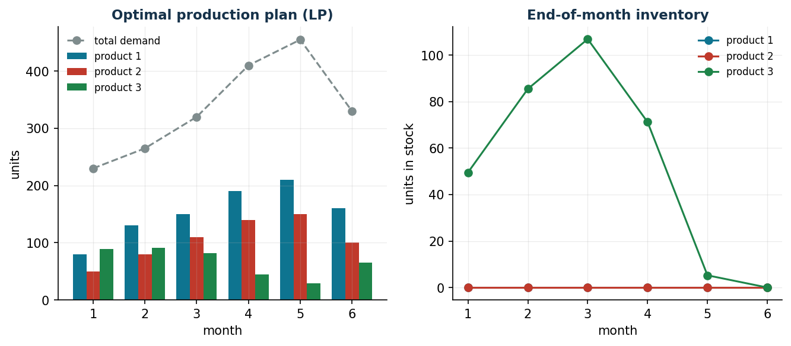
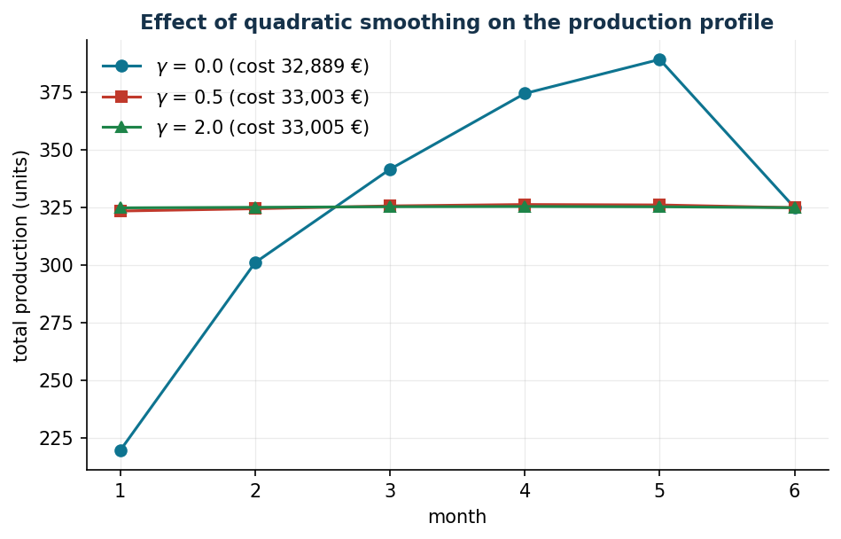

# Multi-period production and inventory

**Class:** LP / convex QP · **Script:** `python/lab04_production.py`

[](https://colab.research.google.com/github/fabiofurini/operations-research-lab/blob/main/notebooks/lab04_production.ipynb)

A firm decides how much to produce today and how much to keep in inventory for future
demand. Producing in advance costs holding; producing at the last moment risks
crashing into the capacity limit precisely in the peak months.

**The problem in words.** *We decide* how many units of each product to produce in
each month and how many to keep in inventory. *The objective* is to minimize
production + holding. *The constraints*: inventory balance month by month (with
demand served in full) and available machine hours.

## Model

**Data (input of the model).**

| Symbol | Type | Meaning |
|---|---|---|
| $n$ | $\in \mathbb{Z}_{\ge 1}$ | number of products; the products are indexed by $i \in \{1, 2, \dots, n\}$ |
| $m$ | $\in \mathbb{Z}_{\ge 1}$ | number of months of the horizon; the months are indexed by $t \in \{1, 2, \dots, m\}$ |
| $d_{it}$ | $\in \mathbb{Q}_{\ge 0}$ | demand for product $i$ in month $t$ (units) |
| $c_{it}$ | $\in \mathbb{Q}_{> 0}$ | production cost of one unit of $i$ in month $t$ (€) |
| $h_{it}$ | $\in \mathbb{Q}_{> 0}$ | holding cost of one unit of $i$ for month $t$ (€) |
| $a_i$ | $\in \mathbb{Q}_{> 0}$ | machine hours needed to produce one unit of product $i$ |
| $b_t$ | $\in \mathbb{Q}_{\ge 0}$ | machine hours available in month $t$ |
| $s_{i0}$ | $\in \mathbb{Q}_{\ge 0}$ | initial inventory of product $i$ (units) |

**Decision variables.** We introduce the following $2\,n\,m$ non-negative variables:

$$
\begin{cases}
x_{it} = \text{units of product } i \text{ produced in month } t\\[1ex]
s_{it} = \text{units of product } i \text{ in inventory at the end of month } t
\end{cases}
\qquad \forall i \in \{1, 2, \dots, n\},~\forall t \in \{1, 2, \dots, m\}.
$$

Using these variables, an LP model for the problem is the following:

$$
\begin{aligned}
\min ~~ \sum_{i=1}^{n} \sum_{t=1}^{m} \bigl( c_{it}\, x_{it} + h_{it}\, s_{it} \bigr) & & \\
\text{subject to} \quad s_{i,t-1} + x_{it} &= d_{it} + s_{it}, & \forall i \in \{1, 2, \dots, n\},~\forall t \in \{1, 2, \dots, m\}, \\
\sum_{i=1}^{n} a_i\, x_{it} &\le b_t, & \forall t \in \{1, 2, \dots, m\}, \\
x_{it} &\ge 0, & \forall i \in \{1, 2, \dots, n\},~\forall t \in \{1, 2, \dots, m\}, \\
s_{it} &\ge 0, & \forall i \in \{1, 2, \dots, n\},~\forall t \in \{1, 2, \dots, m\}.
\end{aligned}
$$

Description of the objective function and of the constraints:

- the linear objective function minimizes the total cost of the plan, the sum of the
  production costs $c_{it}\, x_{it}$ and of the holding costs $h_{it}\, s_{it}$ over
  all products and months;
- the linear **balance** constraints impose that, for every product and every month,
  what comes in (previous inventory plus production) is equal to what goes out
  (demand served plus subsequent inventory); for $t = 1$ the initial inventory
  $s_{i0}$ is used ($n\,m$ linear constraints);
- the linear **capacity** constraints ensure that, in every month, the machine hours
  used by all the products do not exceed those available ($m$ linear constraints);
- the non-negativity constraints on $x_{it}$ and $s_{it}$ define the variables of the
  model.

The balance is the inventory accounting and links the months to one another; capacity
is the scarce shared resource, and its shadow price will tell how much an extra hour is worth.

!!! example "Worked example by hand (1 product, 2 months)"
    $d = (60, 100)$, capacity $80$/month, $c = 10$, $h = 1$. The only feasible plan
    is $x = (80, 80)$ with $s_1 = 20$: cost $1620$ €. With one more hour in month 2 the
    cost decreases by 1 € (one unit avoids a month of holding): the dual of month 2 is
    $-1$; that of month 1 is $0$.

## Case study

Three products × six months, demand peaking in months 4–5, capacity 420–460 hours/month
(data in `data/produzione_domanda.csv`).

```text
Optimal total cost: 32.889.33 EUR
month      1      2      3      4      5      6
prod.1  80.0  130.0  150.0  190.0  210.0  160.0
prod.2  50.0   80.0  110.0  140.0  150.0  100.0
prod.3  89.5   91.0   81.4   44.3   29.0   64.8     (inventory up to 107 units)
```



The solver discovers the **pre-build** all by itself: product 3 (2.1 hours/unit) is
produced in advance and stockpiled in order to free up capacity in the peak months; the
inventory goes back to zero in the final month.

## Sensitivity

```text
month 1: use 330.0/420  | Pi =  0.000 EUR/hour | valid for b_t in [330.0, +inf]
month 2: use 420.0/420  | Pi = -0.762 EUR/hour | valid for b_t in [330.0, 524.0]
month 3: use 460.0/460  | Pi = -1.524 EUR/hour | valid for b_t in [370.0, 564.0]
month 4: use 460.0/460  | Pi = -2.286 EUR/hour | valid for b_t in [370.0, 564.0]
month 5: use 460.0/460  | Pi = -3.048 EUR/hour | valid for b_t in [399.0, 564.0]
month 6: use 420.0/420  | Pi = -3.810 EUR/hour | valid for b_t in [330.0, 431.0]

Check: +1 hour in month 6 -> cost from 32889.33 to 32885.52 (delta -3.810)
```

The duals grow by $0.762 = h_3/a_3$ per month: one more hour in month $t$ allows us
to produce $1/a_3$ units of product 3 *one month later*, saving one month of
holding. The capacity value curve is convex and decreasing; below 97%
of the current capacity the problem becomes **infeasible**.



The QP variant adds to the objective $\gamma \sum_{t=2}^{m} (v_t - v_{t-1})^2$ with
$v_t = \sum_{i=1}^{n} x_{it}$: with $\gamma = 0.5$ the production profile becomes almost
flat (maximum monthly variation down from 81 to 1 units) at a cost of merely
$33{,}003 - 32{,}889 = 114$ € (+0.35%).

!!! tip "Managerial take-away"
    It is worth buying overtime hours in months 5–6 up to 3–3.8 €/hour below the
    internal price; the levelled plan costs 0.35% more; below 97% of the
    capacity full service cannot be guaranteed.


## Code

The complete script of the chapter — data, model, solution, sensitivity and figures —
is [`python/lab04_production.py`](https://github.com/fabiofurini/operations-research-lab/blob/main/python/lab04_production.py)
(reproducible with `python3 python/lab04_production.py` from the `python/` folder).

The same code is also available as a notebook — [`notebooks/lab04_production.ipynb`](https://github.com/fabiofurini/operations-research-lab/blob/main/notebooks/lab04_production.ipynb) — which opens in Colab from the badge at the top of the page and runs in the browser, with nothing to install.

??? example "Show the full script — `lab04_production.py`"

    ```python
    """Chapter 4 — Multi-period production and inventory planning (LP / convex QP).

    Case study: a company producing 3 components (products 1, 2, 3) over a 6-month
    horizon with one shared resource (machine hours).

    Contents:
      1. Minimum-cost LP with mandatory service
      2. Shadow prices of capacity and analysis of the duals
      3. QP variant with a smooth production plan (smoothing)
      4. Sensitivity: optimal cost as capacity varies
    """
    import gurobipy as gp
    import numpy as np
    import pandas as pd
    from gurobipy import GRB

    from stile import (ARANCIO, GRIGIO, TEAL, intestazione, plt, salva_dat, salva_dati,
                       salva_figura)

    # ----------------------------------------------------------------------
    # 1. DATA
    # ----------------------------------------------------------------------
    prodotti = ["1", "2", "3"]
    mesi = list(range(1, 7))

    # demand (units/month): increasing seasonality peaking in months 4-5
    domanda = {
        ("1", 1): 110, ("1", 2): 130, ("1", 3): 150, ("1", 4): 190, ("1", 5): 210, ("1", 6): 160,
        ("2", 1): 70,  ("2", 2): 80,  ("2", 3): 110, ("2", 4): 140, ("2", 5): 150, ("2", 6): 100,
        ("3", 1): 50,  ("3", 2): 55,  ("3", 3): 60,  ("3", 4): 80,  ("3", 5): 95,  ("3", 6): 70,
    }
    costo_prod = {"1": 12.0, "2": 18.0, "3": 25.0}   # €/unit
    costo_giac = {"1": 0.8, "2": 1.2, "3": 1.6}      # €/unit/month
    ore_unit = {"1": 0.9, "2": 1.4, "3": 2.1}        # machine hours per unit
    capacita = {1: 420, 2: 420, 3: 460, 4: 460, 5: 460, 6: 420}  # hours/month
    scorta_iniziale = {"1": 30, "2": 20, "3": 10}

    df = pd.DataFrame(
        [(i, t, domanda[i, t], costo_prod[i], costo_giac[i], ore_unit[i], scorta_iniziale[i])
         for i in prodotti for t in mesi],
        columns=["product", "month", "demand", "production_cost", "holding_cost", "hours_unit",
                 "initial_stock"])
    salva_dati(df, "produzione_domanda")
    salva_dati(pd.DataFrame({"month": mesi, "capacity_hours": [capacita[t] for t in mesi]}),
               "produzione_capacita")


    def costruisci_lp():
        """Basic LP: minimum production + holding cost, mandatory service."""
        m = gp.Model("production_inventory")
        m.Params.OutputFlag = 0
        x = m.addVars(prodotti, mesi, name="x")           # quantity produced
        s = m.addVars(prodotti, mesi, name="s")           # stock at the end of the month
        # inventory balance: s_{i,t-1} + x_it = d_it + s_it
        m.addConstrs(
            ((scorta_iniziale[i] if t == 1 else s[i, t - 1]) + x[i, t] == domanda[i, t] + s[i, t]
             for i in prodotti for t in mesi), name="balance")
        # capacity of the shared resource
        v_cap = m.addConstrs(
            (gp.quicksum(ore_unit[i] * x[i, t] for i in prodotti) <= capacita[t]
             for t in mesi), name="capacity")
        m.setObjective(
            gp.quicksum(costo_prod[i] * x[i, t] + costo_giac[i] * s[i, t]
                        for i in prodotti for t in mesi), GRB.MINIMIZE)
        return m, x, s, v_cap


    # ----------------------------------------------------------------------
    # 2. BASIC LP: solution and duals
    # ----------------------------------------------------------------------
    intestazione("Basic LP: minimum cost with mandatory service")
    m, x, s, v_cap = costruisci_lp()
    m.optimize()
    assert m.Status == GRB.OPTIMAL
    print(f"Optimal total cost: {m.ObjVal:,.2f} €")

    piano = pd.DataFrame(
        [(i, t, x[i, t].X, s[i, t].X) for i in prodotti for t in mesi],
        columns=["product", "month", "production", "stock"])
    salva_dati(piano, "produzione_piano_ottimo")
    print("\nProduction plan (units/month):")
    print(piano.pivot(index="product", columns="month", values="production").round(1))
    print("\nEnd-of-month stock:")
    print(piano.pivot(index="product", columns="month", values="stock").round(1))

    print("\nCapacity constraints: utilisation, shadow price and validity range")
    righe_duali = []
    for t in mesi:
        uso = sum(ore_unit[i] * x[i, t].X for i in prodotti)
        c = v_cap[t]
        righe_duali.append((t, uso, capacita[t], c.Pi, c.SARHSLow, c.SARHSUp))
        print(f"  month {t}: usage {uso:6.1f}/{capacita[t]} hours | "
              f"shadow price {c.Pi:6.3f} €/hour | valid for b_t in [{c.SARHSLow:6.1f}, {c.SARHSUp:6.1f}]")
    duali = pd.DataFrame(righe_duali, columns=["month", "hours_used", "capacity", "shadow_price",
                                               "rhs_min", "rhs_max"])
    salva_dati(duali, "produzione_duali_capacita")

    # check of the shadow price by perturbation (month with the most negative dual:
    # in the Gurobi convention, for a <= constraint in a minimisation problem Pi <= 0)
    t_star = duali.loc[duali["shadow_price"].idxmin(), "month"]
    pi_star = duali["shadow_price"].min()
    m2, x2, s2, v2 = costruisci_lp()
    v2[t_star].RHS = capacita[t_star] + 1
    m2.optimize()
    print(f"\nCheck: +1 hour in month {t_star} -> cost goes from {m.ObjVal:.2f} to {m2.ObjVal:.2f} "
          f"(change {m2.ObjVal - m.ObjVal:+.3f} = shadow price {pi_star:.3f})")

    # ----------------------------------------------------------------------
    # 3. QP VARIANT: smooth plan (smoothing of total production)
    # ----------------------------------------------------------------------
    intestazione("QP variant: smooth plan (penalty on the changes)")
    risultati_qp = {}
    for gamma in [0.0, 0.5, 2.0]:
        mq, xq, sq, _ = costruisci_lp()
        mq.update()                       # required before getObjective()
        tot = {t: gp.quicksum(xq[i, t] for i in prodotti) for t in mesi}
        obj = mq.getObjective()
        mq.setObjective(obj + gamma * gp.quicksum((tot[t] - tot[t - 1]) * (tot[t] - tot[t - 1])
                                                  for t in mesi[1:]), GRB.MINIMIZE)
        mq.optimize()
        profilo = [sum(xq[i, t].X for i in prodotti) for t in mesi]
        risultati_qp[gamma] = (mq.ObjVal, profilo)
        var_max = max(abs(profilo[k] - profilo[k - 1]) for k in range(1, len(profilo)))
        print(f"  gamma={gamma:4.1f}: cost {mq.ObjVal:10.2f} €, max monthly change {var_max:6.1f} units")

    # ----------------------------------------------------------------------
    # 4. FIGURES (data for pgfplots + matplotlib preview)
    # ----------------------------------------------------------------------
    salva_dat(pd.DataFrame({
        "month": mesi,
        **{f"x{i}": [x[i, t].X for t in mesi] for i in prodotti},
        **{f"s{i}": [s[i, t].X for t in mesi] for i in prodotti},
        "domtot": [sum(domanda[i, t] for i in prodotti) for t in mesi],
    }), "cap04_piano")
    salva_dat(pd.DataFrame({
        "month": mesi,
        "gzero": risultati_qp[0.0][1],
        "gmezzo": risultati_qp[0.5][1],
        "gdue": risultati_qp[2.0][1],
    }), "cap04_smoothing")

    fig, (ax1, ax2) = plt.subplots(1, 2, figsize=(10.5, 4.0))
    larg = 0.26
    for k, i in enumerate(prodotti):
        prod = [x[i, t].X for t in mesi]
        ax1.bar([t + (k - 1) * larg for t in mesi], prod, width=larg, label=f"product {i}")
    ax1.plot(mesi, [sum(domanda[i, t] for i in prodotti) for t in mesi], "o--",
             color=GRIGIO, label="total demand")
    ax1.set_xlabel("month"); ax1.set_ylabel("units")
    ax1.set_title("Optimal production plan (LP)")
    ax1.legend(fontsize=8)
    for i in prodotti:
        ax2.plot(mesi, [s[i, t].X for i2, t in [(i, t) for t in mesi]], marker="o", label=f"product {i}")
    ax2.set_xlabel("month"); ax2.set_ylabel("units in stock")
    ax2.set_title("End-of-month inventory")
    ax2.legend(fontsize=8)
    salva_figura(fig, "cap04_piano_scorte")

    fig, ax = plt.subplots()
    for gamma, stile_linea in zip([0.0, 0.5, 2.0], ["-o", "-s", "-^"]):
        ax.plot(mesi, risultati_qp[gamma][1], stile_linea,
                label=f"$\\gamma$ = {gamma} (cost {risultati_qp[gamma][0]:,.0f} €)")
    ax.set_xlabel("month"); ax.set_ylabel("total production (units)")
    ax.set_title("Effect of quadratic smoothing on the production profile")
    ax.legend()
    salva_figura(fig, "cap04_smoothing")

    # sensitivity: optimal cost as the uniform capacity varies
    intestazione("Sensitivity: optimal cost as capacity varies")
    fattori = np.linspace(0.85, 1.25, 17)
    costi = []
    for f in fattori:
        ms, xs_, ss_, vs = costruisci_lp()
        for t in mesi:
            vs[t].RHS = capacita[t] * f
        ms.optimize()
        costi.append(ms.ObjVal if ms.Status == GRB.OPTIMAL else np.nan)
        print(f"  capacity x{f:4.2f}: cost {costi[-1]:10.2f} €")

    tab_cap = pd.DataFrame({"percent": fattori * 100, "cost": costi}).dropna()
    salva_dat(tab_cap, "cap04_capacita")

    fig, ax = plt.subplots()
    ax.plot(fattori * 100, costi, "-o", color=TEAL)
    ax.axvline(100, color=ARANCIO, linestyle="--", label="current capacity")
    ax.set_xlabel("available capacity (% of the current one)")
    ax.set_ylabel("optimal total cost (€)")
    ax.set_title("Value curve of capacity: convex and decreasing")
    ax.legend()
    salva_figura(fig, "cap04_valore_capacita")

    print("\nDone: chapter 4.")
    ```

## Exercises

1. **Check** — verify by perturbation the duals of months 3 and 4; why is the
   dual of month 1 zero?
2. **Lost demand** — add $u_{it}$ with penalty 40 €/unit and capacity at 90%:
   how much demand is lost, of which product, in which months?
3. **Maximum profit** — revenues $(20, 30, 42)$ € and optional service: which
   demand is it worth *not* serving?
4. **Emissions** — add $\tau \sum_{i,t} e_i x_{it}$ and draw the cost-emissions
   frontier.
5. **Safety stock** — impose $s_{it} \ge 0.1\, d_{i,t+1}$: how much does the
   policy cost?
