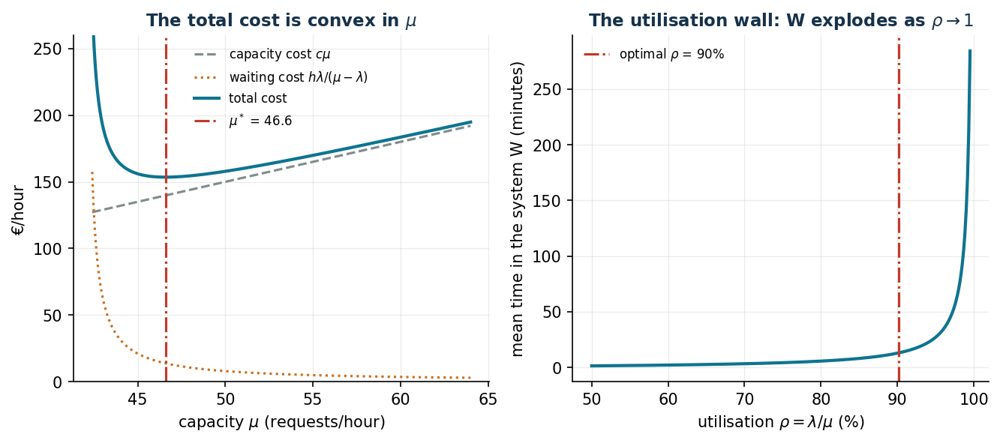
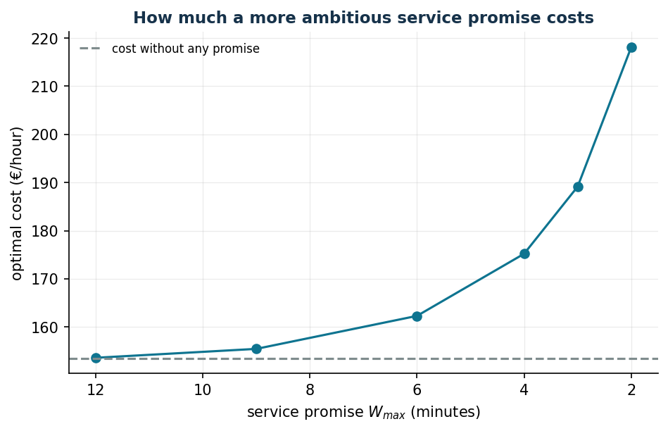

# Service capacity and waiting times

**Class:** convex NLP (M/M/1 queue) · **Script:** `python/lab11_queues.py`

How much capacity should be assigned to a call centre, a service desk, a cloud
service? More capacity costs money; too little capacity makes the waiting times
explode. The central message, counter-intuitive for anyone who reasons "by
efficiency": **the optimal utilization is not 100%**.

**The problem in words.** *We decide* the capacity $\mu$. *The objective*: the cost
of capacity plus the value of the customers' time in the system. *The constraint*:
stability, $\mu > \lambda$.

## Model

We use the simplest queueing model, the **M/M/1**: *Markovian* arrivals (a Poisson
process), *Markovian* service times (exponential) and *one* server. What is new here
is treating the capacity $\mu$ as an optimization variable.

**Data (input of the model).**

| Symbol | Type | Meaning |
|---|---|---|
| $\lambda$ | $\in \mathbb{Q}_{> 0}$ | mean arrival rate of the customers (requests/hour) |
| $c$ | $\in \mathbb{Q}_{> 0}$ | cost of one unit of capacity (€ per unit of $\mu$ per hour) |
| $h$ | $\in \mathbb{Q}_{> 0}$ | value of one hour spent by a customer in the system (€) |

**Decision variable and derived quantities.** We introduce one continuous variable:

$$
\mu = \text{service capacity (service rate, requests/hour)},
$$

with the stability requirement $\mu > \lambda$. From M/M/1 queueing theory we obtain
the mean time in the system $w(\mu) = 1/(\mu - \lambda)$ (in the literature: $W$) and
the mean number of customers in the system $l(\mu) = \lambda/(\mu - \lambda)$
(Little's law; in the literature: $L$).

Using this variable, the model for the problem is the following:

$$
\begin{aligned}
\min ~~ c\,\mu + h\,\frac{\lambda}{\mu - \lambda} & & \\
\text{subject to} \quad \mu &> \lambda. &
\end{aligned}
$$

Description of the objective function and of the constraint:

- the objective function is the sum of two terms: the first, $c\,\mu$, buys the
  capacity; the second, $h \cdot l(\mu)$, monetizes the total time the customers
  spend in the system; it is convex on $(\lambda, +\infty)$;
- the **stability** constraint defines the variable and guarantees that the queue
  does not diverge: with $\mu \le \lambda$ the line grows without bound.

Setting the derivative of the objective to zero gives the closed-form solution:

$$
C'(\mu) = c - \frac{h\,\lambda}{(\mu - \lambda)^2} = 0
\qquad\Longrightarrow\qquad
\tilde\mu = \lambda + \sqrt{h\,\lambda/c}
$$

"Capacity = demand + **safety stock**": the margin $\sqrt{h\lambda/c}$ grows with the
value of the customers' time, decreases with the cost of capacity, and scales like
$\sqrt\lambda$ (economies of scale in the buffer → pooling).

!!! example "Worked example by hand"
    $\lambda = 8$/h, $c = 2$ €, $h = 4$ €/h: $\tilde\mu = 8 + \sqrt{4 \cdot 8/2} = 12$
    customers/hour, $\rho = 8/12 = 66{,}7\%$, $w = 1/(12 - 8) = 15$ min, cost
    $2 \cdot 12 + 4 \cdot 8/4 = 32$ €/h. "Cutting the waste" down to $\mu = 9$
    ($\rho = 89\%$) would cost $18 + 32 = 50$ €/h: the apparent waste of 33% of
    unused capacity is exactly what keeps the queues short.

## Case study

$\lambda = 42$ requests/hour, $c = 3$ €, $h = 1{,}5$ €.

```text
Analytical: mu* = 42 + sqrt(1.5*42/3) = 46.583   cost 153.495 EUR/h
Gurobi    : mu* = 46.582 (bilinear w(mu-lam) = 1, NonConvex=2: matches)
At optimum: rho = 90.2%   w = 13.1 minutes
```



Between $\rho = 90\%$ and $\rho = 99\%$ the waiting time **is multiplied by ten**:
"saturating the resources" and "giving good service" are in mathematical, not
organizational, conflict.

## The price of a service promise

If marketing promises a "mean time below $w_{\max}$", we need
$\mu \ge \lambda + 1/w_{\max}$: the constraint becomes active when it is tighter than
the economic optimum (13.1 minutes).

```text
w_max = 12 min: mu = 47.00  cost 153.60   (almost free)
w_max =  9 min: mu = 48.67  cost 155.45
w_max =  6 min: mu = 52.00  cost 162.30
w_max =  4 min: mu = 57.00  cost 175.20
w_max =  3 min: mu = 62.00  cost 189.15
w_max =  2 min: mu = 72.00  cost 218.10   (+42% on the base cost)
```



The shadow price of the constraint grows explosively: going from 12 to 9 minutes
costs 1.85 €/h, from 3 to 2 minutes costs 28.95 €/h. When the constraint is active,
$\mu = \lambda + 1/w_{\max}$ and $C = c\lambda + c/w_{\max} + h\lambda\, w_{\max}$,
from which $dC/dw_{\max} = -c/w_{\max}^2 + h\lambda$ (with $w_{\max}$ in hours): at
$w_{\max} = 6$ minutes it is equal to $-300 + 63 = -237$ €/h per hour of promise —
the number to give to marketing *before* it signs the SLA (*Service Level
Agreement*).

**Robustness:** if $\lambda$ is uncertain in $[36, 48]$, sizing on the nominal
optimum $\tilde\mu = 46{,}58$ is **unstable**: with $\lambda = 48 > \tilde\mu$ the
queue diverges (infinite cost). Minimizing the cost of the worst case gives
$\mu_{\text{rob}} = 52{,}90$ with a worst-case cost of 173.39 €/h: an insurance
premium of about 13% is paid in order to be protected from a disaster.


## Code

The complete script of the chapter — data, model, solution, sensitivity and figures —
is [`python/lab11_queues.py`](https://github.com/fabiofurini/operations-research-lab/blob/main/python/lab11_queues.py)
(reproducible with `python3 python/lab11_queues.py` from the `python/` folder).

??? example "Show the full script — `lab11_queues.py`"

    ```python
    """Chapter 11 — Service capacity and waiting times (convex NLP, M/M/1).

    Case study: sizing the agents of a customer service desk.
    Arrivals lambda = 42 requests/hour; each "capacity unit" mu costs c = 3 €/hour;
    one hour spent in the system by a customer is worth h = 1.5 €.

    Contents:
      1. Total cost c·mu + h·lambda/(mu-lambda): analytical vs Gurobi (global)
      2. The utilisation wall: rho -> 1 makes the waiting time explode
      3. Service-level constraint W <= W_max and its shadow price
      4. Robustness: lambda uncertain in the interval [36, 48]
    """
    import gurobipy as gp
    import numpy as np
    import pandas as pd
    from gurobipy import GRB

    from stile import (ARANCIO, GRIGIO, ROSSO, TEAL, VERDE, intestazione, plt, salva_dat,
                       salva_dati, salva_figura)

    lam, c, h = 42.0, 3.0, 1.5

    # ----------------------------------------------------------------------
    # 1. TOTAL COST: analytical vs numerical
    # ----------------------------------------------------------------------
    intestazione("Analytical and numerical optimum")


    def costo(mu):
        return c * mu + h * lam / (mu - lam)


    def mu_ottimo(lams):
        """min c·mu + max_l h·l/(mu - l) with Gurobi (global, NonConvex=2).

        The term 1/(mu - l) is linearised with the variable w_l and the bilinear
        constraint w_l·(mu - l) = 1; with a single l this is the basic M/M/1 model,
        with several values of l it is the robust version (worst-case minimisation)."""
        m = gp.Model("mm1")
        m.Params.OutputFlag = 0
        m.Params.NonConvex = 2
        m.Params.MIPGap = 1e-9
        lam_max = max(lams)
        mu = m.addVar(lb=lam_max + 1e-3, ub=4 * lam_max, name="mu")
        t = m.addVar(name="t")                       # t = worst-case waiting cost
        for l in lams:
            w = m.addVar(lb=1e-6, ub=1e5)            # w = 1/(mu - l)
            v = m.addVar(lb=1e-3, ub=4 * lam_max)    # v = mu - l
            m.addConstr(v == mu - l)
            m.addQConstr(w * v == 1)                 # bilinear: solved globally
            m.addConstr(t >= h * l * w)
        m.setObjective(c * mu + t, GRB.MINIMIZE)
        m.optimize()
        assert m.Status == GRB.OPTIMAL
        return mu.X, m.ObjVal


    mu_star = lam + np.sqrt(h * lam / c)               # from setting the derivative to zero
    mu_num, costo_num = mu_ottimo([lam])
    print(f"Analytical: mu* = lambda + sqrt(h·lambda/c) = {mu_star:.3f}  -> cost {costo(mu_star):.3f} €/h")
    print(f"Gurobi    : mu* = {mu_num:.3f}  -> cost {costo_num:.3f} €/h")
    rho = lam / mu_star
    W = 1 / (mu_star - lam)
    print(f"At the optimum: utilisation rho = {rho:.1%}, mean time in the system w = {W * 60:.1f} minutes")
    print("Note: the optimum is NOT rho ~ 100%: it pays to keep some safety capacity.")

    # ----------------------------------------------------------------------
    # 2. SERVICE-LEVEL CONSTRAINT: W <= W_max
    # ----------------------------------------------------------------------
    intestazione("Service level: W <= W_max")
    righe = []
    for W_max_min in [12, 9, 6, 4, 3, 2]:               # minutes
        W_max = W_max_min / 60
        mu_sl = max(mu_star, lam + 1 / W_max)            # constraint active if more binding
        prezzo_ombra = 0.0
        if mu_sl > mu_star + 1e-9:                       # active constraint: marginal cost
            # dC/dW_max = derivative of the optimal cost with respect to the promise
            eps = 1e-6
            mu_eps = lam + 1 / (W_max + eps)
            prezzo_ombra = (costo(mu_eps) - costo(mu_sl)) / eps
        righe.append((W_max_min, mu_sl, costo(mu_sl), lam / mu_sl, prezzo_ombra))
        print(f"  w_max = {W_max_min:4.1f} min: mu = {mu_sl:7.3f}, cost = {costo(mu_sl):8.3f} €/h, "
              f"rho = {lam / mu_sl:6.1%}, price of the promise = {prezzo_ombra:9.1f} €/h per hour of W")
    sl = pd.DataFrame(righe, columns=["W_max_min", "mu", "cost", "rho", "shadow_price"])
    salva_dati(sl, "code_service_level")

    # ----------------------------------------------------------------------
    # 3. ROBUSTNESS: lambda uncertain in [36, 48]
    # ----------------------------------------------------------------------
    intestazione("Robustness: uncertain demand lambda in [36, 48]")
    lam_lo, lam_hi = 36.0, 48.0


    mu_rob, costo_rob = mu_ottimo([lam_lo, lam_hi])
    print(f"robust mu = {mu_rob:.3f} (vs {mu_star:.3f} nominal)")
    print(f"Worst-case cost: {costo_rob:.3f} €/h")
    print(f"The nominal plan with lambda = 48 would cost: "
          f"{c * mu_star + h * 48 / (mu_star - 48) if mu_star > 48 else float('inf'):.3f} €/h -> "
          + ("ok" if mu_star > 48 else "UNSTABLE (mu* < maximum lambda!)"))

    # ----------------------------------------------------------------------
    # 4. FIGURES
    # ----------------------------------------------------------------------
    mus = np.linspace(lam + 0.4, lam + 22, 400)
    salva_dat(pd.DataFrame({"mu": mus, "capacity": c * mus, "waiting": h * lam / (mus - lam),
                            "total": [costo(mm) for mm in mus]}), "cap11_costo")
    rhos_ = np.linspace(0.5, 0.995, 300)
    salva_dat(pd.DataFrame({"rho": rhos_ * 100, "W_min": 1 / (lam / rhos_ - lam) * 60}),
              "cap11_muro")
    salva_dat(sl, "cap11_promessa")
    fig, (ax1, ax2) = plt.subplots(1, 2, figsize=(10.5, 4.0))
    ax1.plot(mus, c * mus, ls="--", color=GRIGIO, label="capacity cost $c\\mu$")
    ax1.plot(mus, h * lam / (mus - lam), ls=":", color=ARANCIO,
             label="waiting cost $h\\lambda/(\\mu-\\lambda)$")
    ax1.plot(mus, [costo(mm) for mm in mus], color=TEAL, lw=2, label="total cost")
    ax1.axvline(mu_star, color=ROSSO, ls="-.", label=f"$\\mu^*$ = {mu_star:.1f}")
    ax1.set_xlabel("capacity $\\mu$ (requests/hour)")
    ax1.set_ylabel("€/hour")
    ax1.set_ylim(0, 260)
    ax1.set_title("The total cost is convex in $\\mu$")
    ax1.legend(fontsize=8)

    rhos = np.linspace(0.5, 0.995, 300)
    ax2.plot(rhos * 100, 1 / (lam / rhos - lam) * 60, color=TEAL, lw=2)
    ax2.axvline(rho * 100, color=ROSSO, ls="-.", label=f"optimal $\\rho$ = {rho:.0%}")
    ax2.set_xlabel("utilisation $\\rho = \\lambda/\\mu$ (%)")
    ax2.set_ylabel("mean time in the system W (minutes)")
    ax2.set_title("The utilisation wall: W explodes as $\\rho \\to 1$")
    ax2.legend(fontsize=8)
    salva_figura(fig, "cap11_costo_muro")

    fig, ax = plt.subplots()
    ax.plot(sl["W_max_min"], sl["cost"], "-o", color=TEAL)
    ax.axhline(costo(mu_star), color=GRIGIO, ls="--", label="cost without any promise")
    ax.set_xlabel("service promise $W_{max}$ (minutes)")
    ax.set_ylabel("optimal cost (€/hour)")
    ax.set_title("How much a more ambitious service promise costs")
    ax.invert_xaxis()
    ax.legend(fontsize=8)
    salva_figura(fig, "cap11_promessa")

    print("\nDone: chapter 11.")
    ```

## Exercises

1. Derive $dC/dw_{\max} = -c/w_{\max}^2 + h\lambda$ and verify it at 4 and 9 minutes.
2. Quadratic waiting cost $h/(\mu - \lambda)^2$: $\tilde\mu = \lambda + (2h/c)^{1/3}$.
3. Pooling: two separate queues ($\lambda = 21$ each) vs a single one
   ($\lambda = 42$) at equal total capacity.
4. Frontier (cost, $w$): where does every promised minute cut cost more than 10 €/h?
   (Below ~4 minutes.)
