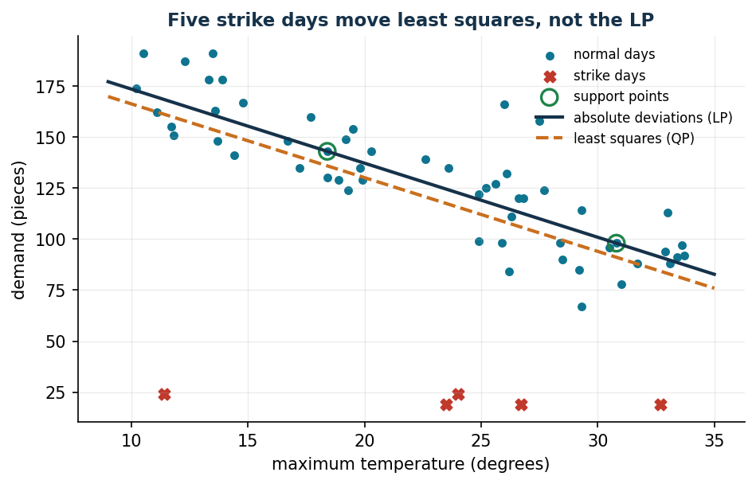
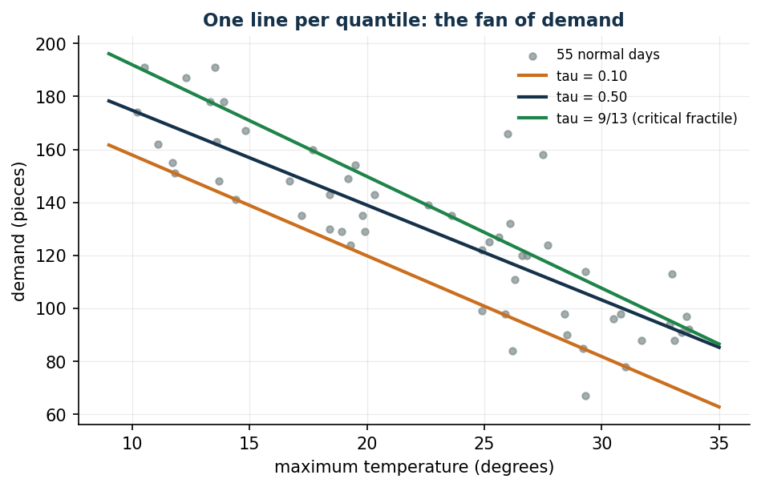
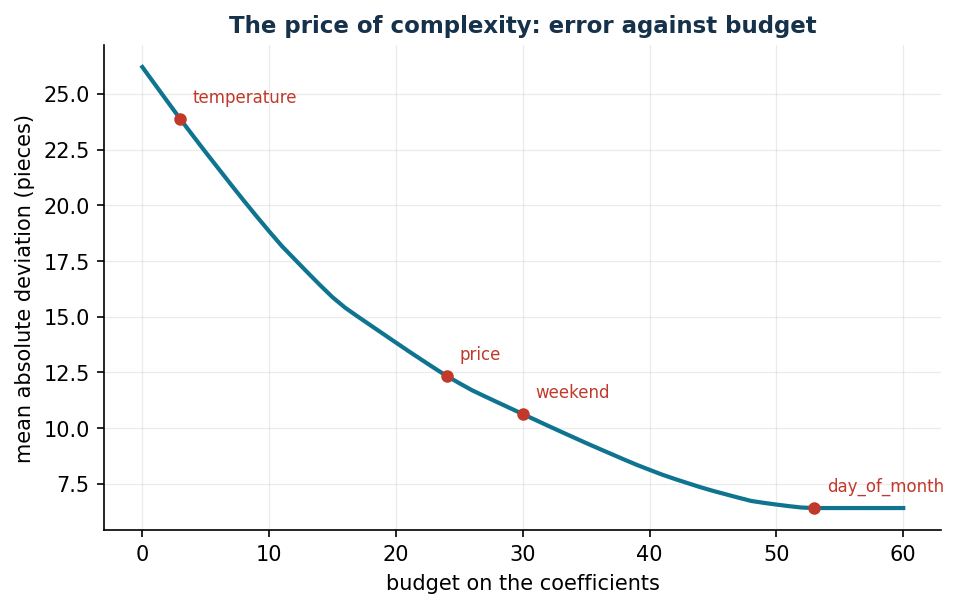

# Robust and quantile regression

**Class: LP** (compared with a QP) · Script: `python/lab16_regression.py`

[](https://colab.research.google.com/github/fabiofurini/operations-research-lab/blob/main/notebooks/lab16_regression.ipynb)

Every model in the lab starts from known parameters: the demand curve of
[pricing](pricing.md), the costs of [production](production.md), the scenarios of
the [newsvendor](newsvendor.md). Somebody has to estimate those numbers, and the
estimation is itself an optimization problem. Minimising **absolute** rather than
squared deviations keeps the problem an LP, the estimate is not dragged around by
anomalous data and — by weighting deviations above and below asymmetrically — it
aims at a **quantile** of demand instead of its centre: exactly the number the
newsvendor needs.

## The model

*Data*: $n$ observations indexed by $i \in \{1, 2, \dots, n\}$, with features
$x_{ij}$ for $j \in \{1, 2, \dots, p\}$ and observed value $y_i$; the level
$\tau \in \mathbb{Q}$, $0 < \tau < 1$.

*Variables*: the coefficients $w_j$ and the intercept $b$ (free), the deviations
above $u_i$ and below $v_i$ (non-negative).

$$
\begin{aligned}
\min ~ \sum_{i=1}^{n} \bigl[\, \tau\, u_i + (1 - \tau)\, v_i \,\bigr] & & \\
\text{subject to} \quad \sum_{j=1}^{p} w_j\, x_{ij} + b + u_i - v_i &= y_i,
   & \forall i \in \{1, 2, \dots, n\}, \\
w_j &\gtreqless 0, & \forall j \in \{1, 2, \dots, p\}, \\
b &\gtreqless 0, \\
u_i,\; v_i &\ge 0, & \forall i \in \{1, 2, \dots, n\}.
\end{aligned}
$$

The deviation has an arbitrary sign but the objective must pay its absolute
value: splitting it into a positive and a negative part keeps the objective
linear. At the optimum at least one of the two is zero, because reducing both by
the same amount would leave the constraint satisfied and lower the objective. It
is the same positive-part trick as the [scenario newsvendor](newsvendor.md).

!!! example "With no features: the empirical quantile comes back"
    With $p = 0$ only the intercept is left. Seven days of sales: 88, 96, 104,
    112, 120, 132, 148 pieces; the bakery of chapter 12 has $c_u = 9$ and
    $c_o = 4$, hence $\tau = \alpha^* = 9/13 = 0.6923$.

    The optimum is $\tilde b = 120$, the fifth observation in increasing order
    ($4/7 = 0.5714 \le \tau \le 5/7 = 0.7143$), with value

    $$
    \tilde z = \tfrac{4}{13}(32 + 24 + 16 + 8) + \tfrac{9}{13}(12 + 28)
             = \tfrac{680}{13} = 52.3077 .
    $$

    The duals are $\tilde\pi = \bigl(-\tfrac{4}{13}, -\tfrac{4}{13},
    -\tfrac{4}{13}, -\tfrac{4}{13}, -\tfrac{2}{13}, \tfrac{9}{13},
    \tfrac{9}{13}\bigr)$: zero sum, dual value $680/13$. With no features the
    model **is** the quantile rule; with features it becomes a *conditional*
    quantile.

## Case study: the bakery history

Sixty days of sales (demand, temperature, price, weekend) in
`data/panetteria_storico.csv`; five of them fall during two transport strikes,
with sales collapsing to about twenty pieces. With temperature alone:

```text
LP  (median)       : demand = 209.77 - 3.63 * temperature
QP  (least squares): demand = 202.34 - 3.61 * temperature
Mean absolute deviation over the 55 normal days: LP 13.08 pieces, QP 14.81 pieces
QP without the 5 strike days: demand = 213.58 - 3.72 * temperature
Distance from the "clean" intercept 213.58: LP 3.81 pieces, QP 11.24 pieces
```



Least squares pays the deviation **squared**: one deviation of 100 weighs as much
as ten thousand deviations of one, and five days out of sixty are enough to move
the intercept by 11 pieces. The LP pays the deviation once and reaches on its own
the line the QP finds only after somebody has cleaned the history by hand.

## The dual reading: the support points

The dual $\pi_i$ of the constraint of observation $i$ lives in a window that
depends on $\tau$ alone, and the two conditions on the free variables complete
the picture:

$$
-(1 - \tau) \le \tilde\pi_i \le \tau,
\qquad
\sum_{i=1}^{n} \tilde\pi_i\, x_{ij} = 0 \;\; \forall j,
\qquad
\sum_{i=1}^{n} \tilde\pi_i = 0 .
$$

Complementary slackness says where each dual sits:

| Position of the observation | Positive variable | Dual |
|---|---|---|
| above the estimate | $\tilde u_i > 0$ | $\tilde\pi_i = \tau$ |
| below the estimate | $\tilde v_i > 0$ | $\tilde\pi_i = -(1 - \tau)$ |
| on the estimate (interpolated) | $\tilde u_i = \tilde v_i = 0$ | $-(1-\tau) < \tilde\pi_i < \tau$ |

The interpolated observations are the **support points**: there are $p + 1$ of
them, as many as the free variables, and they alone determine the estimate. They
are for regression what the support vectors of the [SVM](svm.md) are for
classification.

```text
Observations above the line: 29, below: 29, interpolated: 2  <- p + 1 = 2
sum of the duals                       = 0.000000
sum of the duals times temperature     = 0.000000
dual value 616.9960 = primal value 616.9960   (strong duality)
```

The condition $\sum_i \tilde\pi_i = 0$ is the dual of the intercept and is the
quantile property in algebraic form: substituting the values of the table,
$\tau\,n_+ - (1-\tau)\,n_- + \sum_{\text{interpolated}} \tilde\pi_i = 0$, that is,
the estimate leaves a fraction $\tau$ of the observations below it.

The deviation is also a diagnostic tool: with all three features the normal days
have a deviation of at most 23.2 pieces and the five strikes of at least 67.5. A
threshold at 40 pieces isolates them exactly, knowing nothing about the strikes.

## Quantile regression and safety stock

On the 55 normal days, the three-feature model for several values of $\tau$; the
last column checks the quantile property.

| $\tau$ | intercept | temperature | price | weekend | share below the estimate |
|---|---:|---:|---:|---:|---:|
| 0.10 | 269.29 | −4.04 | −24.71 | +37.05 | 0.073 |
| 0.50 | 272.01 | −3.85 | −22.24 | +28.74 | 0.455 |
| 9/13 = 0.6923 | 281.19 | −3.96 | −23.21 | +31.47 | 0.673 |
| 0.90 | 287.49 | −3.57 | −25.69 | +27.98 | 0.873 |



For a hot weekend day at full price (28 degrees, price 3.00):

```text
median predicted demand           126.3 pieces
predicted 0.6923 quantile         132.1 pieces   <- quantity to bake
safety stock                        5.8 pieces
0.6923 quantile with no features  148.0 pieces
```

The quantile rule is still the one of chapter 12, but the number it applies to
changes: the quantile over the whole history says 148 pieces, the one
*conditional* on the conditions of the day asks for 132. Sixteen unsold pieces a
day fewer, without touching the costs. The gap between the median estimate and
the one at the critical fractile, 5.8 pieces, is the safety stock — computed
directly, with no assumption about the distribution.

## Feature selection with a budget

Given enough freedom the model chases noise. So we put a budget on the
coefficients: $p$ new variables $z_j \ge 0$ and the datum $t \in
\mathbb{Q}_{\ge 0}$, with

$$
-z_j \le w_j \le z_j \;\; \forall j \in \{1, 2, \dots, p\},
\qquad \sum_{j=1}^{p} z_j \le t .
$$

!!! warning "Standardising is mandatory"
    The budget adds up coefficients of features measured in different units
    (degrees, euros, 0/1 indicators): without standardising, the selection would
    depend on the units of measurement. Here every feature has zero mean and unit
    standard deviation, and each coefficient reads as *pieces per standard
    deviation*.

To the three real features we add four with no link to demand (followers,
rainfall in a neighbouring region, a stock index, the day of the month).

```text
budget  temperature   price  weekend  followers    rain  index  day_of_month
    10       -10.00    0.00     0.00       0.00    0.00   0.00          0.00
    20       -18.16   -1.51     0.00       0.00   -0.33   0.00          0.00
    30       -22.43   -4.45     2.35       0.00   -0.77   0.00          0.00
    45       -26.98   -8.22     9.09       0.00   -0.63   0.00         -0.09

budget  5: mean deviation 22.37 pieces, shadow price -19.952 pieces per unit
budget 10: mean deviation 18.83 pieces, shadow price -18.665 pieces per unit
budget 20: mean deviation 13.84 pieces, shadow price -10.658 pieces per unit
budget 30: mean deviation 10.63 pieces, shadow price  -7.271 pieces per unit
budget 45: mean deviation  7.19 pieces, shadow price  -4.197 pieces per unit
```



The shadow price of the budget constraint is the **price of complexity**: how
many pieces of error are saved for every extra unit of budget. It is −19.95 when
the budget is scarce and −4.20 when it is plentiful: the first units buy
temperature, the last ones buy noise. The three real features enter in the order
of their importance, the four irrelevant ones never exceed 2 pieces per standard
deviation until the budget becomes plainly excessive. The budget to choose is not
the one minimising the historical error, but the one beyond which the shadow
price becomes negligible.

The same code is also available as a notebook — [`notebooks/lab16_regression.ipynb`](https://github.com/fabiofurini/operations-research-lab/blob/main/notebooks/lab16_regression.ipynb) — which opens in Colab from the badge at the top of the page and runs in the browser, with nothing to install.

??? example "Show the complete script — `lab16_regression.py`"
    ```python
    """Chapter 16 — Robust and quantile regression (LP).

    Case study: the bakery of chapter 12. Sixty days of history (demand,
    temperature, price, weekend) plus five transport-strike days on which demand
    collapses.

    Contents:
      1. With no features the model returns the empirical quantile (worked example)
      2. Absolute deviations (LP) against least squares (QP): robustness to outliers
      3. Dual reading: pi_i, complementary slackness, support points
      4. Quantile regression: the newsvendor safety stock from the data
      5. Feature selection with a budget on the coefficients
    """
    import gurobipy as gp
    import numpy as np
    import pandas as pd
    from gurobipy import GRB

    from stile import (ARANCIO, BLU, GRIGIO, ROSSO, TEAL, VERDE, intestazione, plt,
                       salva_dat, salva_dati, salva_figura)

    TAU_NV = 9 / 13                                # critical fractile of chapter 12


    # ----------------------------------------------------------------------
    # MODEL: quantile regression as an LP
    # ----------------------------------------------------------------------
    def quantile_regression(X, y, tau=0.5, budget=None):
        """min sum_i [tau u_i + (1-tau) v_i]  with  X w + b + u - v = y.

        With `budget` it adds sum_j z_j <= budget and -z_j <= w_j <= z_j
        (feature selection: a budget on the coefficients)."""
        n, p = X.shape
        m = gp.Model("regression")
        m.Params.OutputFlag = 0
        w = m.addVars(p, lb=-GRB.INFINITY, name="w")
        b = m.addVar(lb=-GRB.INFINITY, name="b")
        u = m.addVars(n, name="u")                 # deviation above
        v = m.addVars(n, name="v")                 # deviation below
        residual = m.addConstrs(
            (gp.quicksum(X[i, j] * w[j] for j in range(p)) + b + u[i] - v[i] == y[i]
             for i in range(n)), name="residual")
        budget_constr = None
        if budget is not None:
            z = m.addVars(p, name="z")
            m.addConstrs((w[j] <= z[j] for j in range(p)), name="abs_up")
            m.addConstrs((-w[j] <= z[j] for j in range(p)), name="abs_down")
            budget_constr = m.addConstr(gp.quicksum(z[j] for j in range(p)) <= budget,
                                        name="budget")
        m.setObjective(gp.quicksum(tau * u[i] + (1 - tau) * v[i] for i in range(n)),
                       GRB.MINIMIZE)
        m.optimize()
        assert m.Status == GRB.OPTIMAL
        coef = np.array([w[j].X for j in range(p)])
        duals = np.array([residual[i].Pi for i in range(n)])
        return m, coef, b.X, duals, budget_constr


    def least_squares(X, y):
        """min sum_i r_i^2  with  X w + b + r = y  (convex QP, same solver)."""
        n, p = X.shape
        m = gp.Model("least_squares")
        m.Params.OutputFlag = 0
        w = m.addVars(p, lb=-GRB.INFINITY, name="w")
        b = m.addVar(lb=-GRB.INFINITY, name="b")
        r = m.addVars(n, lb=-GRB.INFINITY, name="r")
        m.addConstrs((gp.quicksum(X[i, j] * w[j] for j in range(p)) + b + r[i] == y[i]
                      for i in range(n)), name="residual")
        m.setObjective(gp.quicksum(r[i] * r[i] for i in range(n)), GRB.MINIMIZE)
        m.optimize()
        assert m.Status == GRB.OPTIMAL
        return np.array([w[j].X for j in range(p)]), b.X


    def mean_deviation(X, y, coef, b):
        return float(np.abs(y - (X @ coef + b)).mean())


    # ----------------------------------------------------------------------
    # 1. NO FEATURES: THE MODEL RETURNS THE EMPIRICAL QUANTILE
    # ----------------------------------------------------------------------
    intestazione("No features: the empirical quantile (worked example)")
    y7 = np.array([88.0, 96.0, 104.0, 112.0, 120.0, 132.0, 148.0])
    X0 = np.zeros((len(y7), 0))
    m0, _, b0, pi0, _ = quantile_regression(X0, y7, tau=TAU_NV)
    print(f"Seven days: {y7.astype(int)}")
    print(f"tau = alpha* = 9/13 = {TAU_NV:.4f}  (bakery of chapter 12: cu=9, co=4)")
    print(f"Optimal intercept b = {b0:.4f}  -> the 5th ordered value, the 69.23% quantile")
    print(f"Optimal value = {m0.ObjVal:.4f} = 680/13")
    print(f"Duals pi = {np.round(pi0, 4)}  (bounds: -(1-tau) = {-(1 - TAU_NV):.4f}, "
          f"tau = {TAU_NV:.4f})")
    print(f"Check, sum of the duals = {pi0.sum():.6f}  (must be 0: dual of the intercept)")
    above = int((y7 > b0 + 1e-9).sum())
    below = int((y7 < b0 - 1e-9).sum())
    print(f"Observations: {below}/7 below the estimate, 1/7 on it, {above}/7 above")
    print(f"  {below}/7 = {below / 7:.4f}  <=  tau = {TAU_NV:.4f}  <=  "
          f"{below + 1}/7 = {(below + 1) / 7:.4f}")

    # ----------------------------------------------------------------------
    # 2. DATA: SIXTY DAYS OF THE BAKERY
    # ----------------------------------------------------------------------
    intestazione("The bakery history: 60 days")
    rng = np.random.default_rng(16)
    n = 60
    temperature = np.round(rng.uniform(10, 34, n), 1)
    price = rng.choice([2.20, 2.60, 3.00, 3.40], n)
    weekend = (rng.random(n) < 0.30).astype(float)
    demand = (258 - 3.7 * temperature - 19.0 * price + 33.0 * weekend
              + rng.normal(0, 9, n))
    outlier = np.zeros(n)
    strike_days = [11, 22, 29, 41, 46]             # two transport strikes
    demand[strike_days] = rng.uniform(18, 32, len(strike_days))
    outlier[strike_days] = 1
    demand = np.round(demand).astype(float)

    # four features with no link to demand (for the selection)
    followers = np.round(rng.uniform(8, 20, n), 1)
    rain = np.round(rng.uniform(0, 12, n), 1)
    stock_index = np.round(rng.uniform(95, 115, n), 1)
    day_of_month = rng.integers(1, 29, n).astype(float)

    data = pd.DataFrame({
        "giorno": np.arange(1, n + 1),
        "domanda": demand.astype(int),
        "temperatura": temperature,
        "prezzo": price,
        "weekend": weekend.astype(int),
        "follower": followers,
        "pioggia": rain,
        "indice_borsa": stock_index,
        "giorno_del_mese": day_of_month.astype(int),
        "sciopero": outlier.astype(int),
    })
    salva_dati(data, "panetteria_storico")
    print(f"Demand: min {demand.min():.0f}, mean {demand.mean():.1f}, "
          f"max {demand.max():.0f}   strike days: {strike_days}")

    # ----------------------------------------------------------------------
    # 3. ABSOLUTE DEVIATIONS (LP) AGAINST LEAST SQUARES (QP)
    # ----------------------------------------------------------------------
    intestazione("Absolute deviations (LP) against least squares (QP)")
    Xt = temperature.reshape(-1, 1)
    m_lad, w_lad, b_lad, pi_lad, _ = quantile_regression(Xt, demand, tau=0.5)
    w_ols, b_ols = least_squares(Xt, demand)
    normal = outlier == 0
    print(f"LP  (median)      : demand = {b_lad:.2f} {w_lad[0]:+.2f} * temperature")
    print(f"QP  (least squares): demand = {b_ols:.2f} {w_ols[0]:+.2f} * temperature")
    print(f"Mean absolute deviation over the 55 normal days: "
          f"LP {mean_deviation(Xt[normal], demand[normal], w_lad, b_lad):.2f} pieces, "
          f"QP {mean_deviation(Xt[normal], demand[normal], w_ols, b_ols):.2f} pieces")
    w_clean, b_clean = least_squares(Xt[normal], demand[normal])
    print(f"QP without the 5 strike days: demand = {b_clean:.2f} "
          f"{w_clean[0]:+.2f} * temperature  (the LP gets there removing nothing)")
    print(f"Distance from the 'clean' intercept {b_clean:.2f}: "
          f"LP {abs(b_lad - b_clean):.2f} pieces, QP {abs(b_ols - b_clean):.2f} pieces")

    # ----------------------------------------------------------------------
    # 4. DUAL READING: SUPPORT POINTS AND THE QUANTILE PROPERTY
    # ----------------------------------------------------------------------
    intestazione("Dual reading of the LP")
    residual = demand - (Xt @ w_lad + b_lad)
    support = np.abs(residual) < 1e-6
    print(f"Observations above the line: {(residual > 1e-6).sum()}, "
          f"below: {(residual < -1e-6).sum()}, interpolated: {int(support.sum())}")
    print(f"Duals: minimum {pi_lad.min():.4f}, maximum {pi_lad.max():.4f}  "
          f"(bounds -0.5 and +0.5)")
    print(f"pi = +0.5 (point above the line): {(pi_lad > 0.5 - 1e-6).sum()} points")
    print(f"pi = -0.5 (point below the line): {(pi_lad < -0.5 + 1e-6).sum()} points")
    print(f"-0.5 < pi < +0.5 (support points): {int(support.sum())} points  -> p + 1 = 2")
    print(f"Sum of the duals = {pi_lad.sum():.6f} (dual of the intercept)")
    print(f"Sum of the duals times temperature = {(pi_lad * temperature).sum():.6f}")
    print(f"Dual value {float(pi_lad @ demand):.4f} = primal value "
          f"{m_lad.ObjVal:.4f}  (strong duality)")
    print("Support days:", (np.where(support)[0] + 1).tolist(),
          "-> temperatures", np.round(temperature[support], 1).tolist())

    # the anomalous days show up in the deviations of the three-feature model
    X3all = np.column_stack([temperature, price, weekend])
    _, w3, b3, _, _ = quantile_regression(X3all, demand, tau=0.5)
    res3 = demand - (X3all @ w3 + b3)
    suspect = np.abs(res3) > 40
    print(f"\nThree-feature model over all 60 days: "
          f"demand = {b3:.2f} {w3[0]:+.2f}*temp {w3[1]:+.2f}*price {w3[2]:+.2f}*weekend")
    print(f"Absolute deviation: {np.abs(res3[outlier == 0]).max():.1f} pieces at most on "
          f"normal days, {np.abs(res3[outlier == 1]).min():.1f} at least on anomalous ones")
    print(f"Days with a deviation above 40 pieces: {(np.where(suspect)[0] + 1).tolist()}")
    print(f"They are exactly the strike days: {bool((suspect == (outlier == 1)).all())}")
    clean = ~suspect

    # ----------------------------------------------------------------------
    # 5. QUANTILE REGRESSION: THE SAFETY STOCK FROM THE DATA
    # ----------------------------------------------------------------------
    intestazione("Quantile regression and safety stock")
    X3 = np.column_stack([temperature, price, weekend])[clean]
    y3 = demand[clean]
    print(f"From here on: the {int(clean.sum())} normal days")
    rows = []
    for tau in (0.10, 0.50, TAU_NV, 0.90):
        _, w_t, b_t, _, _ = quantile_regression(X3, y3, tau=tau)
        below_t = float((y3 < X3 @ w_t + b_t - 1e-9).mean())
        rows.append({"tau": tau, "intercetta": b_t, "temperatura": w_t[0],
                     "prezzo": w_t[1], "weekend": w_t[2], "quota_sotto": below_t})
        print(f"tau = {tau:.4f}: demand = {b_t:7.2f} {w_t[0]:+6.2f}*temp "
              f"{w_t[1]:+7.2f}*price {w_t[2]:+6.2f}*weekend   "
              f"| observations below the estimate {below_t:.3f}")
    tab_tau = pd.DataFrame(rows)
    salva_dati(tab_tau, "regressione_quantili")

    typical_day = np.array([28.0, 3.00, 1.0])       # hot, full price, weekend
    _, w_med, b_med, _, _ = quantile_regression(X3, y3, tau=0.5)
    _, w_nv, b_nv, _, _ = quantile_regression(X3, y3, tau=TAU_NV)
    pred_med = float(typical_day @ w_med + b_med)
    pred_nv = float(typical_day @ w_nv + b_nv)
    q_uncond = float(np.quantile(y3, TAU_NV))
    print(f"\nTypical day (28 degrees, price 3.00, weekend):")
    print(f"  median predicted demand        {pred_med:6.1f} pieces")
    print(f"  predicted {TAU_NV:.4f} quantile     {pred_nv:6.1f} pieces  <- quantity to bake")
    print(f"  safety stock                   {pred_nv - pred_med:6.1f} pieces")
    print(f"  {TAU_NV:.4f} quantile with no features {q_uncond:6.1f} pieces  "
          f"(chapter 12: same rule, no features)")

    # ----------------------------------------------------------------------
    # 6. FEATURE SELECTION WITH A BUDGET ON THE COEFFICIENTS
    # ----------------------------------------------------------------------
    intestazione("Feature selection: a budget on the coefficients")
    names = ["temperature", "price", "weekend", "followers", "rain",
             "stock_index", "day_of_month"]
    # the CSV keeps the same column names as the Italian version: the two scripts
    # must produce byte-identical files
    columns = ["temperatura", "prezzo", "weekend", "follower", "pioggia",
               "indice_borsa", "giorno_del_mese"]
    Xg = np.column_stack([temperature, price, weekend, followers, rain,
                          stock_index, day_of_month])[clean]
    Xs = (Xg - Xg.mean(axis=0)) / Xg.std(axis=0)    # standardisation is mandatory

    _, w_full, b_full, _, _ = quantile_regression(Xs, y3, tau=0.5)
    print("Without a budget (all the features):")
    for name, coeff in zip(names, w_full):
        print(f"  {name:16s} {coeff:+8.2f}")
    print(f"  |coefficients| = {np.abs(w_full).sum():.2f}   mean absolute deviation "
          f"{mean_deviation(Xs, y3, w_full, b_full):.2f} pieces")

    THRESHOLD = 2.0                                 # relevance: 2 pieces per std. dev.
    grid_t = np.round(np.arange(0, 60.5, 1.0), 2)
    curve, entries = [], {}
    for t in grid_t:
        mt, w_t, b_t, _, constr = quantile_regression(Xs, y3, tau=0.5, budget=t)
        mad = mean_deviation(Xs, y3, w_t, b_t)
        curve.append({"budget": t, "scarto_medio": mad, "prezzo_ombra": constr.Pi,
                      **{col: w_t[j] for j, col in enumerate(columns)}})
        for j, name in enumerate(names):
            if abs(w_t[j]) > THRESHOLD and name not in entries:
                entries[name] = t
    curve = pd.DataFrame(curve)
    salva_dati(curve, "regressione_budget")
    salva_dat(curve[["budget", "scarto_medio", "prezzo_ombra"]], "cap16_budget")

    print(f"\nOrder of entry (coefficient above {THRESHOLD:.0f} pieces per standard "
          f"deviation):")
    for name, t in sorted(entries.items(), key=lambda kv: kv[1]):
        print(f"  budget {t:5.1f} -> {name} enters")
    never = [name for name in names if name not in entries]
    print(f"  stay out: {', '.join(never) if never else '(none)'}")

    print("\nCoefficients as the budget grows:")
    print("  budget  " + "".join(f"{name[:9]:>11s}" for name in names))
    for t in (10.0, 20.0, 30.0, 45.0):
        row = curve[curve["budget"] == t].iloc[0]
        print(f"  {t:6.0f}  " + "".join(f"{row[col]:11.2f}" for col in columns))

    for t in (5.0, 10.0, 20.0, 30.0, 45.0):
        row = curve[curve["budget"] == t].iloc[0]
        print(f"budget {t:5.1f}: mean deviation {row['scarto_medio']:6.2f} pieces, "
              f"shadow price {row['prezzo_ombra']:+7.3f} pieces per unit of budget")

    # ----------------------------------------------------------------------
    # 7. FIGURES
    # ----------------------------------------------------------------------
    points = pd.DataFrame({"temperatura": temperature, "domanda": demand,
                           "sciopero": outlier.astype(int),
                           "appoggio": support.astype(int)})
    salva_dat(points, "cap16_panetteria")

    fig, ax = plt.subplots()
    ax.scatter(temperature[normal], demand[normal], s=18, color=TEAL,
               label="normal days")
    ax.scatter(temperature[~normal], demand[~normal], s=45, color=ROSSO, marker="X",
               label="strike days")
    ax.scatter(temperature[support], demand[support], s=95, facecolors="none",
               edgecolors=VERDE, linewidths=1.6, label="support points")
    gr = np.linspace(9, 35, 2)
    ax.plot(gr, b_lad + w_lad[0] * gr, color=BLU, lw=2, label="absolute deviations (LP)")
    ax.plot(gr, b_ols + w_ols[0] * gr, color=ARANCIO, lw=2, ls="--",
            label="least squares (QP)")
    ax.set_xlabel("maximum temperature (degrees)")
    ax.set_ylabel("demand (pieces)")
    ax.set_title("Five strike days move least squares, not the LP")
    ax.legend(loc="upper right", fontsize=8)
    salva_figura(fig, "cap16_regressione_robusta")

    lines = []
    for tau in (0.10, 0.50, TAU_NV):
        _, w_t, b_t, _, _ = quantile_regression(Xt[clean], demand[clean], tau=tau)
        lines.append({"tau": tau, "intercetta": b_t, "pendenza": w_t[0]})
    lines = pd.DataFrame(lines)
    salva_dat(lines, "cap16_rette_quantili")

    fig, ax = plt.subplots()
    ax.scatter(temperature[clean], demand[clean], s=16, color=GRIGIO, alpha=0.7,
               label="55 normal days")
    colours = {0.10: ARANCIO, 0.50: BLU, TAU_NV: VERDE}
    for _, row in lines.iterrows():
        label = ("tau = 9/13 (critical fractile)" if abs(row["tau"] - TAU_NV) < 1e-9
                 else f"tau = {row['tau']:.2f}")
        ax.plot(gr, row["intercetta"] + row["pendenza"] * gr,
                color=colours[row["tau"]], lw=2, label=label)
    ax.set_xlabel("maximum temperature (degrees)")
    ax.set_ylabel("demand (pieces)")
    ax.set_title("One line per quantile: the fan of demand")
    ax.legend(loc="upper right", fontsize=8)
    salva_figura(fig, "cap16_quantili")

    fig, ax = plt.subplots()
    ax.plot(curve["budget"], curve["scarto_medio"], color=TEAL, lw=2)
    for name, t in sorted(entries.items(), key=lambda kv: kv[1]):
        row = curve[curve["budget"] == t].iloc[0]
        ax.plot([t], [row["scarto_medio"]], "o", color=ROSSO, ms=5)
        ax.annotate(name, (t, row["scarto_medio"]), textcoords="offset points",
                    xytext=(6, 8), fontsize=8, color=ROSSO)
    ax.set_xlabel("budget on the coefficients")
    ax.set_ylabel("mean absolute deviation (pieces)")
    ax.set_title("The price of complexity: error against budget")
    salva_figura(fig, "cap16_budget")

    print("\nDone: chapter 16 (robust and quantile regression).")
    ```

## Exercises

1. With the seven days of the example (88, 96, 104, 112, 120, 132, 148) and
   $\tau = 1/2$, compute by hand the median, the optimal value and the seven
   duals; check that they sum to zero.
2. Estimate the model with temperature alone and $\tau = 1/2$, then move an
   observation above the line up by $+30$ pieces and re-solve: does the estimate
   change? And if one of the two support points is moved down by $-30$? Explain
   through complementary slackness.
3. The bakery sells its leftovers off at the end of the day and $c_o$ goes from 4
   to 2 euros: recompute $\alpha^*$, re-run the quantile regression and say by how
   many pieces the production of the typical day changes.
4. Plot the optimal value with a budget for $t \in \{0, 1, \dots, 60\}$ and check
   that it is convex and piecewise linear; do the breakpoints coincide with the
   budgets at which the shadow price changes?
5. Split the 55 normal days into estimation (40) and validation (15) and plot the
   mean absolute deviation on the two sets for $t \in \{5, 10, \dots, 55\}$:
   which budget do you choose?
