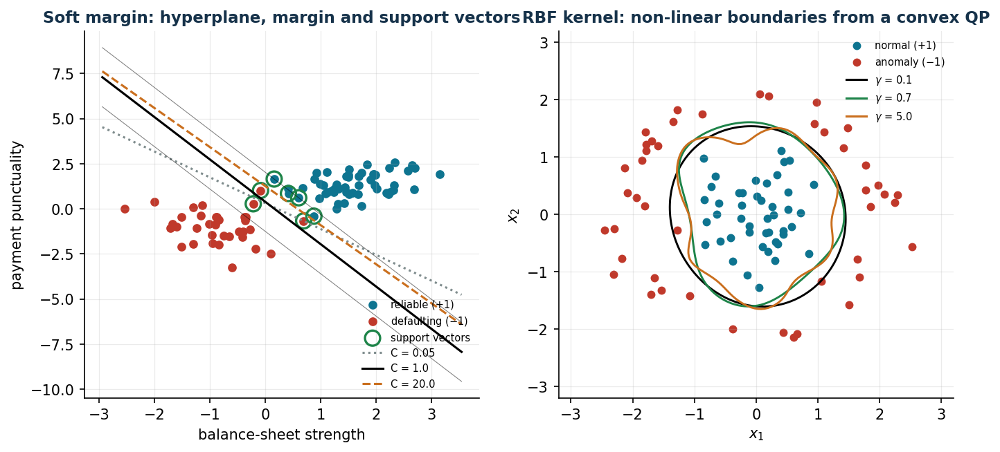
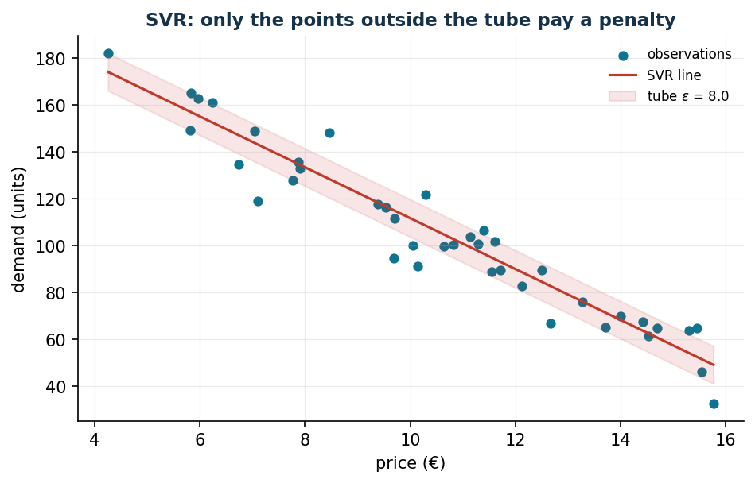

# Support Vector Machine: optimization for machine learning

[:material-file-pdf-box: Lecture notes (PDF)](pdf/operations-research-lab-notes.pdf) · [:material-presentation: Chapter slides (PDF)](pdf/slides-15-svm.pdf)

**Class:** convex QP · **Script:** `python/lab15_svm.py`

[](https://colab.research.google.com/github/fabiofurini/operations-research-lab/blob/main/notebooks/lab15_svm.ipynb)

The SVM connects convex optimization to machine learning: the classifier is obtained
by solving a QP. Here **no ML libraries**: every model is a QP written and solved
with Gurobi, in order to understand *what* a classifier optimizes. The labels
$y_i \in \{-1, +1\}$ are **data**; the variables (coefficients, intercept, slacks,
multipliers) are all continuous.

## Hard margin

**Data (input of the model).**

| Symbol | Type | Meaning |
|---|---|---|
| $n$ | $\in \mathbb{Z}_{\ge 1}$ | number of observations of the training set, indexed by $i \in \{1, 2, \dots, n\}$ |
| $p$ | $\in \mathbb{Z}_{\ge 1}$ | number of features, indexed by $j \in \{1, 2, \dots, p\}$ |
| $x_{ij}$ | $\in \mathbb{Q}$ | value of feature $j$ for observation $i$; $\boldsymbol x_i \in \mathbb{Q}^p$ is the vector of observation $i$ |
| $y_i$ | $\in \{-1, +1\}$ | *observed* class label of $i$ (a datum, not a variable) |
| $C$ | $\in \mathbb{Q}_{> 0}$ | weight of the margin violations (soft margin only); upper case to follow the machine learning literature, an exception to the convention that reserves capital letters for sets and matrices |

**Decision variables.** We introduce the following $p + 1$ free variables:

$$
\begin{cases}
w_j = \text{coefficient } j \text{ of the separating hyperplane}\\[1ex]
b = \text{intercept of the hyperplane}
\end{cases}
\qquad \forall j \in \{1, 2, \dots, p\},
$$

which define the hyperplane $\sum_{j=1}^{p} w_j\, x_j + b = 0$. Using these
variables, the hard margin QP model is the following:

$$
\begin{aligned}
\min ~~ \frac12 \sum_{j=1}^{p} w_j^2 & & \\
\text{subject to} \quad y_i \Bigl( \sum_{j=1}^{p} w_j\, x_{ij} + b \Bigr) &\ge 1, & \forall i \in \{1, 2, \dots, n\}, \\
w_j &\gtreqless 0, & \forall j \in \{1, 2, \dots, p\}, \\
b &\gtreqless 0. &
\end{aligned}
$$

Description of the objective function and of the constraints:

- the convex quadratic objective function minimizes $\tfrac12\|\boldsymbol w\|^2$;
  since the geometric margin between the supporting hyperplanes is
  $2/\|\boldsymbol w\|$, minimizing it is equivalent to **maximizing the margin**;
- the linear **classification** constraints impose that every observation lies on the
  right side of the hyperplane, at a distance of at least one unit in the scale of
  $\boldsymbol w$ ($n$ linear constraints);
- the constraints on $w_j$ and $b$ define the variables of the model, all free.

!!! example "Worked example by hand (2 points)"
    $\boldsymbol x_1 = (0.0)$, $y_1 = -1$; $\boldsymbol x_2 = (2.2)$, $y_2 = +1$:
    $\boldsymbol w = (0{,}5;\, 0{,}5)$, $b = -1$, margin
    $2/\|\boldsymbol w\| = 2\sqrt2 = 2{,}83$ = the distance between the points; both
    constraints are active, hence both points are support vectors.

## Soft margin and the role of C

With real overlapping data the hard margin is infeasible: one adds $n$ non-negative
slack variables,

$$
\xi_i = \text{margin violation of observation } i,
\qquad \forall i \in \{1, 2, \dots, n\},
$$

where $\xi_i > 1$ corresponds to a misclassification.

$$
\begin{aligned}
\min ~~ \frac12 \sum_{j=1}^{p} w_j^2 + C \sum_{i=1}^{n} \xi_i & & \\
\text{subject to} \quad y_i \Bigl( \sum_{j=1}^{p} w_j\, x_{ij} + b \Bigr) &\ge 1 - \xi_i, & \forall i \in \{1, 2, \dots, n\}, \\
w_j &\gtreqless 0, & \forall j \in \{1, 2, \dots, p\}, \\
b &\gtreqless 0, & \\
\xi_i &\ge 0, & \forall i \in \{1, 2, \dots, n\}.
\end{aligned}
$$

Description of the objective function and of the constraints:

- the convex quadratic objective function balances two terms: the simplicity of the
  model ($\tfrac12\|\boldsymbol w\|^2$, wide margin) and the cost of the violations
  on the training set ($C \sum_{i=1}^{n} \xi_i$); $C$ is the price assigned to the
  violations;
- the linear **classification** constraints require correct classification *up to the
  slack* $\xi_i$, paid in the objective ($n$ linear constraints);
- the constraints on $w_j$, $b$ and $\xi_i$ define the variables of the model: $w_j$
  and $b$ free, $\xi_i$ non-negative.

Case study: 90 customers described by two standardized indicators (capital soundness,
punctuality of payments), 55 creditworthy and 35 defaulting, partially overlapping
(`data/svm_clienti.csv`).

```text
C =  0.05: w = (0.678, 0.474)  b = -0.148 | margin 2.418 | errors 2 | in the margin 22
C =  1.00: w = (1.433, 0.611)  b = -0.236 | margin 1.284 | errors 2 | in the margin  7
C = 20.00: w = (5.058, 2.338)  b = -2.936 | margin 0.359 | errors 0 | in the margin  3
```



A small $C$ buys a wide margin while accepting 22 points inside the margin; a large
$C$ chases every point of the training set (zero errors, a very narrow margin): this
is the **regularization–fit** trade-off, and it must be chosen with validation data,
never by looking at the test set.

## The dual and the support vectors

By associating a multiplier $\alpha_i$ with each classification constraint of the
soft margin, one obtains $n$ new variables:

$$
\alpha_i = \text{multiplier of the classification constraint of observation } i,
\qquad \forall i \in \{1, 2, \dots, n\}.
$$

$$
\begin{aligned}
\max ~~ \sum_{i=1}^{n} \alpha_i - \frac12 \sum_{i=1}^{n}\sum_{j=1}^{n} \alpha_i\, \alpha_j\, y_i\, y_j\, \boldsymbol x_i' \boldsymbol x_j & & \\
\text{subject to} \quad \sum_{i=1}^{n} \alpha_i\, y_i &= 0, & \\
\alpha_i &\le C, & \forall i \in \{1, 2, \dots, n\}, \\
\alpha_i &\ge 0, & \forall i \in \{1, 2, \dots, n\}.
\end{aligned}
$$

Description of the objective function and of the constraints:

- the concave quadratic objective function depends on the data *only* through the
  inner products $\boldsymbol x_i' \boldsymbol x_j$: this is the observation that
  opens the door to the kernel;
- the linear **stationarity** constraint follows from the derivative with respect to
  the intercept $b$ (one linear constraint);
- the constraints $\alpha_i \le C$ bound each multiplier by the price $C$ of the
  violations ($n$ linear constraints);
- the non-negativity constraints on $\alpha_i$ define the variables of the model.

Primal-dual relation: $\boldsymbol w = \sum_{i=1}^{n} \alpha_i\, y_i\, \boldsymbol x_i$
and $f(\boldsymbol x) = \mathrm{sign}(\boldsymbol w' \boldsymbol x + b)$.

```text
w from the dual = (1.433, 0.611)   b = -0.236     (identical to the primal)
dual value 4.7868 = primal value (strong duality)
alpha = 0        : 83 points  -> do NOT affect the boundary
0 < alpha < C    :  2 points  -> support vectors exactly on the margin
alpha = C        :  5 points  -> inside the margin or misclassified
```

The solution depends **only** on the 7 points with $\alpha_i > 0$: it is they that
"support" the hyperplane, the other 83 could disappear without changing anything. The
KKT complementarity organizes everything: $\alpha_i = 0 \Rightarrow$ point beyond the
margin; $0 < \alpha_i < C \Rightarrow$ exactly on the margin (from these one recovers
$b$); $\alpha_i = C \Rightarrow$ the constraint "pays" a slack $\xi_i > 0$. And the
dual depends on the data only through the inner products: the door to the kernel.

## RBF kernel

By replacing $\boldsymbol x_i'\boldsymbol x_j$ with a kernel
$K(\boldsymbol x_i, \boldsymbol x_j)$ — for example the Gaussian RBF (*Radial Basis
Function*) kernel
$K(\boldsymbol x, \boldsymbol z) = e^{-\gamma\|\boldsymbol x - \boldsymbol z\|^2}$ —
one classifies in a transformed space without ever building it:
$f(\boldsymbol x) = \mathrm{sign}\bigl(\sum_{i=1}^{n} \alpha_i y_i K(\boldsymbol x_i, \boldsymbol x) + b\bigr)$.
The boundary can be arbitrarily curved, but the training problem **remains a convex
QP** if the kernel is valid (positive semidefinite matrix). Case study: 90 process
observations, normal operation in the centre and anomalies arranged in a ring — no
straight line can separate them.

```text
gamma = 0.1: training errors  1   support vectors 20
gamma = 0.7: training errors  0   support vectors 15
gamma = 5.0: training errors  0   support vectors 61  <- "memorizes" the points
```

With $\gamma = 5$ the boundary breaks up into islands around the individual points
and the support vectors rise to 61 out of 90: the model is memorizing the training
set (overfitting), while still remaining a convex QP. Convexity of *training* and the
ability to *generalize* are different properties: $C$ and $\gamma$ must be chosen
together by cross-validation.

## Unbalanced classes and SVR

In managerial applications the important class is rare and an error on the rare cases
costs more. It is enough to weight the slacks:
$C_-\sum_{i:\, y_i = -1}\xi_i + C_+\sum_{i:\, y_i = +1}\xi_i$.

```text
equal costs (C=1)           : precision 1.00   recall defaulters 0.94
10x cost on the defaulters  : precision 0.97   recall defaulters 1.00
```

With the 10× cost the boundary moves back towards the "healthy" class: no defaulter
escapes (recall 100%) at the price of a few more false alarms (precision from 100% to
97%). The weights must reflect the **decision costs**, not the frequencies of the
classes.



**SVR**: Support Vector Regression estimates a continuous function while ignoring the
errors within a tube of width $\varepsilon$, that is,
$\min \tfrac12\|\boldsymbol w\|^2 + C\sum_{i=1}^{n} (\xi_i + \xi_i^*)$ with
$|y_i - (\boldsymbol w' \boldsymbol x_i + b)| \le \varepsilon + \xi_i^{(*)}$ for every
$i \in \{1, 2, \dots, n\}$.

```text
SVR line: demand = -10.86 * price + 220.32    (true: -11p + 220)
Tube eps = 8: 14 points out of 40 outside the tube -> only they determine the line
```


## Code

The complete script of the chapter — data, model, solution, sensitivity and figures —
is [`python/lab15_svm.py`](https://github.com/fabiofurini/operations-research-lab/blob/main/python/lab15_svm.py)
(reproducible with `python3 python/lab15_svm.py` from the `python/` folder).

The same code is also available as a notebook — [`notebooks/lab15_svm.ipynb`](https://github.com/fabiofurini/operations-research-lab/blob/main/notebooks/lab15_svm.ipynb) — which opens in Colab from the badge at the top of the page and runs in the browser, with nothing to install.

??? example "Show the full script — `lab15_svm.py`"

    ```python
    """Chapter 15 — Support Vector Machine as a convex QP (no sklearn: everything in Gurobi).

    Case study: credit risk. 90 customers described by two standardised indicators:
    x1 = balance-sheet strength, x2 = punctuality in payments.
    Label y = +1 reliable customer, y = -1 defaulting customer.

    Contents:
      1. Hard margin on separable data (QP)
      2. Soft margin as C varies; support vectors and violations
      3. Dual formulation: alpha, reconstruction of w and b, complementarity
      4. RBF kernel: non-linear boundary (dual QP)
      5. Imbalanced classes: asymmetric costs C+ / C-
      6. Support Vector Regression on price -> demand
    """
    import gurobipy as gp
    import numpy as np
    import pandas as pd
    from gurobipy import GRB

    from stile import (ARANCIO, GRIGIO, ROSSO, TEAL, VERDE, intestazione, plt, salva_dat,
                       salva_dati, salva_figura, salva_tikz)

    rng = np.random.default_rng(11)

    # ----------------------------------------------------------------------
    # 1. DATA: two partially overlapping groups of customers
    # ----------------------------------------------------------------------
    n_pos, n_neg = 55, 35
    X_pos = rng.multivariate_normal([1.6, 1.4], [[0.55, 0.15], [0.15, 0.45]], n_pos)
    X_neg = rng.multivariate_normal([-0.9, -1.1], [[0.65, -0.1], [-0.1, 0.7]], n_neg)
    X = np.vstack([X_pos, X_neg])
    y = np.array([1.0] * n_pos + [-1.0] * n_neg)
    n = len(y)
    salva_dati(pd.DataFrame({"x1": X[:, 0], "x2": X[:, 1], "y": y}), "svm_clienti")


    def svm_primale(C, pesi=None):
        """Primal soft margin: min 1/2||w||^2 + sum C_i xi_i."""
        Ci = np.full(n, C) if pesi is None else pesi
        m = gp.Model("svm_primal")
        m.Params.OutputFlag = 0
        w = m.addVars(2, lb=-GRB.INFINITY, name="w")
        b = m.addVar(lb=-GRB.INFINITY, name="b")
        xi = m.addVars(n, name="xi")
        m.addConstrs((y[i] * (w[0] * X[i, 0] + w[1] * X[i, 1] + b) >= 1 - xi[i]
                      for i in range(n)), name="classif")
        m.setObjective(0.5 * (w[0] * w[0] + w[1] * w[1])
                       + gp.quicksum(Ci[i] * xi[i] for i in range(n)), GRB.MINIMIZE)
        m.optimize()
        assert m.Status == GRB.OPTIMAL
        return (np.array([w[0].X, w[1].X]), b.X,
                np.array([xi[i].X for i in range(n)]), m.ObjVal)


    # ----------------------------------------------------------------------
    # 2. SOFT MARGIN AS C VARIES
    # ----------------------------------------------------------------------
    intestazione("Primal soft margin as C varies")
    risultati = {}
    for C in [0.05, 1.0, 20.0]:
        w, b, xi, obj = svm_primale(C)
        margine = 2 / np.linalg.norm(w)
        err = int(np.sum(y * (X @ w + b) < 0))
        nsv = int(np.sum(y * (X @ w + b) < 1 + 1e-6))
        risultati[C] = (w, b)
        print(f"  C = {C:5.2f}: w = ({w[0]:6.3f}, {w[1]:6.3f}), b = {b:6.3f} | "
              f"margin = {margine:5.3f} | errors = {err:2d} | points inside the margin = {nsv:2d}")
    print("Small C -> wide margin and more violations; large C -> narrow margin.")

    C_rif = 1.0
    w1, b1, xi1, _ = svm_primale(C_rif)

    # ----------------------------------------------------------------------
    # 3. DUAL FORMULATION
    # ----------------------------------------------------------------------
    intestazione(f"Dual with C = {C_rif}")
    K_lin = X @ X.T
    md = gp.Model("svm_dual")
    md.Params.OutputFlag = 0
    al = md.addVars(n, ub=C_rif, name="alpha")
    md.addConstr(gp.quicksum(al[i] * y[i] for i in range(n)) == 0, name="sum")
    md.setObjective(gp.quicksum(al[i] for i in range(n))
                    - 0.5 * gp.quicksum(al[i] * al[j] * y[i] * y[j] * K_lin[i, j]
                                        for i in range(n) for j in range(n)), GRB.MAXIMIZE)
    md.optimize()
    assert md.Status == GRB.OPTIMAL
    alpha = np.array([al[i].X for i in range(n)])
    w_dual = (alpha * y) @ X
    sv_margine = [i for i in range(n) if 1e-5 < alpha[i] < C_rif - 1e-5]
    b_dual = float(np.mean([y[i] - w_dual @ X[i] for i in sv_margine]))
    print(f"w from the dual = ({w_dual[0]:.3f}, {w_dual[1]:.3f})  (primal: "
          f"({w1[0]:.3f}, {w1[1]:.3f}))")
    print(f"b from the dual = {b_dual:.3f}  (primal: {b1:.3f})")
    n_zero = int(np.sum(alpha < 1e-5))
    n_marg = len(sv_margine)
    n_C = int(np.sum(alpha > C_rif - 1e-5))
    print(f"alpha = 0 (outside the margin): {n_zero} points — they do NOT affect the boundary")
    print(f"0 < alpha < C (on the margin)  : {n_marg} support vectors")
    print(f"alpha = C (inside/beyond)      : {n_C} points with xi > 0")
    print(f"Dual value = {md.ObjVal:.4f} (equal to the primal one by strong duality)")

    sv = alpha > 1e-5
    salva_dat(pd.DataFrame({"x1": X[:, 0], "x2": X[:, 1], "y": y,
                            "alpha": alpha, "sv": sv.astype(int)}), "cap14_punti")
    salva_dat(pd.DataFrame({"C": [0.05, 1.0, 20.0],
                            "w1": [risultati[C][0][0] for C in [0.05, 1.0, 20.0]],
                            "w2": [risultati[C][0][1] for C in [0.05, 1.0, 20.0]],
                            "b": [risultati[C][1] for C in [0.05, 1.0, 20.0]]}), "cap14_rette")

    # ----------------------------------------------------------------------
    # 4. RBF KERNEL
    # ----------------------------------------------------------------------
    intestazione("RBF kernel (ring-shaped data: not linearly separable)")
    # second dataset: process anomalies around a normal operating region
    n2a, n2b = 45, 45
    raggi = rng.normal(0, 0.55, (n2a, 2))
    angoli = rng.uniform(0, 2 * np.pi, n2b)
    corona = np.column_stack([(2.0 + rng.normal(0, 0.25, n2b)) * np.cos(angoli),
                              (2.0 + rng.normal(0, 0.25, n2b)) * np.sin(angoli)])
    X2 = np.vstack([raggi, corona])
    y2 = np.array([1.0] * n2a + [-1.0] * n2b)
    n2 = len(y2)
    salva_dati(pd.DataFrame({"x1": X2[:, 0], "x2": X2[:, 1], "y": y2}), "svm_corona")
    salva_dat(pd.DataFrame({"x1": X2[:, 0], "x2": X2[:, 1], "y": y2}), "cap14_corona")


    def svm_rbf(gamma, C=5.0):
        K = np.exp(-gamma * ((X2[:, None, :] - X2[None, :, :]) ** 2).sum(-1))
        m = gp.Model("rbf")
        m.Params.OutputFlag = 0
        al = m.addVars(n2, ub=C, name="alpha")
        m.addConstr(gp.quicksum(al[i] * y2[i] for i in range(n2)) == 0)
        m.setObjective(gp.quicksum(al[i] for i in range(n2))
                       - 0.5 * gp.quicksum(al[i] * al[j] * y2[i] * y2[j] * K[i, j]
                                           for i in range(n2) for j in range(n2)), GRB.MAXIMIZE)
        m.optimize()
        aa = np.array([al[i].X for i in range(n2)])
        svm_ = [i for i in range(n2) if 1e-5 < aa[i] < C - 1e-5]
        bb = float(np.mean([y2[i] - sum(aa[j] * y2[j] * K[j, i] for j in range(n2))
                            for i in svm_]))

        def punteggio(P):
            KK = np.exp(-gamma * ((P[:, None, :] - X2[None, :, :]) ** 2).sum(-1))
            return KK @ (aa * y2) + bb

        err = int(np.sum(punteggio(X2) * y2 < 0))
        return punteggio, aa, err


    griglia = np.linspace(-3.2, 3.2, 120)
    GX, GY = np.meshgrid(griglia, griglia)
    P_griglia = np.column_stack([GX.ravel(), GY.ravel()])
    contorni = {}
    for gamma in [0.1, 0.7, 5.0]:
        punteggio, aa, err = svm_rbf(gamma)
        Z = punteggio(P_griglia).reshape(GX.shape)
        contorni[gamma] = Z
        print(f"  gamma = {gamma:4.1f}: training errors = {err:2d}, "
              f"support vectors = {int(np.sum(aa > 1e-5)):2d}")
    print("Small gamma -> smooth boundary; large gamma -> a boundary that 'memorises'.")

    # export the boundary (level 0) for pgfplots
    for gamma in [0.1, 0.7, 5.0]:
        cs = plt.contour(GX, GY, contorni[gamma], levels=[0.0])
        segmenti = []
        for percorso in cs.allsegs[0]:
            for px, py in percorso:
                segmenti.append((px, py))
            segmenti.append((np.nan, np.nan))       # line separator for pgfplots
        plt.close()
        salva_dat(pd.DataFrame(segmenti, columns=["x", "y"]),
                  f"cap14_rbf_g{str(gamma).replace('.', '_')}")

    # ----------------------------------------------------------------------
    # 5. IMBALANCED CLASSES: asymmetric costs
    # ----------------------------------------------------------------------
    intestazione("Imbalanced classes: missing a defaulter costs 10 times as much")


    def metriche(w, b, XX, yy):
        pred = np.sign(XX @ w + b)
        tp = np.sum((pred == -1) & (yy == -1))     # defaulters detected
        fp = np.sum((pred == -1) & (yy == 1))
        fn = np.sum((pred == 1) & (yy == -1))
        prec = tp / (tp + fp) if tp + fp else 0
        rec = tp / (tp + fn) if tp + fn else 0
        return prec, rec


    pesi_eq = np.full(n, 1.0)
    pesi_asim = np.where(y == -1, 10.0, 1.0)
    for nome, pesi in [("equal costs (C = 1)", pesi_eq), ("10x cost on defaulters", pesi_asim)]:
        w, b, xi, _ = svm_primale(1.0, pesi=pesi)
        prec, rec = metriche(w, b, X, y)
        print(f"  {nome:>26}: precision = {prec:.2f}, recall on defaulters = {rec:.2f}")
    print("Weighting the rare class more shifts the boundary: more false alarms are accepted")
    print("in order not to let a defaulter through.")

    # ----------------------------------------------------------------------
    # 6. SUPPORT VECTOR REGRESSION: demand as a function of price
    # ----------------------------------------------------------------------
    intestazione("SVR: estimating the price -> demand curve")
    np_srv = 40
    prezzi = rng.uniform(4, 16, np_srv)
    domanda_v = 220 - 11 * prezzi + rng.normal(0, 9, np_srv)
    salva_dati(pd.DataFrame({"price": prezzi, "demand": domanda_v}), "svr_vendite")

    eps_svr, C_svr = 8.0, 10.0
    ms = gp.Model("svr")
    ms.Params.OutputFlag = 0
    w_s = ms.addVar(lb=-GRB.INFINITY, name="w")
    b_s = ms.addVar(lb=-GRB.INFINITY, name="b")
    xi_p = ms.addVars(np_srv, name="xip")
    xi_m = ms.addVars(np_srv, name="xim")
    ms.addConstrs((domanda_v[i] - (w_s * prezzi[i] + b_s) <= eps_svr + xi_p[i]
                   for i in range(np_srv)))
    ms.addConstrs(((w_s * prezzi[i] + b_s) - domanda_v[i] <= eps_svr + xi_m[i]
                   for i in range(np_srv)))
    ms.setObjective(0.5 * w_s * w_s + C_svr * gp.quicksum(xi_p[i] + xi_m[i]
                                                          for i in range(np_srv)), GRB.MINIMIZE)
    ms.optimize()
    fuori = int(sum(1 for i in range(np_srv)
                    if abs(domanda_v[i] - (w_s.X * prezzi[i] + b_s.X)) > eps_svr + 1e-6))
    print(f"SVR line: demand = {w_s.X:.2f} · price + {b_s.X:.2f} (true: -11 p + 220)")
    print(f"Epsilon tube = {eps_svr}: {fuori} points outside the tube out of {np_srv} "
          f"(only these determine the line)")
    salva_dat(pd.DataFrame({"price": prezzi, "demand": domanda_v,
                            "estimate": w_s.X * prezzi + b_s.X}), "cap14_svr")
    salva_dat(pd.DataFrame({"w": [w_s.X], "b": [b_s.X], "eps": [eps_svr]}), "cap14_svr_retta")

    # ----------------------------------------------------------------------
    # 7. FIGURES (matplotlib preview)
    # ----------------------------------------------------------------------
    fig, (ax1, ax2) = plt.subplots(1, 2, figsize=(10.8, 4.6))
    ax1.scatter(X[y > 0, 0], X[y > 0, 1], color=TEAL, s=26, label="reliable (+1)")
    ax1.scatter(X[y < 0, 0], X[y < 0, 1], color=ROSSO, s=26, label="defaulting ($-1$)")
    ax1.scatter(X[sv, 0], X[sv, 1], facecolors="none", edgecolors=VERDE, s=110, lw=1.6,
                label="support vectors")
    xs = np.linspace(X[:, 0].min() - 0.4, X[:, 0].max() + 0.4, 10)
    for cc, (colore, stile_l) in zip([0.05, 1.0, 20.0],
                                     [(GRIGIO, ":"), ("k", "-"), (ARANCIO, "--")]):
        w, b = risultati[cc]
        ax1.plot(xs, -(w[0] * xs + b) / w[1], color=colore, ls=stile_l, label=f"C = {cc}")
    w, b = risultati[1.0]
    for delta in (-1, 1):
        ax1.plot(xs, -(w[0] * xs + b - delta) / w[1], color="k", ls="-", lw=0.5, alpha=0.5)
    ax1.set_xlabel("balance-sheet strength"); ax1.set_ylabel("payment punctuality")
    ax1.set_title("Soft margin: hyperplane, margin and support vectors")
    ax1.legend(fontsize=7, loc="lower right")
    ax2.scatter(X2[y2 > 0, 0], X2[y2 > 0, 1], color=TEAL, s=22, label="normal (+1)")
    ax2.scatter(X2[y2 < 0, 0], X2[y2 < 0, 1], color=ROSSO, s=22, label="anomaly ($-1$)")
    for gamma, colore in zip([0.1, 0.7, 5.0], ["k", VERDE, ARANCIO]):
        ax2.contour(GX, GY, contorni[gamma], levels=[0], colors=[colore], linewidths=1.4)
        ax2.plot([], [], color=colore, label=f"$\\gamma$ = {gamma}")
    ax2.set_xlabel("$x_1$"); ax2.set_ylabel("$x_2$")
    ax2.set_title("RBF kernel: non-linear boundaries from a convex QP")
    ax2.legend(fontsize=7, loc="upper right")
    salva_figura(fig, "cap14_svm")

    fig, ax = plt.subplots()
    ordina = np.argsort(prezzi)
    ax.scatter(prezzi, domanda_v, color=TEAL, s=24, label="observations")
    ax.plot(prezzi[ordina], (w_s.X * prezzi + b_s.X)[ordina], color=ROSSO, label="SVR line")
    ax.fill_between(prezzi[ordina], (w_s.X * prezzi + b_s.X)[ordina] - eps_svr,
                    (w_s.X * prezzi + b_s.X)[ordina] + eps_svr, color=ROSSO, alpha=0.12,
                    label=f"tube $\\varepsilon$ = {eps_svr}")
    ax.set_xlabel("price (€)"); ax.set_ylabel("demand (units)")
    ax.set_title("SVR: only the points outside the tube pay a penalty")
    ax.legend(fontsize=8)
    salva_figura(fig, "cap14_svr")

    print("\nDone: chapter 14.")
    ```

## Exercises

1. Hard margin with $\boldsymbol x_2 = (4, 0)$: $\boldsymbol w = (0{,}5;\, 0)$,
   $b = -1$, margin 4.
2. Check the three complementarity conditions on the 7 support vectors.
3. Validation curve in $C$: monotone training error, U-shaped validation error.
4. Decision threshold $\theta$ with 10:1 costs: plot precision/recall.
5. One-Class SVM on the ring-shaped dataset as $\nu$ varies.
