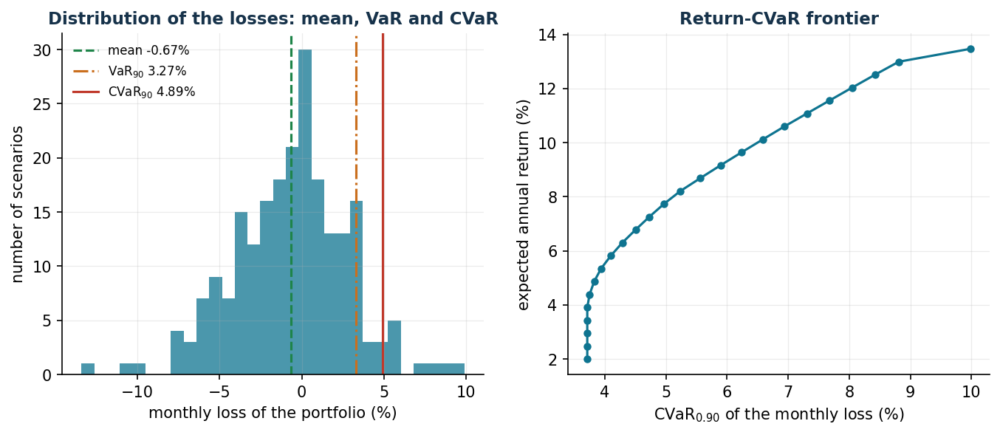

# VaR and CVaR: measuring and optimizing risk

**Class:** scenario-based LP · **Script:** `python/lab13_var_cvar.py`

[](https://colab.research.google.com/github/fabiofurini/operations-research-lab/blob/main/notebooks/lab13_var_cvar.ipynb)

Optimizing an average value can hide rare and very large losses. The **VaR**
(*Value-at-Risk*) answers "what is a high loss threshold?"; the **CVaR**
(*Conditional Value-at-Risk*) also answers "how much do we lose *on average* when
that threshold is exceeded?". The didactic surprise: the CVaR is optimized with a
simple LP.

## Definitions

For a random loss $L$ (upper case to follow the literature — an exception to the
convention that reserves capital letters for sets and matrices; realizations in lower
case $\ell_s$) and a level $\alpha \in (0.1)$:

$$
\mathrm{VaR}_\alpha(L) = \inf\{\eta : \mathbb{P}(L \le \eta) \ge \alpha\}
\qquad
\mathrm{CVaR}_\alpha(L) = \text{average loss in the worst tail of mass } 1 - \alpha .
$$

| Property | |
|---|---|
| Convexity | CVaR is convex in the decisions (if $L$ is); VaR in general is not |
| Subadditivity | CVaR rewards diversification; VaR may violate it |
| Tail | VaR does not distinguish two tails with the same quantile but different severity |
| Optimization | CVaR admits a scenario-based LP formulation; VaR does not |

!!! example "Worked example by hand (6 scenarios, α = 0.80)"
    Equally likely losses $\{2, 4, 5, 7, 12, 20\}$: VaR $= 12$ (the cumulative
    distribution reaches 0.80 there); CVaR $= 12 + \frac{1}{0{,}20}\cdot\frac{1}{6}(20 - 12) =
    \mathbf{18{,}67}$ — the formula correctly handles the mass "straddling" the
    quantile. Mean $= 8{,}33$: three numbers, three stories.

## The Rockafellar–Uryasev linear formulation

**Data (input of the model).** The number of scenarios $k \in \mathbb{Z}_{\ge 1}$,
indexed by $s \in \{1, 2, \dots, k\}$; for each scenario, the probability
$\pi_s \in \mathbb{Q}_{\ge 0}$ (with $\sum_{s=1}^{k} \pi_s = 1$) and the loss
$\ell_s(\boldsymbol x)$, a linear function of the decision vector
$\boldsymbol x$, constrained to a polyhedron $X$; the confidence level
$\alpha \in (0, 1)$.

**Decision variables.** Besides the decisions $\boldsymbol x$, we introduce one free
variable and $k$ non-negative variables:

$$
\begin{cases}
\eta = \text{candidate loss threshold (at the optimum: a VaR)}\\[1ex]
\xi_s = \text{loss in excess of } \eta \text{ in scenario } s
\end{cases}
\qquad \forall s \in \{1, 2, \dots, k\}.
$$

Using these variables, the Rockafellar–Uryasev LP model is the following:

$$
\begin{aligned}
\min ~~ \eta + \frac{1}{1-\alpha} \sum_{s=1}^{k} \pi_s\, \xi_s & & \\
\text{subject to} \quad \xi_s &\ge \ell_s(\boldsymbol x) - \eta, & \forall s \in \{1, 2, \dots, k\}, \\
\boldsymbol x &\in X, & \\
\eta &\gtreqless 0, & \\
\xi_s &\ge 0, & \forall s \in \{1, 2, \dots, k\}.
\end{aligned}
$$

Description of the objective function and of the constraints:

- the linear objective function is the threshold $\eta$ plus the weighted average of
  the tail excesses, amplified by $1/(1-\alpha)$; *at the optimum $\tilde\eta$ is a
  VaR and the objective value is the CVaR*: a single LP provides both measures;
- the linear **tail** constraints define the excesses: only the scenarios with a loss
  beyond the threshold contribute ($k$ linear constraints);
- the constraint $\boldsymbol x \in X$ collects the (polyhedral) constraints of the
  underlying decision problem;
- the constraints on $\eta$ and $\xi_s$ define the variables: $\eta$ is free (the
  symbol $\gtreqless$, in Gurobi `addVar(lb=-GRB.INFINITY)`), the $\xi_s$
  non-negative.

The variable $\xi_s = (\ell_s - \eta)^+$ is the loss in excess of the candidate
threshold $\eta$ (the same positive-part trick as in the Newsvendor). Minimizing over
$\eta$ balances two forces: raising $\eta$ reduces the excesses but pushes up the
threshold; the equilibrium point is exactly the $\alpha$ quantile.

## Case study 1: mean-CVaR portfolio vs Markowitz

The same eight securities as in the chapter on Markowitz, but with $k = 220$ monthly
scenarios generated with **fat tails** (Student $t$ market factor, 4 degrees of
freedom). Scenario loss $\ell_s(\boldsymbol x) = -\sum_{i=1}^{n} r_{is}\, x_i$, where
$r_{is}$ is the return of security $i$ in scenario $s$; we minimize
$\mathrm{CVaR}_{0.90}$ with expected return $\ge 8\%$ per year.

```text
            | mean loss     | VaR90  | CVaR90   (monthly losses)
  mean-CVaR |       -0.0067 | 0.0327 | 0.0489
  Markowitz |       -0.0067 | 0.0329 | 0.0531
Compositions: mean-CVaR: ENE 9.9 FIN 1.9 TEC 10.5 SAN 8.6 UTL 46.5 MAT 22.5
              Markowitz: ENE 18.4 FIN 6.4 TEC 6.5 SAN 13.6 UTL 40.4 MAT 14.6
```



For the same required return and the same average loss, the mean-CVaR portfolio cuts
the tail: CVaR₉₀ of 4.89% against 5.31% for Markowitz (−8%). It does so by reducing
the high-beta securities (ENE from 18% to 10%) in favour of UTL and of a share of TEC
which, although mediocre on average, moves against the trend in the worst scenarios
of this sample. Variance penalizes symmetrically above and below the mean; the CVaR
looks only where it hurts.

## Case study 2: two-stage supply chain

Before observing the scenario we *book* capacity from the suppliers; then, having
seen the scenario, we decide the recourse. F1 is cheap but fragile (in 12% of the
scenarios its availability collapses to 30%); F2 is expensive but reliable. Shortage
penalty 40 €/unit; $k = 400$ scenarios.

**Data.** Two suppliers indexed by $a \in \{1, 2\}$ with booking costs
$c^{\mathrm{pre}}_a \in \mathbb{Q}_{>0}$ and purchase costs
$c^{\mathrm{uso}}_a \in \mathbb{Q}_{>0}$; $k$ scenarios $s \in \{1, 2, \dots, k\}$
with demand $d_s \in \mathbb{Q}_{\ge 0}$ and availability $\delta_{as} \in (0, 1]$
(the datum that models the failure); shortage penalty $g \in \mathbb{Q}_{>0}$; risk
weight $\lambda \in [0, 1]$ and level $\alpha \in (0.1)$.

**Decision variables.** The non-negative variables $x_a$ (capacity booked from
supplier $a$, *first-stage*: the same in all scenarios), $f_{as}$ (purchase from
supplier $a$ in scenario $s$) and $u_s$ (unmet demand in scenario $s$), the latter
two being *recourse* variables.

$$
\begin{aligned}
\min ~~ (1-\lambda) \Bigl[ \sum_{a=1}^{2} c^{\mathrm{pre}}_a x_a + \sum_{s=1}^{k} \pi_s\, \phi_s \Bigr] + \lambda\, \mathrm{CVaR}_\alpha & & \\
\text{subject to} \quad f_{as} &\le \delta_{as}\, x_a, & \forall a \in \{1, 2\},~\forall s \in \{1, 2, \dots, k\}, \\
f_{1s} + f_{2s} + u_s &\ge d_s, & \forall s \in \{1, 2, \dots, k\}, \\
x_a,\ f_{as},\ u_s &\ge 0, & \forall a \in \{1, 2\},~\forall s \in \{1, 2, \dots, k\},
\end{aligned}
$$

where $\phi_s = \sum_{a=1}^{2} c^{\mathrm{uso}}_a f_{as} + g\, u_s$ is the recourse
cost of scenario $s$ and $\mathrm{CVaR}_\alpha$ is the CVaR of the total cost,
linearized with the variables $\eta$ and $\xi_s$ of the Rockafellar–Uryasev model.

Description of the objective function and of the constraints:

- the objective function combines, with weight $\lambda$, the average cost (bookings
  plus the expected value of purchases and penalties) and the CVaR of the total cost;
- the linear **capacity** constraints impose that in scenario $s$ supplier $a$ can be
  used only up to the booked capacity $x_a$, reduced by the availability
  $\delta_{as}$ ($2\,k$ linear constraints);
- the linear **demand** constraints impose that $d_s$ be covered by the flows or,
  failing that, be counted as a shortage $u_s$, which in the objective pays the
  penalty: the model is never infeasible, it "buys" infeasibility at the price of the
  penalty ($k$ linear constraints);
- the non-negativity constraints on $x_a$, $f_{as}$ and $u_s$ define the variables of
  the model.

```text
lambda = 0.0: book suppl.1 161.5  suppl.2 134.2
              mean cost 1724   CVaR90 2902   service 98.7%
lambda = 0.5: book suppl.1  92.7  suppl.2 212.7
              mean cost 1803   CVaR90 2217   service 99.9%
lambda = 1.0: book suppl.1  68.5  suppl.2 236.9
              mean cost 1906   CVaR90 2139   service 99.0%
```

The risk-neutral decision maker buys from the cheap supplier and accepts that in 12%
of the scenarios the shortage makes the costs explode (CVaR 2902). As $\lambda$
grows, capacity migrates towards the reliable supplier: **+79 € of average cost buy
−685 € of CVaR** — the cost of resilience, quantified.

## Sensitivity analysis

| Parameter | Expected effect |
|---|---|
| $\alpha$ | higher ⇒ a more extreme tail estimated from fewer scenarios: more scenarios are needed for stable estimates |
| $\lambda$ | controls the trade-off between average performance and protection |
| $\pi_s$ | reweighted scenarios or stress tests (adding extreme scenarios) |
| $k$ | statistical stability: repeat with different samples, as in the Newsvendor |

!!! warning "Statistical limits"
    With $\alpha = 0{,}99$ and $k = 220$ scenarios the tail contains only 2–3
    scenarios: the estimated CVaR is almost noise. Rule of thumb: at least a few
    dozen scenarios are needed *beyond* the quantile. Moreover, with discrete
    distributions the VaR may not be unique ($\tilde\eta$ is *a* VaR): always compare
    $\tilde\eta$ with the empirical quantile.


## Code

The complete script of the chapter — data, model, solution, sensitivity and figures —
is [`python/lab13_var_cvar.py`](https://github.com/fabiofurini/operations-research-lab/blob/main/python/lab13_var_cvar.py)
(reproducible with `python3 python/lab13_var_cvar.py` from the `python/` folder).

The same code is also available as a notebook — [`notebooks/lab13_var_cvar.ipynb`](https://github.com/fabiofurini/operations-research-lab/blob/main/notebooks/lab13_var_cvar.ipynb) — which opens in Colab from the badge at the top of the page and runs in the browser, with nothing to install.

??? example "Show the full script — `lab13_var_cvar.py`"

    ```python
    """Chapter 13 — VaR and CVaR: linear models and applications (scenario LP).

    Contents:
      1. Example with 6 scenarios: VaR = 12, CVaR = 18.67,
         checked with the linear formulation of Rockafellar-Uryasev
      2. Mean-CVaR portfolio (LP) and comparison with Markowitz (QP)
      3. Return-CVaR frontier
      4. Two-stage supply chain with adverse scenarios: the cost of resilience
    """
    import gurobipy as gp
    import numpy as np
    import pandas as pd
    from gurobipy import GRB

    from stile import (ARANCIO, GRIGIO, ROSSO, TEAL, VERDE, intestazione, plt, salva_dat,
                       salva_dati, salva_figura)

    rng = np.random.default_rng(42)

    # ----------------------------------------------------------------------
    # 1. EXAMPLE WITH 6 SCENARIOS
    # ----------------------------------------------------------------------
    intestazione("Example with 6 scenarios: VaR and CVaR with the linear formulation")
    perdite = np.array([2.0, 4.0, 5.0, 7.0, 12.0, 20.0])
    pi6 = np.full(6, 1 / 6)
    alpha = 0.80

    # direct computation
    cum = np.cumsum(pi6)
    var_diretto = perdite[np.searchsorted(cum, alpha)]
    print(f"Losses: {perdite.tolist()}, probability 1/6 each, alpha = {alpha}")
    print(f"VaR (quantile): {var_diretto:.2f}")

    # linear formulation of Rockafellar-Uryasev: min eta + 1/(1-alpha) sum pi_s xi_s
    m = gp.Model("cvar6")
    m.Params.OutputFlag = 0
    eta = m.addVar(lb=-GRB.INFINITY, name="eta")
    xi = m.addVars(6, name="xi")
    m.addConstrs((xi[s] >= perdite[s] - eta for s in range(6)), name="tail")
    m.setObjective(eta + gp.quicksum(pi6[s] * xi[s] for s in range(6)) / (1 - alpha),
                   GRB.MINIMIZE)
    m.optimize()
    print(f"Rockafellar-Uryasev LP: eta* = {eta.X:.2f} (a VaR), CVaR = {m.ObjVal:.4f}")
    print(f"By hand: 12 + (1/0.20)·(1/6)·(20-12) = 12 + 6.67 = 18.67  OK")
    print(f"Expected value of the loss: {perdite.mean():.2f} "
          f"-> the CVaR tells the story of the tail, the mean does not.")

    # ----------------------------------------------------------------------
    # 2. MEAN-CVaR PORTFOLIO vs MARKOWITZ
    # ----------------------------------------------------------------------
    intestazione("Mean-CVaR portfolio (LP) vs Markowitz (QP)")
    titoli = ["ENE", "FIN", "TEC", "IND", "SAN", "CON", "UTL", "MAT"]
    n = len(titoli)
    beta_f = np.array([1.1, 1.3, 1.5, 1.0, 0.6, 0.8, 0.4, 1.2])
    alfa_ann = np.array([0.05, 0.06, 0.11, 0.05, 0.045, 0.05, 0.035, 0.06])
    sigma_idio = np.array([0.05, 0.055, 0.07, 0.04, 0.03, 0.035, 0.02, 0.06])
    S = 220                                   # monthly scenarios (pip licence: n+2+S constraints)
    # market factor with FAT TAILS (Student t): realistic extreme scenarios
    mercato = 0.004 + 0.035 * rng.standard_t(4, S) / np.sqrt(2)
    R = alfa_ann[None, :] / 12 + np.outer(mercato, beta_f) + rng.normal(0, sigma_idio, (S, n))
    salva_dati(pd.DataFrame(R, columns=titoli), "cvar_scenari_rendimenti")

    mu = R.mean(axis=0) * 12
    Q = np.cov(R.T) * 12
    alpha_c = 0.90


    def porta_cvar(r_min):
        """min CVaR_alpha of the monthly loss -R x  subject to  expected return >= r_min."""
        m = gp.Model("mean_cvar")
        m.Params.OutputFlag = 0
        x = m.addVars(n, name="x")
        eta = m.addVar(lb=-GRB.INFINITY, name="eta")
        xi = m.addVars(S, name="xi")
        m.addConstr(x.sum() == 1)
        m.addConstr(gp.quicksum(mu[i] * x[i] for i in range(n)) >= r_min)
        m.addConstrs((xi[s] >= -gp.quicksum(R[s, i] * x[i] for i in range(n)) - eta
                      for s in range(S)), name="tail")
        m.setObjective(eta + gp.quicksum(xi[s] for s in range(S)) / (S * (1 - alpha_c)),
                       GRB.MINIMIZE)
        m.optimize()
        if m.Status != GRB.OPTIMAL:
            return None, None
        w = np.array([x[i].X for i in range(n)])
        return w, m.ObjVal


    def porta_markowitz(r_min):
        m = gp.Model("mk")
        m.Params.OutputFlag = 0
        x = m.addVars(n, name="x")
        m.addConstr(x.sum() == 1)
        m.addConstr(gp.quicksum(mu[i] * x[i] for i in range(n)) >= r_min)
        m.setObjective(gp.quicksum(Q[i, j] * x[i] * x[j] for i in range(n) for j in range(n)),
                       GRB.MINIMIZE)
        m.optimize()
        return np.array([x[i].X for i in range(n)])


    r_obb = 0.08
    w_cv, cvar_ott = porta_cvar(r_obb)
    w_mk = porta_markowitz(r_obb)
    perd_cv = -R @ w_cv
    perd_mk = -R @ w_mk


    def stat_perdite(perd):
        var_ = np.quantile(perd, alpha_c)
        cvar_ = perd[perd >= var_ - 1e-12].mean()
        return perd.mean(), var_, cvar_


    print(f"Required minimum return: {r_obb:.0%} per year, alpha = {alpha_c}")
    print(f"{'':>12} | {'mean loss':>13} | {'VaR90':>8} | {'CVaR90':>8}  (monthly losses)")
    for nome, perd in [("mean-CVaR", perd_cv), ("Markowitz", perd_mk)]:
        mm_, vv_, cc_ = stat_perdite(perd)
        print(f"{nome:>12} | {mm_:13.4f} | {vv_:8.4f} | {cc_:8.4f}")
    print("\nCompositions (weights > 1%):")
    for nome, w in [("mean-CVaR", w_cv), ("Markowitz", w_mk)]:
        print(f"  {nome:>10}: " + ", ".join(f"{titoli[i]} {w[i]:.1%}"
                                            for i in range(n) if w[i] > 0.01))

    # histogram of the losses of the mean-CVaR portfolio
    conteggi, bordi = np.histogram(perd_cv * 100, bins=30)
    salva_dat(pd.DataFrame({"center": (bordi[:-1] + bordi[1:]) / 2, "freq": conteggi}),
              "cap13_istogramma")
    mm_, var_cv, cvar_cv = stat_perdite(perd_cv)
    salva_dat(pd.DataFrame({"stat": ["mean", "VaR", "CVaR"],
                            "value": [mm_ * 100, var_cv * 100, cvar_cv * 100]}), "cap13_soglie")

    # ----------------------------------------------------------------------
    # 3. RETURN-CVaR FRONTIER
    # ----------------------------------------------------------------------
    intestazione("Return-CVaR frontier")
    r_grid = np.linspace(0.02, mu.max() * 0.999, 25)
    punti = []
    for r in r_grid:
        w, cv = porta_cvar(r)
        if w is not None:
            punti.append((cv * 100, r * 100))
    front = pd.DataFrame(punti, columns=["cvar", "ret"])
    salva_dat(front, "cap13_frontiera")
    print(f"{len(front)} points computed; minimum CVaR {front['cvar'].min():.2f}% "
          f"at return {front.loc[front['cvar'].idxmin(), 'ret']:.1f}%")

    # ----------------------------------------------------------------------
    # 4. TWO-STAGE SUPPLY CHAIN WITH ADVERSE SCENARIOS
    # ----------------------------------------------------------------------
    intestazione("Two-stage supply chain: reserved capacity + recourse")
    # Two suppliers (F1 cheap but fragile, F2 expensive but reliable) -> one market.
    # 1st stage: reserved capacity x_a (€/unit).  2nd stage: flows f_as and shortage u_s.
    forn = ["F1", "F2"]
    c_pren = {"F1": 2.0, "F2": 3.2}         # reservation cost €/unit
    c_uso = {"F1": 4.0, "F2": 5.0}          # purchase cost at delivery time
    pen = 40.0                              # penalty per unit of unserved demand
    Ss = 400
    dom_s = np.maximum(rng.normal(200, 40, Ss), 0)
    # availability of the fragile supplier: in 12% of the scenarios it collapses to 30%
    disp_f1 = np.where(rng.uniform(size=Ss) < 0.12, 0.3, 1.0)
    disp = {"F1": disp_f1, "F2": np.ones(Ss)}


    def duestadi(lam, alpha_c2=0.90):
        m = gp.Model("twostage")
        m.Params.OutputFlag = 0
        x = m.addVars(forn, ub=400, name="x")
        f = m.addVars(forn, range(Ss), name="f")
        u = m.addVars(range(Ss), name="u")
        for s in range(Ss):
            for a in forn:
                m.addConstr(f[a, s] <= disp[a][s] * x[a])
            m.addConstr(gp.quicksum(f[a, s] for a in forn) + u[s] >= dom_s[s])
        costo1 = gp.quicksum(c_pren[a] * x[a] for a in forn)
        costo2 = {s: gp.quicksum(c_uso[a] * f[a, s] for a in forn) + pen * u[s]
                  for s in range(Ss)}
        atteso = costo1 + gp.quicksum(costo2[s] for s in range(Ss)) / Ss
        if lam > 0:
            eta = m.addVar(lb=-GRB.INFINITY)
            xi = m.addVars(range(Ss))
            m.addConstrs((xi[s] >= costo1 + costo2[s] - eta for s in range(Ss)))
            cvar = eta + gp.quicksum(xi[s] for s in range(Ss)) / (Ss * (1 - alpha_c2))
            m.setObjective((1 - lam) * atteso + lam * cvar, GRB.MINIMIZE)
        else:
            m.setObjective(atteso, GRB.MINIMIZE)
        m.optimize()
        assert m.Status == GRB.OPTIMAL, m.Status
        tot = np.array([c_pren["F1"] * x["F1"].X + c_pren["F2"] * x["F2"].X
                        + sum(c_uso[a] * f[a, s].X for a in forn) + pen * u[s].X
                        for s in range(Ss)])
        serv = np.array([1 - u[s].X / dom_s[s] for s in range(Ss)])
        return {a: x[a].X for a in forn}, tot, serv


    righe = []
    for lam in [0.0, 0.5, 1.0]:
        cap, tot, serv = duestadi(lam)
        var_t = np.quantile(tot, 0.90)
        cvar_t = tot[tot >= var_t - 1e-9].mean()
        righe.append((lam, cap["F1"], cap["F2"], tot.mean(), cvar_t, serv.mean()))
        print(f"  lambda = {lam:3.1f}: reserve F1 = {cap['F1']:6.1f}, F2 = {cap['F2']:6.1f} | "
              f"mean cost {tot.mean():8.2f}, CVaR90 {cvar_t:8.2f} | mean service {serv.mean():.1%}")
    res2 = pd.DataFrame(righe, columns=["lam", "F1", "F2", "mean_cost", "cvar", "service"])
    salva_dat(res2, "cap13_duestadi")
    print("The risk-averse decision maker reserves more capacity from the reliable supplier:")
    print("it pays more on average, but it cuts the tail of the scenarios with shortage.")

    # ----------------------------------------------------------------------
    # 5. FIGURES
    # ----------------------------------------------------------------------
    fig, (ax1, ax2) = plt.subplots(1, 2, figsize=(10.8, 4.0))
    ax1.bar((bordi[:-1] + bordi[1:]) / 2, conteggi, width=np.diff(bordi), color=TEAL, alpha=0.75)
    ax1.axvline(mm_ * 100, color=VERDE, ls="--", label=f"mean {mm_ * 100:.2f}%")
    ax1.axvline(var_cv * 100, color=ARANCIO, ls="-.", label=f"VaR$_{{90}}$ {var_cv * 100:.2f}%")
    ax1.axvline(cvar_cv * 100, color=ROSSO, ls="-", label=f"CVaR$_{{90}}$ {cvar_cv * 100:.2f}%")
    ax1.set_xlabel("monthly loss of the portfolio (%)")
    ax1.set_ylabel("number of scenarios")
    ax1.set_title("Distribution of the losses: mean, VaR and CVaR")
    ax1.legend(fontsize=8)
    ax2.plot(front["cvar"], front["ret"], "-o", color=TEAL, ms=4)
    ax2.set_xlabel("CVaR$_{0.90}$ of the monthly loss (%)")
    ax2.set_ylabel("expected annual return (%)")
    ax2.set_title("Return-CVaR frontier")
    salva_figura(fig, "cap13_perdite_frontiera")

    print("\nDone: chapter 13.")
    ```

## Exercises

1. Six scenarios with $\alpha = 0{,}90$: VaR = CVaR = 20 (the tail lies entirely on
   the last point).
2. Build an example in which the VaR violates subadditivity (two independent loans)
   and check that the CVaR does not.
3. Optimal CVaR for $\alpha \in \{0{,}8;\, 0{,}9;\, 0{,}95;\, 0{,}99\}$: when do the
   instabilities begin?
4. Constrained form $\max \sum_i \mu_i x_i$ subject to $\mathrm{CVaR} \le k$: the
   same frontier, dual = marginal return of risk.
5. Stress test: an extreme scenario with probability 1% — how does the booking
   change?
